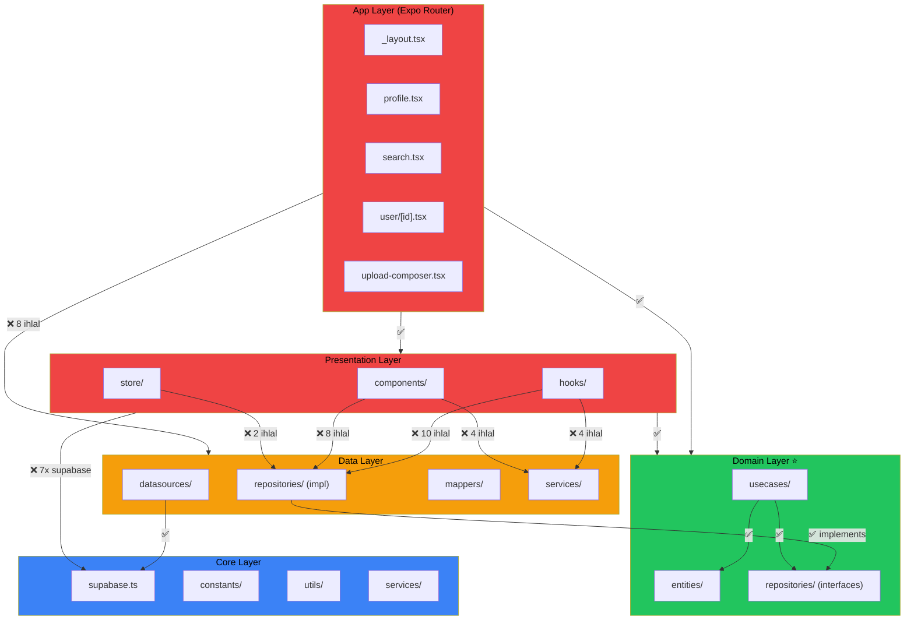

# 🔍 WizyClub — Kapsamlı Clean Architecture Kod İnceleme Raporu

> **Analiz Tarihi:** 22 Şubat 2026  
> **Framework:** React Native (Expo SDK 54/55)  
> **Mimari:** Clean Architecture (Layered)  
> **Video Kütüphanesi:** react-native-video (mevcut kalacak)  
> **Analiz Kapsamı:** `mobile/src/` (4 katman) + `mobile/app/` (Expo Router ekranları)

---

## 📊 1. YÖNETİCİ ÖZETİ (Executive Summary)

### Dosya Envanter Tablosu

| Katman | Yol | Dosya Sayısı | Açıklama |
|--------|-----|-------------|----------|
| **Core** | `src/core/` | 15 | Config, constants, supabase, utils, services, query |
| **Domain** | `src/domain/` | 24 | 7 entities, 8 repository interfaces, 8 use cases, 1 barrel |
| **Data** | `src/data/` | 15 | 6 repositories, 4 datasources, 2 mappers, 2 services, 1 mock |
| **Presentation** | `src/presentation/` | 97+ | ~30 components, 16 stores, 11 hooks + alt bileşenler |
| **App (Screens)** | `app/` | 26 | Expo Router ekranları |
| **Toplam** | — | **177+** | — |

### Genel Mimari Uyumluluk Skoru

| Kriter | Ağırlık | Puan | Ağırlıklı |
|--------|---------|------|-----------|
| Katman Uyumluluğu | %30 | 40/100 | 12.0 |
| Kod Kalitesi | %25 | 45/100 | 11.25 |
| Bileşen Yapısı | %20 | 30/100 | 6.0 |
| Best Practices | %15 | 55/100 | 8.25 |
| Güvenlik | %10 | 25/100 | 2.5 |
| **TOPLAM** | **%100** | — | **40.0 / 100** |

### Risk Matrisi

| Öncelik | Seviye | Sorun Sayısı |
|---------|--------|-------------|
| 🔴 P0 — Kritik | Hemen düzelt | **4** |
| 🟠 P1 — Yüksek | Bu hafta düzelt | **12** |
| 🟡 P2 — Orta | 2 hafta içinde | **15+** |
| 🟢 P3 — Düşük | İyileştirme | **10+** |

### 🚨 Hemen Aksiyon Gerektiren İlk 3 Madde

1. **Hardcoded Supabase Credentials** — `core/supabase.ts` dosyasında URL ve ANON_KEY açık metin olarak yazılmış. `.env` dosyasına taşınmalı.
2. **26 Presentation → Data Katman İhlali** — Presentation katmanı doğrudan `*RepositoryImpl` ve data servisleri import ediyor. DI/Factory pattern ile düzeltilmeli.
3. **God Components** — `profile.tsx` (1798 satır), `upload-composer.tsx` (1132 satır), `search.tsx` (1059 satır) acil parçalanmalı.

---

## 🚨 2. KRİTİK SORUNLAR (P0 — Immediate Action Required)

### SC001 — Hardcoded Supabase Credentials

| Alan | Detay |
|------|-------|
| **Dosya** | `src/core/supabase.ts` (satır 6-7) |
| **Sorun** | Supabase URL ve ANON_KEY doğrudan kaynak kodda yazılmış |
| **Etki** | Git history'de kalıcı olarak açığa çıkmış durumda |
| **Öncelik** | 🔴 P0 — Acil |

**Mevcut Kod:**
```typescript
// src/core/supabase.ts:6-7
const SUPABASE_URL = 'https://xxxxx.supabase.co';
const SUPABASE_ANON_KEY = 'eyJhbGciOiJI...REDACTED...';
```

**Düzeltme:**
```typescript
// src/core/supabase.ts
import Constants from 'expo-constants';

const SUPABASE_URL = Constants.expoConfig?.extra?.supabaseUrl
    ?? process.env.EXPO_PUBLIC_SUPABASE_URL
    ?? '';
const SUPABASE_ANON_KEY = Constants.expoConfig?.extra?.supabaseAnonKey
    ?? process.env.EXPO_PUBLIC_SUPABASE_ANON_KEY
    ?? '';

if (!SUPABASE_URL || !SUPABASE_ANON_KEY) {
    throw new Error('Supabase credentials not configured');
}
```

> [!CAUTION]
> `.env` dosyasının `.gitignore`'da olduğundan emin olun. Mevcut key'leri Supabase Dashboard'dan rotate edin — git history'de mevcut key'ler zaten açığa çıkmış durumda.

---

### SC002 — Hardcoded API URL

| Alan | Detay |
|------|-------|
| **Dosya** | `src/core/config.ts` (satır 4) |
| **Sorun** | Fallback olarak yerel IP adresi (`192.168.0.138:3000`) hardcoded |
| **Etki** | Production build'de yanlış API'ye bağlanma riski |

**Mevcut Kod:**
```typescript
API_URL: process.env.EXPO_PUBLIC_API_URL || 'http://192.168.0.138:3000',
```

**Düzeltme:**
```typescript
API_URL: process.env.EXPO_PUBLIC_API_URL ?? (() => {
    if (__DEV__) return 'http://localhost:3000';
    throw new Error('EXPO_PUBLIC_API_URL must be set in production');
})(),
```

---

### LV001–LV026 — Presentation → Data Katman İhlalleri (26 İhlal)

| # | Dosya | İhlal Eden Import |
|---|-------|-------------------|
| 1 | `store/useSocialStore.ts:3` | `InteractionRepositoryImpl` |
| 2 | `store/useDraftStore.ts:3` | `DraftRepositoryImpl` |
| 3 | `hooks/useProfileSearch.ts:3` | `ProfileRepositoryImpl` |
| 4 | `hooks/useSavedVideos.ts:4-5` | `InteractionRepositoryImpl`, `VideoRepositoryImpl` |
| 5 | `hooks/useStories.ts:5` | `StoryRepositoryImpl` |
| 6 | `hooks/useVideoViewTracking.ts:2` | `SupabaseVideoDataSource` |
| 7 | `hooks/useVideoSearch.ts:3` | `VideoRepositoryImpl` |
| 8 | `hooks/useVideoFeed.ts:9-13` | `VideoRepositoryImpl`, `InteractionRepositoryImpl`, `VideoCacheService`, `FeedPrefetchService` |
| 9 | `hooks/useProfile.ts:4` | `ProfileRepositoryImpl` |
| 10 | `components/story/StoryViewer.tsx:31,36` | `StoryRepositoryImpl`, `VideoCacheService` |
| 11 | `components/poolFeed/PoolFeedVideoPlayerPool.tsx:19` | `VideoCacheService` |
| 12 | `components/poolFeed/PoolFeedStoryBar.tsx:15` | `ProfileRepositoryImpl` |
| 13 | `components/poolFeed/utils/PoolFeedVideoErrorHandler.ts:9` | `VideoCacheService` |
| 14 | `components/poolFeed/hooks/usePoolFeedLifecycleSync.ts:5` | `FeedPrefetchService` |
| 15 | `components/poolFeed/hooks/usePoolFeedScroll.ts:25-26` | `VideoCacheService`, `FeedPrefetchService` |
| 16 | `components/infiniteFeed/InfiniteFeedManager.tsx:39-40` | `FeedPrefetchService`, `VideoCacheService` |
| 17 | `components/infiniteFeed/InfiniteStoryBar.tsx:7` | `ProfileRepositoryImpl` |
| 18 | `components/explore/TrendingCarousel.tsx:15` | `FeedPrefetchService` |
| 19 | `components/profile/EditProfileSheet.tsx:10` | `ProfileRepositoryImpl` |
| 20 | `app/_layout.tsx:29` | `ProfileRepositoryImpl` |
| 21 | `app/user/[id].tsx:51` | `InteractionRepositoryImpl` |
| 22 | `app/user/activities/[type].tsx:7` | `UserActivityRepositoryImpl` |
| 23 | `app/search.tsx:12` | `VideoCacheService` |
| 24 | `app/notifications.tsx:14` | `MOCK_NOTIFICATIONS` |
| 25 | `app/(tabs)/_layout.tsx:9` | `MOCK_NOTIFICATIONS` |
| 26 | `app/(tabs)/profile.tsx:61` | `UserActivityRepositoryImpl` |

**Örnek İhlal:**
```typescript
// ❌ YANLIŞ — Presentation doğrudan Data katmanına bağımlı
import { VideoRepositoryImpl } from '../../data/repositories/VideoRepositoryImpl';
const repo = new VideoRepositoryImpl();
```

**Doğru Yaklaşım — Factory Pattern:**
```typescript
// src/core/di/container.ts (yeni dosya)
import { IVideoRepository } from '../../domain/repositories/IVideoRepository';
import { VideoRepositoryImpl } from '../../data/repositories/VideoRepositoryImpl';

export const container = {
    videoRepository: new VideoRepositoryImpl() as IVideoRepository,
    // ...diğer bağımlılıklar
};

// Presentation katmanında:
// ✅ DOĞRU
import { container } from '../../core/di/container';
import { IVideoRepository } from '../../domain/repositories/IVideoRepository';
const repo: IVideoRepository = container.videoRepository;
```

---

### LV005 — Business Logic Presentation Katmanında

| Alan | Detay |
|------|-------|
| **Dosya** | `store/useAuthStore.ts` (satır 92-151) |
| **Sorun** | `signUp` fonksiyonu içinde profil oluşturma business logic'i doğrudan Supabase çağrısı yapıyor |
| **Etki** | Domain katmanını bypass ediyor, test edilemez |

**Mevcut Kod (satır 123-141):**
```typescript
// store/useAuthStore.ts — Business logic in presentation!
if (data.user) {
    const username = email.split('@')[0].toLowerCase().replace(/[^a-z0-9]/g, '');
    const { error: profileError } = await supabase
        .from('profiles')
        .upsert({ id: data.user.id, username, full_name: fullName, ... });
}
```

**Düzeltme:** Bu logic bir `SignUpUseCase` içine taşınmalı. `useAuthStore` sadece use case çağırmalı.

---

### LV006 — Presentation Katmanından Doğrudan Supabase Erişimi (7 İhlal)

| # | Dosya | Satır |
|---|-------|-------|
| 1 | `store/useAuthStore.ts` | 2 |
| 2 | `hooks/useStories.ts` | 9 |
| 3 | `components/profile/DeletedContentSheet.tsx` | 5 |
| 4 | `components/infiniteFeed/InfiniteFeedManager.tsx` | 45 |
| 5 | `app/UploadDetails.tsx` | 25 |
| 6 | `app/edit.tsx` | 23 |
| 7 | `app/(tabs)/explore.tsx` | 12 (dolaylı) |

Tüm Supabase erişimleri **Data katmanı** üzerinden yapılmalı. Presentation katmanı `supabase` client'ına asla doğrudan erişmemeli.

---

## ⚠️ 3. YÜKSEK ÖNCELİKLİ SORUNLAR (P1)

### CA001/CA007 — God Components (300+ Satır)

| Dosya | Satır | useState Sayısı (tahmini) | Önem |
|-------|-------|--------------------------|------|
| `app/(tabs)/profile.tsx` | **1798** | 20+ | 🔴 Acil |
| `app/upload-composer.tsx` | **1132** | 15+ | 🔴 Acil |
| `app/search.tsx` | **1059** | 12+ | 🔴 Acil |
| `components/story/StoryViewer.tsx` | **931** | 15+ | 🟠 Yüksek |
| `components/poolFeed/PoolFeedVideoPlayerPool.tsx` | **827** | 10+ | 🟠 Yüksek |
| `app/user/[id].tsx` | **743** | 10+ | 🟠 Yüksek |
| `hooks/useVideoFeed.ts` | **710** | N/A (Hook) | 🟠 Yüksek |
| `app/video-editor.tsx` | **699** | 8+ | 🟡 Orta |
| `components/poolFeed/PoolFeedManager.tsx` | **631** | 8+ | 🟡 Orta |

#### Parçalama Önerileri: `profile.tsx` (1798 satır)

| Yeni Bileşen | Kapsam | Tahmini Satır |
|--------------|--------|--------------|
| `ProfileHeader.tsx` | Avatar, bio, stats bölümü | ~200 |
| `ProfileTabsBar.tsx` | Tab navigasyon bar | ~80 |
| `ProfileGridView.tsx` | Grid/video görünümü | ~150 |
| `ProfileActivityHistory.tsx` | İzleme geçmişi, filtre ve gruplama | ~200 |
| `useProfileState.ts` | Tüm useState + useEffect logic | ~300 |
| `ShopFireworks.tsx` | Konfeti animasyonu (ayrı dosyaya zaten uygun) | ~75 |
| `PreviewModal.tsx` (shared) | Video önizleme modal — `user/[id].tsx` ile ortak | ~20 |

#### Parçalama Önerileri: `upload-composer.tsx` (1132 satır)

| Yeni Bileşen | Kapsam | Tahmini Satır |
|--------------|--------|--------------|
| `ComposerPreviewCarousel.tsx` | Video/görsel önizleme kaydırıcı | ~150 |
| `ComposerSubtitleEditor.tsx` | Altyazı düzenleme paneli | ~200 |
| `ComposerToolbar.tsx` | Alt toolbar (ikon butonları) | ~100 |
| `useComposerLogic.ts` | Ana state ve business logic | ~300 |
| `ExitConfirmationModal.tsx` | Çıkış onay modal | ~45 |
| `DeleteSubtitleConfirmationModal.tsx` | Altyazı silme modal | ~45 |

---

### CQ001 — TypeScript `any` Kullanımı (50+ Kullanım)

**En Kritik Örnekler:**

| Dosya | Satır | Sorunlu Kod |
|-------|-------|-------------|
| `PoolFeedOverlays.tsx` | 69,71 | `storyUsers: any[]`, `uiOpacityStyle: any` |
| `PoolFeedVideoPlayerPool.tsx` | 67,114 | `error: any`, `netInfo: any` |
| `ProfileSettingsOverlay.tsx` | 74-79,104,143 | 6 farklı `any` kullanımı |
| `usePoolFeedScroll.ts` | 60,126,304 | `event: any`, `listRef: React.RefObject<any>` |
| `usePoolFeedInteractions.ts` | 51,53 | `event: any` (2 adet) |
| `StoryViewer.tsx` | 536,548,576,586 | `data: any` (4 adet) |
| Tüm `catch` blokları | — | `catch (error: any)` (12+ adet) |
| `app/(tabs)/profile.tsx` | 462,492,500,504,625,635,640 | 7 farklı `any` kullanımı |

**Düzeltme Önerisi:**
```typescript
// ❌ YANLIŞ
const handleVideoLoad = useCallback((storyId: string) => (data: any) => { ... });

// ✅ DOĞRU
import type { OnLoadData } from 'react-native-video';
const handleVideoLoad = useCallback((storyId: string) => (data: OnLoadData) => { ... });

// ❌ YANLIŞ — catch blocks
catch (error: any) {

// ✅ DOĞRU
catch (error: unknown) {
    const message = error instanceof Error ? error.message : 'Unknown error';
}
```

---

### CQ006 — DRY İhlalleri (Tekrarlanan Kod)

#### `profile.tsx` ↔ `user/[id].tsx` Arasında Tekrarlanan Bileşenler

| Tekrarlanan Bileşen | profile.tsx | user/[id].tsx |
|---------------------|------------|---------------|
| `GridIcon` | Satır 73-78 | Satır 63-68 |
| `VideoIcon` | Satır 80-90 | Satır 70-80 |
| `StoreTabIcon` | Satır 176-178 | Satır 82-84 |
| `PreviewModal` | Satır 180-196 | Satır 136-152 |
| `renderTabsBar` | Satır 1070-1129 | Satır 518-552 |

Bu bileşenler `presentation/components/shared/` altında ortaklaştırılmalı.

#### `resolveSubtitleTextAlign` Fonksiyonu

- `upload-composer.tsx` (satır 81-86)
- `video-editor.tsx` (satır 41-45)

Aynı fonksiyon iki ayrı dosyada tekrarlanmış. Bir utility fonksiyona taşınmalı.

---

### SM001 — useAuthStore İçinde Business Logic

`useAuthStore.ts` aşağıdaki sorunları içeriyor:

1. **Doğrudan Supabase erişimi** (presentation → supabase): Satır 31, 48, 62, 97, 127, 156
2. **Profil oluşturma logic'i** `signUp` içinde (satır 123-141): Bu bir use case
3. **Username generation** logic'i (satır 125): `email.split('@')[0]...` — Domain logic

---

### CQ003 — Web-Only Code React Native Projesinde

| Dosya | Satır | Sorun |
|-------|-------|-------|
| `core/supabase.ts` | 10-24 | `window.localStorage` referansı |
| `core/supabase.ts` | 52-60 | `document.addEventListener('visibilitychange')` |

Bu kodlar React Native ortamında gereksiz. Platform tabanlı web desteği Expo SDK 54'te `Platform.OS === 'web'` ile korunmuş olsa bile, React Native-only projede bu dead code kalıntıları kaldırılabilir.

---

## 📝 4. ORTA ÖNCELİKLİ SORUNLAR (P2)

### RN003 — Memoization Eksiklikleri

- [ ] `profile.tsx` — 1798 satırlık component `React.memo` kullanmıyor
- [ ] `search.tsx` — Sub-componentler inline tanımlı, `memo` yok
- [ ] `user/[id].tsx` — `AnimatedIconButton` her render'da yeniden oluşturuluyor
- [ ] `StoryViewer.tsx` — 931 satır, iç bileşenler ayrı dosyalara çıkarılmalı ve `memo` ile sarılmalı

### FS002 — Eksik Barrel Exports (index.ts)

Mevcut barrel export'lar (7 adet):

- ✅ `core/constants/index.ts`
- ✅ `core/index.ts`
- ✅ `core/utils/index.ts`
- ✅ `domain/entities/index.ts`
- ✅ `presentation/components/deals/index.ts`
- ✅ `presentation/components/poolFeed/hooks/index.ts`
- ✅ `presentation/components/profile/index.ts`

**Eksik olanlar:**

- ❌ `domain/repositories/` — barrel yok
- ❌ `domain/usecases/` — barrel yok
- ❌ `data/repositories/` — barrel yok
- ❌ `data/datasources/` — barrel yok
- ❌ `data/mappers/` — barrel yok
- ❌ `data/services/` — barrel yok
- ❌ `presentation/hooks/` — barrel yok
- ❌ `presentation/store/` — barrel yok
- ❌ `presentation/components/infiniteFeed/` — barrel yok
- ❌ `presentation/components/story/` — barrel yok
- ❌ `presentation/components/explore/` — barrel yok

### CQ004 — Hardcoded Strings

- `search.tsx` — Tab isimleri doğrudan kodda: `['Senin İçin', 'Hesaplar', 'Kişiselleştirilmemiş', 'Etiketler', 'Yerder']`
- `useAuthStore.ts` — Hata mesajları: `'E-posta veya şifre hatalı.'`, `'Bu e-posta adresi zaten kayıtlı.'` vb.
- `useAuthStore.ts:133` — Avatar URL: `https://api.dicebear.com/7.x/avataaars/png?seed=${username}`

Bu string'ler `core/constants/` veya bir i18n çözümüne taşınmalı.

### CQ005 — Magic Numbers

| Dosya | Satır | Magic Number | Öneri |
|-------|-------|-------------|-------|
| `useVideoViewTracking.ts` | 14 | `30 * 60 * 1000` | `VIEW_COOLDOWN_MS` ✅ (zaten var) |
| `useVideoViewTracking.ts` | 15 | `5000` | `MAX_RECENT_ENTRIES` ✅ (zaten var) |
| `StoryViewer.tsx` | 48 | `25` | `STAGE_EXTRA_TOP_OFFSET` ✅ |
| `StoryViewer.tsx` | 49-51 | `130, 1.1, 70, 180` | ✅ Zaten named const |
| `search.tsx` | 30 | `350` | `SEARCH_DEBOUNCE_MS` ✅ |

> Not: Genel olarak magic numberlar iyi yönetilmiş. ✅

### RN009 — useEffect Cleanup Kontrolü

- `useAuthStore.ts:48` — `supabase.auth.onAuthStateChange()` subscription'ı cleanup'sız (`unsubscribe` çağrılmıyor)

```typescript
// ❌ Mevcut
supabase.auth.onAuthStateChange((_event, session) => { ... });

// ✅ Düzeltme
const { data: { subscription } } = supabase.auth.onAuthStateChange((_event, session) => { ... });
// cleanup'ta: subscription.unsubscribe();
```

### FS001 — `src/utils/` Klasörü

`src/utils/ignoreWarnings.ts` dosyası `src/` kökünde ayrı bir `utils` klasöründe duruyor. Bu, `core/utils/` altında olmalı veya `core/` ile birleştirilmeli.

---

## 🔄 5. REFACTORING PLANI

### 5.1 Oluşturulması Gereken Yeni Componentler

| Bileşen Adı | Mevcut Konum | Hedef Konum | Neden | Öncelik |
|-------------|-------------|-------------|-------|---------|
| `ProfileHeader` | `app/(tabs)/profile.tsx` | `presentation/components/profile/ProfileHeader.tsx` | 1798 satır'dan SRP çıkarımı | P0 |
| `ProfileTabsBar` | `app/(tabs)/profile.tsx` + `app/user/[id].tsx` | `presentation/components/profile/ProfileTabsBar.tsx` | Tekrarlanan tab bar | P0 |
| `ProfileActivityHistory` | `app/(tabs)/profile.tsx` | `presentation/components/profile/ProfileActivityHistory.tsx` | Tarih filtreleme + gruplama logic | P1 |
| `SharedPreviewModal` | `app/(tabs)/profile.tsx` + `app/user/[id].tsx` | `presentation/components/shared/PreviewModal.tsx` | Birebir tekrar | P0 |
| `SharedTabIcons` | `app/(tabs)/profile.tsx` + `app/user/[id].tsx` | `presentation/components/shared/TabIcons.tsx` | GridIcon, VideoIcon, StoreTabIcon tekrarı | P0 |
| `ComposerPreviewCarousel` | `app/upload-composer.tsx` | `presentation/components/composer/ComposerPreviewCarousel.tsx` | 1132 satırdan ayrıştırma | P1 |
| `ComposerSubtitleEditor` | `app/upload-composer.tsx` | `presentation/components/composer/ComposerSubtitleEditor.tsx` | SRP | P1 |
| `SearchDiscoveryView` | `app/search.tsx` | `presentation/components/search/SearchDiscoveryView.tsx` | 1059 satırdan ayrıştırma | P1 |
| `SearchResultsView` | `app/search.tsx` | `presentation/components/search/SearchResultsView.tsx` | SRP | P1 |

### 5.2 Extract Edilmesi Gereken Custom Hooks

| Hook Adı | Kaynak Bileşen | Çıkarılacak Logic | Öncelik |
|----------|---------------|-------------------|---------|
| `useProfileState` | `profile.tsx` | 20+ useState, useEffect'ler | P0 |
| `useProfileTabs` | `profile.tsx` | Tab switching, inner tab state | P1 |
| `useSearchState` | `search.tsx` | Search state, debounce, recent history | P1 |
| `useComposerState` | `upload-composer.tsx` | Subtitle generation, preview state | P1 |
| `useStoryViewerState` | `StoryViewer.tsx` | Story navigation, progress, gestures | P1 |

### 5.3 Taşınması Gereken Dosyalar

| Dosya | Mevcut Katman | Hedef Katman | Neden |
|-------|--------------|-------------|-------|
| `src/utils/ignoreWarnings.ts` | `src/utils/` (katmansız) | `src/core/utils/` | Core altyapı aracı |
| Auth business logic (`useAuthStore.ts` satır 92-151) | Presentation (store) | Domain (`usecases/SignUpUseCase.ts`) | Business logic domain katmanında olmalı |

### 5.4 Oluşturulması Gereken Yeni Dosyalar

| Dosya | Konum | Amaç |
|-------|-------|------|
| `container.ts` | `src/core/di/container.ts` | Dependency Injection container |
| `SignUpUseCase.ts` | `src/domain/usecases/` | Auth signUp business logic |
| `IAuthRepository.ts` | `src/domain/repositories/` | Auth repository interface |
| `AuthRepositoryImpl.ts` | `src/data/repositories/` | Auth repository implementation |

---

## 📁 6. KATMAN BAZLI ANALİZ

### 6.1 Core Katmanı — Skor: **60/100**

| Metrik | Sayı |
|--------|------|
| Toplam Dosya | 15 |
| Constants | 3 |
| Services | 3 |
| Utils | 5 |
| Config | 2 |
| Query | 1 |

**Sorunlar:**
- 🔴 Hardcoded Supabase credentials (`supabase.ts`)
- 🔴 Hardcoded local IP in config (`config.ts`)
- 🟡 Web-only code (`window.localStorage`, `document`) gereksiz
- 🟡 Core katmanda Supabase client yaşıyor — bu bir mimari karar ancak data katmanına taşınabilir

**İyi Yönler:**
- ✅ Diğer katmanlardan import yok (temiz bağımsızlık)
- ✅ Logger sistemi iyi yapılandırılmış (`Logger.ts`, `PerformanceLogger.ts`, `SessionLogService.ts`)
- ✅ Surface theme tokens iyi organize edilmiş

---

### 6.2 Domain Katmanı — Skor: **90/100** ⭐

| Metrik | Sayı |
|--------|------|
| Toplam Dosya | 24 |
| Entities | 7 (+1 barrel) |
| Repository Interfaces | 8 |
| Use Cases | 8 |

**Sorunlar:**
- 🟡 Barrel export sadece `entities/` için var, `repositories/` ve `usecases/` için eksik
- 🟡 Bazı eksik use cases: `SignUpUseCase`, `DeleteVideoUseCase`, `UploadVideoUseCase`

**İyi Yönler:**
- ✅ **Sıfır dış bağımlılık** — Hiçbir React, RN, Expo veya Supabase import'u yok
- ✅ Tüm import'lar kendi katmanı içinde (entities, repositories)
- ✅ Repository interface'leri `I` prefix ile doğru adlandırılmış
- ✅ Use case'ler `UseCase` suffix'i ile doğru adlandırılmış
- ✅ Pure TypeScript — Tam Clean Architecture uyumlu

---

### 6.3 Data Katmanı — Skor: **70/100**

| Metrik | Sayı |
|--------|------|
| Toplam Dosya | 15 |
| Repository Impl | 6 |
| DataSources | 4 |
| Mappers | 2 |
| Services | 2 |
| Mock | 1 |

**Sorunlar:**
- 🟡 Barrel export'lar eksik
- 🟡 `FeedPrefetchService` ve `VideoCacheService` doğrudan presentation'dan kullanılıyor (DI yok)
- 🟡 `mock/notifications.ts` doğrudan presentation'dan import ediliyor — repository pattern kullanılmalı

**İyi Yönler:**
- ✅ Presentation katmanından import yok (doğru bağımlılık yönü)
- ✅ Repository implementations `Impl` suffix ile doğru adlandırılmış
- ✅ DataSources Supabase prefix ile iyi organize edilmiş
- ✅ Mappers mevcut (StoryMapper, VideoMapper)

---

### 6.4 Presentation Katmanı — Skor: **35/100**

| Metrik | Sayı |
|--------|------|
| Toplam Dosya | 97+ |
| Components | ~30 (dosya bazında) |
| Hooks | 11 |
| Stores (Zustand) | 16 |
| Config | 1 |

**Sorunlar:**
- 🔴 26 adet Data katmanından doğrudan import
- 🔴 7 adet direkt Supabase erişimi
- 🔴 50+ `any` kullanımı
- 🔴 8 God Component (300+ satır)
- 🟠 Çok sayıda tekrarlanan kod (profile ↔ user)
- 🟠 Barrel export eksiklikleri
- 🟠 Business logic store'larda (useAuthStore)
- 🟡 Memoization eksiklikleri

**İyi Yönler:**
- ✅ Zustand store'lar iyi yapılandırılmış (16 ayrı store, sorumluluk ayrımı)
- ✅ Pool Feed modüler hook mimarisi iyi (`usePoolFeedScroll`, `usePoolFeedInteractions`, `usePoolFeedActions`, vb.)
- ✅ Surface theme token sistemi tutarlı
- ✅ Config-driven UI flags (`usePoolFeedConfig`, `useInfiniteFeedConfig`)
- ✅ Pool Feed'de slot-based video player recycling iyi tasarlanmış

---

## 📈 7. DEPENDENCY GRAPH



**Kırmızı oklar:** Katman ihlalleri (Presentation/App → Data direkt erişim)  
**Yeşil bağlantılar:** Doğru dependency yönü

---

## ✅ 8. İYİ UYGULAMALAR (Positives)

### 🏅 Domain Katmanı Mükemmel
- Sıfır dış bağımlılık, pure TypeScript, tam Clean Architecture uyumlu. Bu projenin en güçlü yönü.

### 🏅 Pool Feed Modüler Mimarisi
- `PoolFeedManager` başarılı bir şekilde modüler hook'lara ayrılmış:
  - `usePoolFeedScroll`, `usePoolFeedInteractions`, `usePoolFeedActions`
  - `usePoolFeedVideoCallbacks`, `usePoolFeedLifecycleSync`
  - `PoolFeedSlotRecycler`, `PoolFeedVideoErrorHandler` utility sınıfları
- Bu pattern diğer büyük bileşenlere de uygulanabilir.

### 🏅 Logger Altyapısı
- `Logger.ts` — LogCode enum ile yapılandırılmış, okunabilir
- `PerformanceLogger.ts` — Performans ölçümleri için ayrı servis
- `SessionLogService.ts` — Oturum bazlı loglama

### 🏅 Config-Driven UI
- `usePoolFeedConfig.ts` ve `useInfiniteFeedConfig.ts` ile UI bayrakları dinamik
- `scripts/ui.js` ile real-time config yönetimi

### 🏅 Surface Theme Token Sistemi
- `surface-theme-tokens.ts` ile tutarlı tasarım tokenleri
- `modal-sheet-colors.ts` ile modal stilleri standardize edilmiş

### 🏅 Named Constants
- Magic number'lar genellikle named constant olarak tanımlanmış (iyi pratik)

### 🏅 Video Player Pool Pattern
- 3 slot'lu video player recycling sistemi — performans optimizasyonu için sofistike yaklaşım

---

## 🎯 9. AKSİYON PLANI

### Phase 1 — Kritik Düzeltmeler (Bu Hafta) ⏱️ ~12 saat

| # | Görev | Tahmini Süre |
|---|-------|-------------|
| 1 | Supabase credentials'ı `.env`'e taşı, key rotate et | 1 saat |
| 2 | DI Container oluştur (`core/di/container.ts`) | 2 saat |
| 3 | 26 presentation→data ihlalini DI container üzerinden düzelt | 4 saat |
| 4 | 7 direkt supabase import'unu data katmanına taşı | 3 saat |
| 5 | `useAuthStore` içindeki business logic'i `SignUpUseCase`'e taşı | 2 saat |

### Phase 2 — Component Refactoring (2 Hafta) ⏱️ ~24 saat

| # | Görev | Tahmini Süre |
|---|-------|-------------|
| 1 | `profile.tsx` parçalama (7 alt bileşen + hook) | 6 saat |
| 2 | `upload-composer.tsx` parçalama (5 alt bileşen + hook) | 4 saat |
| 3 | `search.tsx` parçalama (3 alt bileşen + hook) | 3 saat |
| 4 | Tekrarlanan kodu ortaklaştır (PreviewModal, TabIcons, vb.) | 2 saat |
| 5 | `any` type'ları proper types ile değiştir (50+ yer) | 4 saat |
| 6 | Barrel export'ları oluştur (11 eksik dizin) | 2 saat |
| 7 | `StoryViewer.tsx` parçalama | 3 saat |

### Phase 3 — İyileştirmeler (1 Ay) ⏱️ ~16 saat

| # | Görev | Tahmini Süre |
|---|-------|-------------|
| 1 | React.memo optimizasyonları ekle | 3 saat |
| 2 | Hardcoded string'leri i18n veya constants'a taşı | 2 saat |
| 3 | useEffect cleanup'ları kontrol et ve düzelt | 2 saat |
| 4 | Web-only dead code'u kaldır (`supabase.ts`) | 1 saat |
| 5 | `src/utils/` → `core/utils/` taşıma | 0.5 saat |
| 6 | Eksik use case'leri oluştur (Delete, Upload) | 3 saat |
| 7 | Error handling standardizasyonu (ErrorBoundary, domain exceptions) | 4 saat |
| 8 | `user/[id].tsx` ve `video-editor.tsx` parçalama | 3 saat |

**Toplam Tahmini Süre: ~52 saat**

---

## 📚 10. EKLER

### 10.1 Sorunlu Dosyaların Tam Listesi

<details>
<summary>Katman İhlali Olan Dosyalar (33 adet)</summary>

**Presentation → Data (26 ihlal):**
1. `src/presentation/store/useSocialStore.ts`
2. `src/presentation/store/useDraftStore.ts`
3. `src/presentation/hooks/useProfileSearch.ts`
4. `src/presentation/hooks/useSavedVideos.ts`
5. `src/presentation/hooks/useStories.ts`
6. `src/presentation/hooks/useVideoViewTracking.ts`
7. `src/presentation/hooks/useVideoSearch.ts`
8. `src/presentation/hooks/useVideoFeed.ts`
9. `src/presentation/hooks/useProfile.ts`
10. `src/presentation/components/story/StoryViewer.tsx`
11. `src/presentation/components/poolFeed/PoolFeedVideoPlayerPool.tsx`
12. `src/presentation/components/poolFeed/PoolFeedStoryBar.tsx`
13. `src/presentation/components/poolFeed/utils/PoolFeedVideoErrorHandler.ts`
14. `src/presentation/components/poolFeed/hooks/usePoolFeedLifecycleSync.ts`
15. `src/presentation/components/poolFeed/hooks/usePoolFeedScroll.ts`
16. `src/presentation/components/infiniteFeed/InfiniteFeedManager.tsx`
17. `src/presentation/components/infiniteFeed/InfiniteStoryBar.tsx`
18. `src/presentation/components/explore/TrendingCarousel.tsx`
19. `src/presentation/components/profile/EditProfileSheet.tsx`
20. `app/_layout.tsx`
21. `app/user/[id].tsx`
22. `app/user/activities/[type].tsx`
23. `app/search.tsx`
24. `app/notifications.tsx`
25. `app/(tabs)/_layout.tsx`
26. `app/(tabs)/profile.tsx`

**Presentation → Supabase Direct (7 ihlal):**
27. `src/presentation/store/useAuthStore.ts`
28. `src/presentation/hooks/useStories.ts`
29. `src/presentation/components/profile/DeletedContentSheet.tsx`
30. `src/presentation/components/infiniteFeed/InfiniteFeedManager.tsx`
31. `app/UploadDetails.tsx`
32. `app/edit.tsx`
33. `app/(tabs)/explore.tsx`

</details>

### 10.2 Video Kütüphanesi (react-native-video) İncelemesi

| Kontrol | Durum | Not |
|---------|-------|-----|
| VID001 — Lifecycle handlers | ✅ | `onLoad`, `onEnd`, `onError` mevcut (`PoolFeedVideoPlayerPool.tsx`) |
| VID002 — Memory cleanup | ✅ | useEffect cleanup, `isCancelled` pattern kullanılıyor |
| VID003 — Error handling | ✅ | `PoolFeedVideoErrorHandler` utility sınıfı, retry mekanizması |
| VID004 — Loading states | ✅ | Poster image overlay, `onReadyForDisplay` handler |
| VID005 — Ref management | ⚠️ | `useRef` kullanılıyor ancak `any` ile tip güvenliği zayıf |
| VID006 — Fullscreen | ✅ | Safe area insets doğru kullanılıyor |

> react-native-video kullanımı genel olarak iyi. Slot recycling pattern profesyonel seviyede.

### 10.3 Kullanılan Analiz Yöntemleri

- Manuel dosya bazlı tarama (`find_by_name`, `view_file_outline`)
- Import statement regex analizi (`grep_search`)
- Satır sayısı analizi
- Kod kalitesi pattern tespiti (`any` kullanımı, `console.log`, hardcoded values)
- Clean Architecture katman bağımlılık kontrolü

---

> **Rapor Sonu** — WizyClub Clean Architecture Kod İnceleme Raporu  
> Tarih: 22 Şubat 2026  
> Genel Skor: **40/100**  
> En Acil Aksiyon: Supabase credentials güvenliği + DI Container kurulumu
