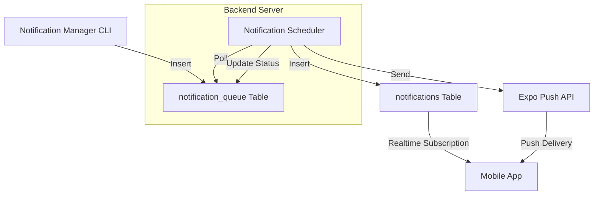

# WizyClub Bildirim Sistemi Rehberi (Notification System Guide)

Bu belge, uygulamaya entegre edilen **Zaman Ayarlı Bildirim Sistemi**'nin mimarisini, dosya yapısını ve çalışma prensibini detaylandırmaktadır.

---

## 🏗️ Genel Mimari (Workflow)

Sistem dört ana katmandan oluşur:

1.  **Yönetim Paneli (CLI):** Bildirimlerin oluşturulduğu ve zamanlandığı arayüz.
2.  **Veritabanı Kuyruğu (Supabase):** Bildirimlerin bekletildiği ve durumlarının takip edildiği merkez.
3.  **Backend Nöbetçisi (Scheduler):** Kuyruğu sürekli kontrol eden ve zamanı gelenleri işleyen servis.
4.  **Teslimat Kanalları:**
    *   **Expo Push:** Telefonlara giden gerçek "Push Notification".
    *   **Supabase Realtime:** Uygulama açıkken anında ekrana düşen "In-App Notification".

---

## 📁 Dosya ve Kod Yapısı

### 1. Veritabanı Katmanı (Supabase)
*   **`notification_queue` Tablosu:** Planlanmış tüm bildirimlerin ana listesidir. 
    *   `scheduled_at`: Gönderim zamanı (UTC).
    *   `status`: 'pending', 'processing', 'sent', 'failed'.
*   **`notifications` Tablosu:** Uygulama içi (Realtime) mesajlar için kullanılır.
*   **`profiles` Tablosu:** Kullanıcıların `expo_push_token` değerlerini saklar.

### 2. Backend Katmanı (Node.js)
*   **`backend/services/NotificationService.js`:** Sistemin kalbi.
    *   `processScheduledNotifications()`: Kuyruktaki zamanı gelmiş bildirimleri bulur, işleme alır ve gönderir.
    *   `sendExpoPushNotifications()`: Expo API'sine HTTP isteği atar.
    *   `startNotificationScheduler()`: Belirli aralıklarla (30 sn) süreci tetikler.
*   **`backend/bootstrap/createInfrastructure.js`:** Servisin başlatıldığı ve veritabanı bağlantısının kurulduğu yer.
*   **`backend/server.js`:** Sunucu başladığında scheduler'ı aktif eden giriş noktası.

### 3. Yönetim Paneli (CLI)
*   **`backend/scripts/notification-manager.js`:** Senin kullandığın interaktif ekran. 
    *   Türkiye saat dilimine (UTC+3) göre giriş alıp UTC'ye çevirerek kuyruğa ekler.

### 4. Mobil Katman (React Native / Expo)
*   **`mobile/app/_layout.tsx`:** 
    *   Kullanıcı giriş yaptığında `expo-notifications` ile token alıp Supabase'e kaydeder.
    *   Supabase Realtime ile `notifications` tablosunu dinler ve mesaj geldiğinde `Notifications.scheduleNotificationAsync` ile ekranda gösterir.

---

## 🕒 Saat Dilimi Mantığı (Turkey Timezone)

Sistem içi tüm veriler **UTC** standardında saklanır. Ancak panel (`notification-manager.js`) giriş alırken:
1.  Sana Türkiye saatini gösterir.
2.  Girdiğin zamanın sonuna otomatik olarak `+03:00` ekler.
3.  Bunu sistemin anlayacağı mutlak zamana (UTC) çevirerek kaydeder.

Bu sayede backend sunucun dünyanın neresinde olursa olsun, bildirimlerin senin istediğin Türkiye saatinde gönderilir.

---

## 🛠️ Nasıl Çalıştırılır?

1.  **Backend Sunucusu:** `npm start` (Bildirimlerin gitmesi için bu sunucu açık olmalıdır).
2.  **Panel:** `npm run notify` (Bildirim göndermek için kullanılır).
3.  **Mobil:** Uygulama açık ve internete bağlı olmalıdır.

> [!NOTE]
> Gerçek push bildirimlerinin telefona gitmesi için kullanıcının uygulamaya bir kez girip "Bildirimlere İzin Ver" demesi ve veritabanına `expo_push_token` kaydının düşmesi gerekir.
