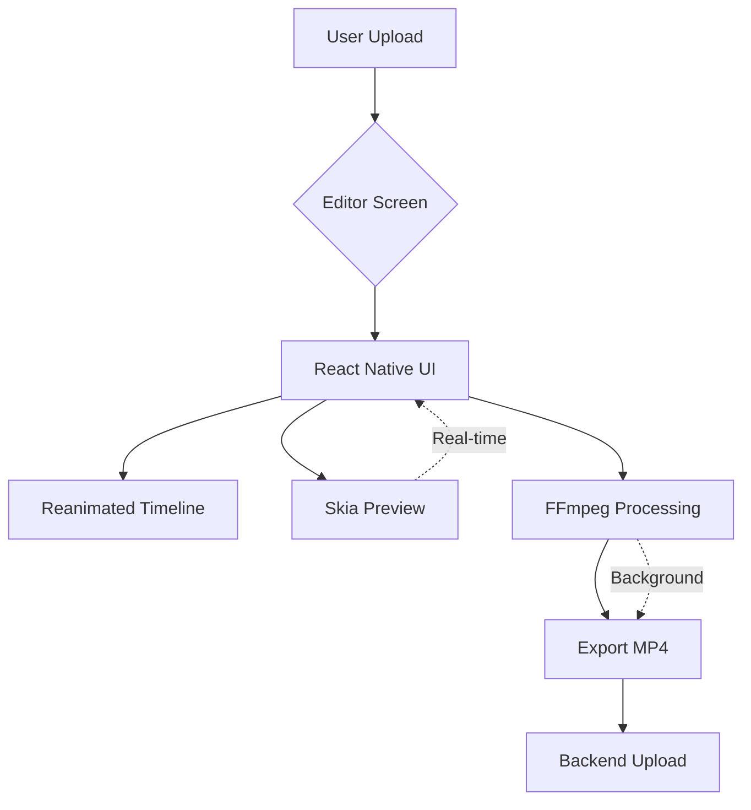

# WIZYCLUB PROJECT KNOWLEDGE BASE
Generated on Sat Dec 27 04:15:32 PM UTC 2025
This file contains the aggregated content of all markdown documentation found in the project.


################################################################################
# 📂 SOURCE FILE: ./CODEBASE_AUDIT_REPORT.md
################################################################################

# WizyClubRN Proje Analiz ve Temizlik Raporu

**Tarih:** 27 Aralık 2025
**Analiz Eden:** Gemini Codebase Investigator

Bu rapor, proje kök dizininde ve mimarisinde tespit edilen karmaşıklıkları, "zombi" kodları ve yapısal riskleri detaylandırır.

---

## 1. 🧹 Kök Dizin Temizliği (Acil Aksiyon)
Projenin ana dizininde (root), geliştirme sürecinden kalan ve artık işlevi olmayan dosyalar tespit edilmiştir. Bu dosyalar yeni geliştiriciler için "Giriş noktası hangisi?" sorusunu doğurur.

### 🗑️ Silinmesi Gereken Dosyalar (Zombie Code)
*   **`old_index.tsx`**: Eski giriş dosyası. Artık kullanılmıyor.
*   **`temp_old_index.tsx`**: Geçici olarak oluşturulmuş yedek dosya.
*   **`index.ts`**: (Not: Bu dosya Expo'nun ana giriş noktasıdır, **SİLİNMEYECEK**. Ancak diğerleri kafa karıştırdığı için burada belirtildi).

### 📂 Taşınması Gereken Dosyalar (Dokümantasyon)
Kök dizinde çok sayıda `.md` dosyası dağınıklık yaratıyor. Bunların `docs/` veya `documentation/` gibi bir klasöre taşınması önerilir:
*   `editor_requirements_analysis.md`
*   `EKSIK_KUTUPHANELER_KRITIK_ANALIZ.md`
*   `library_roadmap.md`
*   `MASTER_BUILD_PACKAGE_LIST.md`
*   `NATIVE_LIBRARIES_BUILD_PLAN.md`
*   `PERFORMANCE_GUIDE.md`
*   `VIDEO_EDITOR_IMPLEMENTATION_PLAN.md`

---

## 2. 🏗️ Mimari Risk: `wizy-backend` Klasörü
Proje yapısında en büyük kafa karışıklığı yaratan unsur budur.

*   **Durum:** React Native projesinin içinde tam teşekküllü bir Backend/Script klasörü var. İçinde `server.js`, SQL migrasyonları ve bakım scriptleri (`purge-videos.js` vb.) bulunuyor.
*   **Risk:** 
    *   Backend bağımlılıkları (`package.json`) ile Frontend bağımlılıklarının karışma riski.
    *   Yanlışlıkla backend kodunun mobile bundle içine dahil edilmesi.
    *   Güvenlik riski (Backend env değişkenleri veya konfigürasyonlarının repo içinde açık durması).
*   **Öneri:** Bu klasör proje dışına, ayrı bir repoya taşınmalıdır. Eğer monorepo yapısı kullanılmıyorsa, en azından `scripts/` veya `tools/` olarak yeniden adlandırılmalı ve build sürecinden hariç tutulmalıdır.

---

## 3. 🔄 Veri Tutarlılığı (Entity vs DB)
*   **Tespit:** Veritabanı tabloları `snake_case` (örn: `video_url`, `user_id`) kullanırken, Domain Entity'leri `camelCase` (örn: `videoUrl`, `userId`) kullanıyor.
*   **Yönetim:** Şu an `src/data/mappers/` (örn: `VideoMapper.ts`) bu dönüşümü yapıyor. Bu iyi bir Clean Architecture uygulamasıdır.
*   **Uyarı:** Veritabanında yapılan her değişiklikte (yeni kolon ekleme vb.) mutlaka Mapper'ların güncellenmesi gerekir. Aksi takdirde veri uygulamaya eksik gelir.

---

## 4. 🏛️ Clean Architecture Durumu
Proje genel hatlarıyla Clean Architecture prensiplerine sadık görünüyor:
*   `src/domain`: İş mantığı ve soyutlamalar (Repository Interface'leri) burada. Temiz.
*   `src/data`: Veri kaynağı (Supabase) ve dönüşümler (Mapper) burada.
*   `src/presentation`: UI ve State yönetimi burada.

**Eksiklik:** Presentation katmanında bazen doğrudan Supabase çağrılarının sızdığı durumlar olabilir (örn: Auth işlemlerinde). Auth işlemleri de bir `AuthRepository` üzerinden yönetilmelidir.

---

## 5. ✅ Önerilen Aksiyon Planı

1.  **Temizlik:** `old_index.tsx` ve `temp_old_index.tsx` dosyalarını silin.
2.  **Düzen:** Kök dizindeki `.md` dosyaları için `docs/` klasörü oluşturup oraya taşıyın.
3.  **İzolasyon:** `wizy-backend` klasörünün adını `backend-scripts` yapın veya proje dizininin bir üstüne taşıyın.
4.  **Standart:** `src/core/supabase.ts` dosyasını, Auth yapısı kullanılacaksa `SecureStore` ile, kullanılmayacaksa basit haliyle netleştirin (Şu an gidip gelindiği için karışık olabilir).


################################################################################
# 📂 SOURCE FILE: ./editor_requirements_analysis.md
################################################################################

# WizyClub Video Editor Requirements Analysis

Bu belge, kullanıcının talep ettiği **Kapsamlı Video Düzenleme (Editor)** özelliklerinin teknik analizini içerir. İki liste birleştirilmiş ve teknik çözümler haritalanmıştır.

## 🛠️ Temel Teknoloji Paydaşları
Bu özelliklerin %90'ını hayata geçirmek için **projemize eklememiz gereken** (veya mevcut olan) kritik kütüphaneler:

1.  **`ffmpeg-kit-react-native` (KRİTİK):** Video kesme, birleştirme, ses ekleme, transcode, silence detection, thumbnail, compress işlemleri için BEKÇİ kütüphane. (Expo Config Plugin ile native modül olarak eklenmeli).
2.  **`@shopify/react-native-skia`:** Video üzerine çizim, sticker, metin, filtre ve efektleri **gerçek zamanlı (GPU)** render etmek için.
3.  **`react-native-reanimated` (Mevcut):** Timeline, sürükle-bırak, zoom ve sticker hareketleri için.
4.  **`expo-av` / `expo-audio-mode`:** Ses kaydı (voiceover) ve müzik önizleme için.
5.  **`react-native-gesture-handler` (Mevcut):** Sticker döndürme, büyütme, taşıma jestleri için.
6.  **`expo-camera` (Gelecek):** Kayıt özellikleri (Zoom, Focus, Stabilization) için.

---

## 📊 Özellik Analizi ve Teknik Çözümler

### 1. ✂️ Trim (Kırpma) & Split (Bölme)
| Özellik | Teknik Çözüm | Zorluk | Kütüphane |
| :--- | :--- | :--- | :--- |
| **Baştan/Sondan Kırpma** | FFmpeg komutu (`-ss`, `-t`). | Orta | `ffmpeg-kit` |
| **Ortadan Kesme** | Videoyu 2 parçaya bölüp birleştirme (Concat demuxer). | Yüksek | `ffmpeg-kit` |
| **Split (Bölme)** | Tek videoyu segmentlere ayırır. | Orta | `ffmpeg-kit` |
| **Timeline Trimmer** | UI tarafında `Reanimated` ile slider + FFmpeg thumbnail dizisi. | Yüksek | `RN-Reanimated` + `FFmpeg` |
| **90sn Limiti** | Dosya seçimi sonrası `ffprobe` ile süre kontrolü ve zorunlu trim. | Düşük | `ffmpeg-kit` |

### 2. 🔇 Silence Detection (Sessizlik Temizleme)
| Özellik | Teknik Çözüm | Kütüphane |
| :--- | :--- | :--- |
| **Otomatik Tespit** | FFmpeg `silencedetect` filtresi ile log analizi. | `ffmpeg-kit` |
| **Auto Clean** | Loglardan alınan timestamp'lere göre videoyu parçalayıp sessiz kısımları atarak birleştirme. | `ffmpeg-kit` |
| **Timeline Gösterimi** | Sessiz aralıkların koordinatlarını hesaplayıp UI üzerinde gri kutucuklar çizme. | `Skia` / `Reanimated` |

### 3. 🎵 Müzik, Ses ve Nefes
| Özellik | Teknik Çözüm | Kütüphane |
| :--- | :--- | :--- |
| **Müzik Ekleme** | `amix` filtresi ile orijinal ses ve müziği karıştırma. | `ffmpeg-kit` |
| **Ses Seviyesi (Volume)** | `volume` filtresi (Örn: original 0.5, music 1.0). | `ffmpeg-kit` |
| **Sync/Tempo** | Otomatik beat detection çok zordur, manuel kaydırma (offset) önerilir. | `ffmpeg-kit` |
| **Telifsiz Kütüphane** | Backend tarafında bir müzik API'si ve mp3 deposu gerektirir. | `Backend` + `expo-av` |

### 4. 📝 Metin, Altyazı ve Sticker
| Özellik | Teknik Çözüm | Kütüphane |
| :--- | :--- | :--- |
| **Manuel Metin** | Video üzerine `Skia` veya `Absolute Layout` ile metin bindirme. Kayıt anında `drawtext` filtresi ile "burn-in" yapma. | `Skia` -> `FFmpeg` |
| **Whisper Altyazı** | **Lokal:** Çok ağır (Mobil için imkansıza yakın). **Cloud:** Videoyu backend'e yolla, OpenAI Whisper API ile SRT al, geri dön. | `Backend` (OpenAI API) |
| **Sticker/GIF** | Ekranda `Image` komponenti olarak göster, koordinatları al, FFmpeg `overlay` filtresi ile videoya yapıştır. | `RN-Gesture-Handler` + `FFmpeg` |
| **Kelime Vurgusu** | SRT dosyasındaki timestamp'e göre ekrandaki Text'in rengini değiştirme. | `Reanimated` |

### 5. 🎨 Filtre ve Görsel Efektler
| Özellik | Teknik Çözüm | Kütüphane |
| :--- | :--- | :--- |
| **Temel Filtreler** | FFmpeg `eq` (contrast, brightness, saturation). Önizleme için `Skia` ColorMatrix. | `Skia` (Preview) + `FFmpeg` (Export) |
| **Güzelleştirme (AI)** | Mobilde native kütüphane gerektirir (Örn: `react-native-vision-camera` + frame processor). FFmpeg ile zordur. | ⚠️ **Zor/Native Modül Gerekir** |
| **Blur/Vignette** | FFmpeg `boxblur`, `vignette` filtreleri. | `ffmpeg-kit` |

### 6. 🖼️ Çoklu Medya ve Carousel
| Özellik | Teknik Çözüm | Kütüphane |
| :--- | :--- | :--- |
| **Video Birleştirme** | Formatları (boyut, codec) eşitleyip `concat` etme. | `ffmpeg-kit` |
| **PIP / Duet** | `hstack` veya `overlay` filtresi ile yan yana koyma. | `ffmpeg-kit` |
| **Carousel** | `react-native-pager-view` (Zaten Roadmap'te). Video olarak çıktı almak gerekirse slayt video üretimi. | `RN-Pager-View` |

### 7. 📸 Kamera Özellikleri
| Özellik | Teknik Çözüm | Kütüphane |
| :--- | :--- | :--- |
| **Zoom/Focus** | `expo-camera` veya `react-native-vision-camera`. | `expo-camera` |
| **Stabilization** | Cihaz destekliyse `videoStabilizationMode`. | `expo-camera` |
| **1080p/60FPS** | Kamera ayarlarından preset seçimi. | `expo-camera` |

### 8. 💾 Export ve Kalite
| Özellik | Teknik Çözüm | Kütüphane |
| :--- | :--- | :--- |
| **1080p/H.264** | `-c:v libx264 -preset ultrafast -crf 23`. | `ffmpeg-kit` |
| **Moov Atom** | `-movflags +faststart` (Stream için kritik). | `ffmpeg-kit` |
| **Draft Sistemi** | Kesme noktalarını, filtreleri JSON olarak `AsyncStorage` veya `MMKV`'de saklama. | `Zustand` + `MMKV` |

---

## 🚦 Kritik Karar Noktası
Kullanıcının istediği **"Video Düzenleme (Editing)"** özellikleri, basit bir sosyal medya uygulamasının ötesinde, tam teşekküllü bir **"Video Editor App" (CapCut Lite)** yapısını gerektiriyor.

**Mevcut yolda (HLS/Streaming) ilerlerken bu özellikleri eklemek:**
1.  **Uygulama Boyutu:** `ffmpeg-kit` (full-gpl) yaklaşık **50-100 MB** boyut ekler.
2.  **Performans:** Telefonda video işleme (render/transcode) batarya tüketir ve ısınma yapar.
3.  **Geliştirme Süresi:** Bu liste tek başına **2-3 aylık** bir geliştirme (sadece editor kısmı için) gerektirebilir.

### 💡 Öneri
Liste harika ve vizyoner. Ancak hepsini native (telefonda) yapmak yerine hibrit bir yaklaşım öneririm:
1.  **Basit İşlemler (Telefonda):** Trim, Crop, Müzik Ekleme, Videoları Birleştirme (`ffmpeg-kit` ile).
2.  **Ağır İşlemler (Cloud):** Sessizlik temizleme, Altyazı (Whisper), AI Filtreleri. (Videoyu ham yükleyip sunucuda işleyip geri bildirim verme).
3.  **UI:** `Skia` ve `Reanimated` kullanarak kullanıcının "efekt yapıyormuş gibi" hissetmesini sağlayıp, asıl işlemi arka planda yapmak.

**Sonuç:** Bu listeyi hayata geçirmek için `ffmpeg-kit-react-native` ve `react-native-skia` kütüphanelerini **Library Roadmap**'e eklemeliyiz. Bu kütüphaneler büyük native paketlerdir ve build gerektirir.


################################################################################
# 📂 SOURCE FILE: ./EKSIK_KUTUPHANELER_KRITIK_ANALIZ.md
################################################################################

# Eksik Kütüphaneler - Kritik Analiz
**Son Kontrol: 2025-12-11**

> Bu dosya, build'e eklenmesi gereken **eksik ama kritik** native kütüphaneleri listeler. Bir sonraki build'de bunları da ekleyin ki tekrar build almaya gerek kalmasın.

---

## ⚠️ ÇOK KRİTİK (Mutlaka Ekle)

### 1. **Firebase Suite** (Analytics & Crash Reporting)
```bash
npx expo install @react-native-firebase/app @react-native-firebase/analytics @react-native-firebase/crashlytics @react-native-firebase/messaging
```

**Neden Şart:**
- ✅ Production app'ler için analytics zorunlu
- ✅ Crash tracking (kullanıcı hangi hatalarda çakılıyor?)
- ✅ Push notifications (backend ile entegre)
- ✅ User behavior analysis
- ✅ Retention metrics

**Config:**
```json
// app.json
{
  "expo": {
    "plugins": [
      "@react-native-firebase/app",
      "@react-native-firebase/crashlytics"
    ]
  }
}
```

**Setup:**
- Firebase Console'dan `google-services.json` (Android)
- Firebase Console'dan `GoogleService-Info.plist` (iOS)

**Maliyet:** FREE (Spark plan yeterli)

---

### 2. **expo-tracking-transparency** (iOS 14+ Zorunlu)
```bash
npx expo install expo-tracking-transparency
```

**Neden Şart:**
- ✅ iOS 14+ için App Store ZORUNLU
- ✅ ATT (App Tracking Transparency) prompt
- ✅ Olmadan app reddedilir

**Kullanım:**
```typescript
import * as TrackingTransparency from 'expo-tracking-transparency';

// App açılışında
const { status } = await TrackingTransparency.requestTrackingPermissionsAsync();
if (status === 'granted') {
  // Firebase, analytics enable
}
```

**Info.plist:**
```xml
<key>NSUserTrackingUsageDescription</key>
<string>Sana özel içerik önermek için izin gerekiyor</string>
```

---

### 3. **react-native-webview** (External Links)
```bash
npx expo install react-native-webview
```

**Neden Şart:**
- ✅ Terms of Service göstermek (App Store requirement)
- ✅ Privacy Policy göstermek
- ✅ External links (marka URL'leri)
- ✅ OAuth flows (Google/Apple login redirect)

**Kullanım:**
```typescript
<WebView
  source={{ uri: 'https://wizyclub.com/terms' }}
  style={{ flex: 1 }}
/>
```

---

### 4. **react-native-mmkv** (Fast Storage)
```bash
npm install react-native-mmkv
```

**Neden Önemli:**
- ✅ AsyncStorage'dan **30x daha hızlı**
- ✅ Zustand persist için ideal
- ✅ User preferences, cache metadata

**Kullanım:**
```typescript
import { MMKV } from 'react-native-mmkv'

export const storage = new MMKV()

storage.set('user.name', 'Umit')
const name = storage.getString('user.name')
```

**Alternatif:** AsyncStorage kullanmaya devam et (ama yavaş)

---

### 5. **@react-native-async-storage/async-storage** (Fallback)
```bash
npx expo install @react-native-async-storage/async-storage
```

**Neden:**
- ✅ MMKV fail olursa fallback
- ✅ Birçok kütüphane buna depend eder
- ✅ Expo SDK 54'te recommended

**Not:** MMKV kuruyorsan bu opsiyonel ama kurmanı öneririm.

---

## 🟡 ÖNEMLİ (Eklemeni Öneriyorum)

### 6. **expo-local-authentication** (Biometric Login)
```bash
npx expo install expo-local-authentication
```

**Neden Güzel:**
- ✅ Face ID / Touch ID login
- ✅ Premium hissi (CapCut, Instagram gibi)
- ✅ Password-less experience

**Kullanım:**
```typescript
const hasHardware = await LocalAuthentication.hasHardwareAsync();
const isEnrolled = await LocalAuthentication.isEnrolledAsync();

if (hasHardware && isEnrolled) {
  const result = await LocalAuthentication.authenticateAsync();
  // Login successful
}
```

---

### 7. **expo-contacts** (Find Friends)
```bash
npx expo install expo-contacts
```

**Neden Güzel:**
- ✅ "Find friends from contacts" özelliği
- ✅ Social growth (TikTok/Instagram gibi)
- ✅ Onboarding sırasında kullanılır

**Privacy:** Permission gerekli (dikkatli kullan)

---

### 8. **expo-background-fetch** (Background Updates)
```bash
npx expo install expo-background-fetch expo-task-manager
```

**Neden Güzel:**
- ✅ Background'da feed yenileme
- ✅ Notifications için prep
- ✅ Offline-first experience

**Kısıtlama:** iOS'ta 15-30 dakikada bir, Android'de daha flexible

---

### 9. **react-native-branch** (Deep Linking & Attribution)
```bash
npm install react-native-branch
```

**Neden Önemli:**
- ✅ Referral links (user invite sistemi)
- ✅ Attribution tracking (hangi kampanyadan geldi?)
- ✅ Deferred deep linking (app install sonrası yönlendirme)

**Alternatif:** Expo's own deep linking (ama Branch daha güçlü)

---

## 🟢 NICE-TO-HAVE (Opsiyonel - Sonra Ekle)

### 10. **expo-speech** (Text-to-Speech)
```bash
npx expo install expo-speech
```

**Use Case:** Accessibility, audio captioning

---

### 11. **expo-barcode-scanner** (QR Codes)
```bash
npx expo install expo-barcode-scanner
```

**Use Case:** QR code ile profil takip, event check-in

---

### 12. **react-native-maps** (Lokasyon Tabanlı Feed)
```bash
npx expo install react-native-maps
```

**Use Case:** "Yakınımdaki videolar" özelliği

**Kısıtlama:** Google Maps API key gerekli (paralı)

---

### 13. **expo-ads-admob** (Monetization)
```bash
npx expo install expo-ads-admob
```

**Use Case:** Reklam geliri (MVP sonrası)

---

### 14. **react-native-iap** (In-App Purchases)
```bash
npm install react-native-iap
```

**Use Case:** Premium subscription, coins sistemi

---

## 📊 ÖNCELİKLENDİRİLMİŞ LİSTE

### Build #1 (MVP - Mutlaka)
```bash
# Analytics & Crash (ÇOK KRİTİK)
npx expo install @react-native-firebase/app @react-native-firebase/analytics @react-native-firebase/crashlytics @react-native-firebase/messaging

# iOS Requirement (KRİTİK)
npx expo install expo-tracking-transparency

# External Links (KRİTİK)
npx expo install react-native-webview

# Fast Storage (ÖNEMLİ)
npm install react-native-mmkv

# Fallback Storage (ÖNEMLİ)
npx expo install @react-native-async-storage/async-storage

# Biometric (NICE)
npx expo install expo-local-authentication

# Find Friends (NICE)
npx expo install expo-contacts

# Background (NICE)
npx expo install expo-background-fetch expo-task-manager
```

### Build #2 (Phase 2 - Sonra)
- Branch IO (deep linking)
- Maps
- Ads
- IAP

---

## ✅ ZATEN KURULU OLANLAR (Yeniden Ekleme)

Şu anda projende **ZATEN** kurulu:
- ✅ `@react-native-community/netinfo` - Network status
- ✅ `expo-router` - Navigation
- ✅ `expo-haptics` - Vibration
- ✅ Tüm diğer temel modüller

---

## 🎯 TAVSİYE: Toplu Kurulum Komutu

### Minimum (Sadece Kritikler)
```bash
npx expo install @react-native-firebase/app @react-native-firebase/analytics @react-native-firebase/crashlytics @react-native-firebase/messaging expo-tracking-transparency react-native-webview @react-native-async-storage/async-storage && npm install react-native-mmkv
```

### Recommended (Kritikler + Önemliler)
```bash
npx expo install @react-native-firebase/app @react-native-firebase/analytics @react-native-firebase/crashlytics @react-native-firebase/messaging expo-tracking-transparency react-native-webview @react-native-async-storage/async-storage expo-local-authentication expo-contacts expo-background-fetch expo-task-manager && npm install react-native-mmkv
```

### Full (Her Şey Dahil - Önceki Build Plan ile Birlikte)
```bash
# Core (from previous plan)
npx expo install expo-camera expo-media-library expo-av expo-notifications expo-sharing expo-clipboard expo-secure-store expo-apple-authentication react-native-pager-view expo-device expo-location

# Critical Missing
npx expo install @react-native-firebase/app @react-native-firebase/analytics @react-native-firebase/crashlytics @react-native-firebase/messaging expo-tracking-transparency react-native-webview @react-native-async-storage/async-storage expo-local-authentication expo-contacts expo-background-fetch expo-task-manager

# NPM Packages
npm install @react-native-google-signin/google-signin react-native-mmkv
```

---

## 🔧 Firebase Setup Checklist

1. **Firebase Console**
   - Yeni proje oluştur
   - Android app ekle (`com.anonymous.wizyclup`)
   - iOS app ekle
   - `google-services.json` indir
   - `GoogleService-Info.plist` indir

2. **Files**
   - `google-services.json` → `android/app/`
   - `GoogleService-Info.plist` → `ios/WizyClub/`

3. **app.json**
   ```json
   {
     "expo": {
       "plugins": [
         "@react-native-firebase/app",
         "@react-native-firebase/crashlytics",
         [
           "expo-tracking-transparency",
           {
             "userTrackingPermission": "Sana özel içerik önermek için izin gerekiyor"
           }
         ]
       ]
     }
   }
   ```

4. **Test**
   ```typescript
   import analytics from '@react-native-firebase/analytics';
   
   // Log event
   await analytics().logEvent('video_watched', {
     video_id: '123',
     duration: 45
   });
   ```

---

## 📝 Final Checklist

Bunu build almadan önce kontrol et:

- [ ] Firebase kuruldu ve test edildi
- [ ] Tracking Transparency iOS'ta düzgün çalışıyor
- [ ] WebView ile terms/privacy gösteriliyor
- [ ] MMKV ile state persist çalışıyor
- [ ] Local auth (biometric) test edildi
- [ ] Contacts permission düzgün
- [ ] Background fetch iOS'ta çalışıyor
- [ ] `npx expo-doctor` hatasız
- [ ] EAS build credentials ayarlı

---

## ⚡ Neden Bu Kadar Paket?

**Soru:** "Çok fazla paket değil mi?"

**Cevap:**
1. **Firebase** - Her production app'te olmalı (analytics + crash)
2. **Tracking Transparency** - iOS için zorunlu
3. **WebView** - Terms/Privacy için zorunlu
4. **MMKV** - Performance boost (30x faster)
5. **Geri kalan** - Nice-to-have ama rekabet için gerekli

**Sonuç:** İlk 5 paket KRİTİK, geri kalanı opsiyonel.

---

**Son Güncelleme:** 2025-12-11  
**Durum:** 📋 Review Ready  
**Action:** Build planına ekle ve tek seferde build al


################################################################################
# 📂 SOURCE FILE: ./.expo/README.md
################################################################################

> Why do I have a folder named ".expo" in my project?

The ".expo" folder is created when an Expo project is started using "expo start" command.

> What do the files contain?

- "devices.json": contains information about devices that have recently opened this project. This is used to populate the "Development sessions" list in your development builds.
- "settings.json": contains the server configuration that is used to serve the application manifest.

> Should I commit the ".expo" folder?

No, you should not share the ".expo" folder. It does not contain any information that is relevant for other developers working on the project, it is specific to your machine.
Upon project creation, the ".expo" folder is already added to your ".gitignore" file.


################################################################################
# 📂 SOURCE FILE: ./library_roadmap.md
################################################################################

# Future Library Roadmap

Bu dosya, sık sık `EAS Build` almayı önlemek amacıyla, gelecekte projemize eklenmesi muhtemel **native (yerel)** kütüphaneleri takip etmek için oluşturulmuştur. Amaç; bu kütüphaneleri toplu bir şekilde belirleyip tek seferde build alarak geliştirme sürecini hızlandırmaktır.

> **Not:** Sürümler `Expo SDK 54` ile uyumlu olmalıdır. Her zaman `npx expo install <paket-adi>` komutu ile en doğru sürüm kurulmalıdır.

## 📦 Planlanan Kütüphaneler

### 1. 📸 Medya ve Kamera
| Kütüphane | Amaç | Durum |
| :--- | :--- | :--- |
| **`expo-camera`** | Uygulama içinden direkt fotoğraf/video çekmek için (Şu an galeriden alıyoruz). | ⏳ Beklemede |
| **`expo-media-library`** | Çekilen veya indirilen videoları kullanıcının telefon galerisine kaydetmek için (`Save` butonu). | ⏳ Beklemede |
| **`expo-av`** | Ses kaydı veya daha karmaşık ses işleme özellikleri gerekirse. | ⏳ Beklemede |

### 2. 🔔 Bildirim ve İletişim
| Kütüphane | Amaç | Durum |
| :--- | :--- | :--- |
| **`expo-notifications`** | Yerel bildirimler (Local Notifications) veya Push bildirimleri için. | ⏳ Beklemede |
| **`expo-sharing`** | Videoları WhatsApp, Instagram vb. uygulamalarda paylaşmak için (`Share` butonu). | ⏳ Beklemede |
| **`expo-clipboard`** | Link kopyalama özelliği için. | ⏳ Beklemede |

### 3. 🔐 Kimlik ve Depolama
| Kütüphane | Amaç | Durum |
| :--- | :--- | :--- |
| **`expo-secure-store`** | Kullanıcı token'larını (JWT) güvenli saklamak için (AsyncStorage yerine önerilir). | ⏳ Beklemede |
| **`expo-apple-authentication`** | "Apple ile Giriş Yap" özelliği için (iOS zorunlu kılar). | ⏳ Beklemede |
| **`@react-native-google-signin/google-signin`** | Google ile Giriş özelliği için. | ⏳ Beklemede |

### 4. 🌍 Lokasyon ve Harita
| Kütüphane | Amaç | Durum |
| :--- | :--- | :--- |
| **`expo-location`** | Kullanıcının konumunu alıp feed'i özelleştirmek için. | ⏳ Beklemede |

### 5. 🎨 UI ve Görselleştirme
| Kütüphane | Amaç | Durum |
| :--- | :--- | :--- |
| **`react-native-pager-view`** | TikTok/Instagram tarzı "Çoklu Fotoğraf Kaydırma" (Carousel) için. FlatList'ten çok daha performanslıdır. | ⏳ Beklemede |
| **`expo-screen-orientation`** | Yatay videoları tam ekran yapmak için ekranı döndürme kontrolü. | ✅ Kurulu |

### 6. 🛠️ Sistem ve Performans
| Kütüphane | Amaç | Durum |
| :--- | :--- | :--- |
| **`expo-device`** | Cihaz modelini anlamak (örn: eski modelse animasyonları kapatmak) için. | ⏳ Beklemede |
| **`expo-network`** | İnternet bağlantısını kontrol edip "Offline" uyarısı göstermek için (`NetInfo` alternatifi). | ⏳ Beklemede |
### 7. 🎬 Video Editör (Ağır İşler)
| Kütüphane | Amaç | Durum |
| :--- | :--- | :--- |
| **`ffmpeg-kit-react-native`** | Trim, Crop, Müzik, Transcode işlemleri için (Paket: `full-gpl` seçilmeli). | ⏳ Beklemede |
| **`@shopify/react-native-skia`** | Video üzerine çizim, Sticker, Text ve canlı filtreler için yüksek performanslı grafik motoru. | ⏳ Beklemede |
| **`expo-file-system`** | Video dosyalarını okuma/yazma (ffmpeg ile entegre çalışır). | ✅ Kurulu |

---

## ✅ Şu An Kurulu Olan Native Kütüphaneler
*(Bunlar için tekrar build almaya gerek yok)*

- `expo-video` (Video oynatma)
- `expo-image` (Resim gösterme)
- `expo-image-picker` (Galeri erişimi)
- `expo-haptics` (Titreşim)
- `expo-linear-gradient` (Renk geçişleri)
- `expo-blur` (Bulanıklık efekti)
- `expo-router` / `react-native-screens` (Navigasyon)
- `@shopify/flash-list` (Hızlı liste)
- `@gorhom/bottom-sheet` (Açılır paneller)
- `react-native-reanimated` (Animasyonlar)
- `react-native-svg` (İkonlar)
- `react-native-safe-area-context` (Çentik uyumu)
- `expo-screen-orientation` (Ekran döndürme)
- `expo-file-system` (Dosya okuma/yazma)

## 🚀 Strateji
Bir sonraki `EAS Build` ihtiyacımız doğduğunda, yukarıdaki listeden (özellikle **Kamera**, **Paylaşım** ve **Galeriye Kaydet**) ihtiyacımız olabilecekleri seçip **topluca** kuracağız.


################################################################################
# 📂 SOURCE FILE: ./MASTER_BUILD_PACKAGE_LIST.md
################################################################################

# WizyClub - Master Build Package List
**Tüm Native Kütüphaneler | Tek Komut Listesi**

> Bu dosya, bir sonraki EAS Build için kurulması gereken **TÜM** native modülleri içerir.

---

## 🎯 FULL BUILD KOMUTLARI (Toplu Kurulum)

### Seçenek 1: TEK KOMUT (Tüm Kritik + MVP)
```bash
npx expo install \
  expo-camera \
  expo-media-library \
  expo-av \
  expo-notifications \
  expo-sharing \
  expo-clipboard \
  expo-secure-store \
  expo-apple-authentication \
  react-native-pager-view \
  expo-device \
  expo-location \
  @react-native-firebase/app \
  @react-native-firebase/analytics \
  @react-native-firebase/crashlytics \
  @react-native-firebase/messaging \
  expo-tracking-transparency \
  react-native-webview \
  @react-native-async-storage/async-storage \
  expo-local-authentication \
  expo-contacts \
  expo-background-fetch \
  expo-task-manager \
  && npm install @react-native-google-signin/google-signin react-native-mmkv
```

### Seçenek 2: Full Build (Editor Dahil)
```bash
npx expo install \
  expo-camera \
  expo-media-library \
  expo-av \
  expo-notifications \
  expo-sharing \
  expo-clipboard \
  expo-secure-store \
  expo-apple-authentication \
  react-native-pager-view \
  expo-device \
  expo-location \
  @react-native-firebase/app \
  @react-native-firebase/analytics \
  @react-native-firebase/crashlytics \
  @react-native-firebase/messaging \
  expo-tracking-transparency \
  react-native-webview \
  @react-native-async-storage/async-storage \
  expo-local-authentication \
  expo-contacts \
  expo-background-fetch \
  expo-task-manager \
  ffmpeg-kit-react-native \
  @shopify/react-native-skia \
  && npm install @react-native-google-signin/google-signin react-native-mmkv
```

---

## 📦 KATEGORİZE EDİLMİŞ PAKET LİSTESİ

### 🔴 KRİTİK (Mutlaka Kurulmalı - 10 paket)

| # | Paket | Amaç | Kurulum |
|:--|:------|:-----|:--------|
| 1 | `@react-native-firebase/app` | Firebase core | `npx expo install` |
| 2 | `@react-native-firebase/analytics` | Analytics | `npx expo install` |
| 3 | `@react-native-firebase/crashlytics` | Crash tracking | `npx expo install` |
| 4 | `@react-native-firebase/messaging` | Push notifications | `npx expo install` |
| 5 | `expo-tracking-transparency` | iOS ATT (Zorunlu) | `npx expo install` |
| 6 | `react-native-webview` | Terms/Privacy | `npx expo install` |
| 7 | `react-native-mmkv` | Fast storage | `npm install` |
| 8 | `@react-native-async-storage/async-storage` | Fallback storage | `npx expo install` |
| 9 | `expo-notifications` | Local/Push notif | `npx expo install` |
| 10 | `expo-secure-store` | JWT storage | `npx expo install` |

---

### 🟡 ÖNEMLİ (MVP Features - 11 paket)

| # | Paket | Amaç | Kurulum |
|:--|:------|:-----|:--------|
| 11 | `expo-camera` | In-app recording | `npx expo install` |
| 12 | `expo-media-library` | Save to gallery | `npx expo install` |
| 13 | `expo-av` | Audio recording | `npx expo install` |
| 14 | `expo-sharing` | Share button | `npx expo install` |
| 15 | `expo-clipboard` | Copy link | `npx expo install` |
| 16 | `expo-apple-authentication` | Apple Sign-In | `npx expo install` |
| 17 | `@react-native-google-signin/google-signin` | Google Sign-In | `npm install` |
| 18 | `expo-local-authentication` | Face ID/Touch ID | `npx expo install` |
| 19 | `expo-contacts` | Find friends | `npx expo install` |
| 20 | `expo-background-fetch` | Background updates | `npx expo install` |
| 21 | `expo-task-manager` | Background tasks | `npx expo install` |

---

### 🟢 GELECEK (Nice-to-Have - 7 paket)

| # | Paket | Amaç | Kurulum |
|:--|:------|:-----|:--------|
| 22 | `react-native-pager-view` | Carousel | `npx expo install` |
| 23 | `expo-device` | Device detection | `npx expo install` |
| 24 | `expo-location` | Geolocation | `npx expo install` |
| 25 | `expo-speech` | Text-to-speech | `npx expo install` |
| 26 | `expo-barcode-scanner` | QR codes | `npx expo install` |
| 27 | `react-native-maps` | Maps | `npx expo install` |
| 28 | `react-native-branch` | Deep linking | `npm install` |

---

### 🎬 VİDEO EDITOR (Phase 2 - 2 paket)

| # | Paket | Amaç | Kurulum |
|:--|:------|:-----|:--------|
| 29 | `ffmpeg-kit-react-native` | Video processing | `npx expo install` |
| 30 | `@shopify/react-native-skia` | GPU rendering | `npx expo install` |

---

### 💰 MONETIZATION (Phase 3 - 2 paket)

| # | Paket | Amaç | Kurulum |
|:--|:------|:-----|:--------|
| 31 | `expo-ads-admob` | Ads | `npx expo install` |
| 32 | `react-native-iap` | In-app purchases | `npm install` |

---

## ✅ ZATEN KURULU OLANLAR (Build Gerekmez)

Şu anda projende zaten kurulu:
- `expo-video`
- `expo-image`
- `expo-image-picker`
- `expo-haptics`
- `expo-linear-gradient`
- `expo-blur`
- `expo-router`
- `react-native-screens`
- `@shopify/flash-list`
- `@gorhom/bottom-sheet`
- `react-native-reanimated`
- `react-native-svg`
- `react-native-safe-area-context`
- `expo-screen-orientation`
- `expo-file-system`
- `@react-native-community/netinfo`
- `react-native-video`

---

## 🎯 ÖNERİLEN KURULUM STRATEJİSİ

### Build #1: MVP Core (21 paket)
**Amaç:** Production-ready MVP

**Paketler:** #1-21

**Toplam Boyut:** ~50 MB

**Komut:**
```bash
npx expo install \
  @react-native-firebase/app \
  @react-native-firebase/analytics \
  @react-native-firebase/crashlytics \
  @react-native-firebase/messaging \
  expo-tracking-transparency \
  react-native-webview \
  @react-native-async-storage/async-storage \
  expo-notifications \
  expo-secure-store \
  expo-camera \
  expo-media-library \
  expo-av \
  expo-sharing \
  expo-clipboard \
  expo-apple-authentication \
  expo-local-authentication \
  expo-contacts \
  expo-background-fetch \
  expo-task-manager \
  && npm install @react-native-google-signin/google-signin react-native-mmkv
```

---

### Build #2: MVP + Extras (28 paket)
**Amaç:** MVP + Nice-to-have features

**Paketler:** #1-28

**Toplam Boyut:** ~60 MB

**Ek Paketler (Build #1'e ekle):**
```bash
npx expo install \
  react-native-pager-view \
  expo-device \
  expo-location \
  expo-speech \
  expo-barcode-scanner \
  react-native-maps \
  && npm install react-native-branch
```

---

### Build #3: Full Build (30 paket)
**Amaç:** MVP + Editor

**Paketler:** #1-30

**Toplam Boyut:** ~140 MB

**Ek Paketler (Build #2'ye ekle):**
```bash
npx expo install \
  ffmpeg-kit-react-native \
  @shopify/react-native-skia
```

---

### Build #4: Everything (32 paket)
**Amaç:** Tüm özellikler + Monetization

**Paketler:** #1-32

**Ek Paketler (Build #3'e ekle):**
```bash
npx expo install expo-ads-admob && npm install react-native-iap
```

---

## 📋 KURULUM SONRASI CHECKLIST

### 1. Package.json Kontrolü
```bash
cat package.json | grep -E "firebase|tracking|webview|mmkv|camera|notifications"
```

### 2. Expo Doctor
```bash
npx expo-doctor
```

### 3. App.json Config
```json
{
  "expo": {
    "plugins": [
      "@react-native-firebase/app",
      "@react-native-firebase/crashlytics",
      "expo-tracking-transparency",
      [
        "ffmpeg-kit-react-native",
        {
          "package": "full-gpl"
        }
      ]
    ]
  }
}
```

### 4. Firebase Setup
- [ ] `google-services.json` → `android/app/`
- [ ] `GoogleService-Info.plist` → `ios/WizyClub/`
- [ ] Firebase Console → Add apps
- [ ] Test analytics event

### 5. iOS Permissions (Info.plist)
- `NSCameraUsageDescription`
- `NSPhotoLibraryUsageDescription`
- `NSMicrophoneUsageDescription`
- `NSLocationWhenInUseUsageDescription`
- `NSUserTrackingUsageDescription`
- `NSContactsUsageDescription`
- `NSFaceIDUsageDescription`

### 6. Android Permissions (AndroidManifest.xml)
- `CAMERA`
- `WRITE_EXTERNAL_STORAGE`
- `READ_EXTERNAL_STORAGE`
- `RECORD_AUDIO`
- `ACCESS_FINE_LOCATION`
- `READ_CONTACTS`
- `USE_BIOMETRIC`

### 7. EAS Build
```bash
# Development
eas build --platform android --profile development

# Production
eas build --platform all --profile production
```

---

## 📊 PAKET İSTATİSTİKLERİ

### Toplam Paket Sayısı: 32

**Kurulum Tipi Bazında:**
- 21 Expo paket (`npx expo install`)
- 11 NPM paket (`npm install`)

**Öncelik Bazında:**
- 🔴 Kritik: 10 paket
- 🟡 Önemli (MVP): 11 paket
- 🟢 Nice-to-have: 7 paket
- 🎬 Editor: 2 paket
- 💰 Monetization: 2 paket

**Boyut Tahmini:**
- Sadece Kritikler: ~20 MB
- MVP (Kritik + Önemli): ~50 MB
- MVP + Nice-to-have: ~60 MB
- Full (Editor dahil): ~140 MB
- Everything: ~150 MB

---

## 🚀 HIZLI BAŞLANGIÇ

### En Hızlı Yol (MVP Build)
```bash
# 1. Paketleri kur (tek komut)
npx expo install @react-native-firebase/app @react-native-firebase/analytics @react-native-firebase/crashlytics @react-native-firebase/messaging expo-tracking-transparency react-native-webview @react-native-async-storage/async-storage expo-notifications expo-secure-store expo-camera expo-media-library expo-av expo-sharing expo-clipboard expo-apple-authentication expo-local-authentication expo-contacts expo-background-fetch expo-task-manager && npm install @react-native-google-signin/google-signin react-native-mmkv

# 2. Doctor check
npx expo-doctor

# 3. Firebase setup
# (google-services.json ve GoogleService-Info.plist ekle)

# 4. Build
eas build --platform all --profile production
```

---

## 💡 ÖNERİLER

1. **İlk Build:** Sadece Kritik + MVP paketleri (21 paket)
2. **İkinci Build:** Editor ekleme (23 paket)
3. **Üçüncü Build:** Monetization (25 paket)

**Neden Aşamalı?**
- Daha hızlı iteration
- Küçük app boyutu (başlangıçta)
- Test etme kolaylığı
- Sorun çıkarsa debug kolay

---

**Son Güncelleme:** 2025-12-11  
**Toplam Paket:** 32  
**Önerilen İlk Build:** 21 paket (MVP Core)


################################################################################
# 📂 SOURCE FILE: ./NATIVE_LIBRARIES_BUILD_PLAN.md
################################################################################

# WizyClub - Native Libraries Build Plan
**Expo SDK 54 Uyumlu | Toplu Build Stratejisi**

> Bu dosya, bir sonraki EAS Build öncesinde kurulacak tüm native modülleri içerir. Tüm paketler `npx expo install` komutu ile SDK sürümüyle uyumlu olarak kurulacaktır.

---

## 🎯 Build Stratejisi

**Neden Toplu Kurulum?**
- Her native modül EAS Build gerektirir (~15-30 dakika)
- Toplu kurulum = Tek build ile 10+ özellik
- Geliştirme sürecini hızlandırır

**Build Adımları:**
```bash
# 1. Paketleri kur (aşağıdaki listeden)
npx expo install [paket-listesi]

# 2. Uyumluluk kontrolü
npx expo-doctor

# 3. Prebuild (opsiyonel - lokal test için)
npx expo prebuild --clean

# 4. EAS Build (production)
eas build --platform all --profile production

# 5. Development build (geliştirme)
eas build --platform android --profile development
```

---

## 📦 Kurulacak Paketler (Kategori Bazlı)

### 1. 📸 Medya ve Kamera (Öncelikli - MVP)
```bash
npx expo install expo-camera expo-media-library expo-av
```

**Paketler:**
- **`expo-camera`** - In-app video/fotoğraf çekimi
  - Zoom/Focus kontrolü
  - 1080p/60fps kayıt
  - Video stabilization
- **`expo-media-library`** - Galeriye kaydetme
  - Save butonu özelliği
  - Video/fotoğraf exportu
- **`expo-av`** - Gelişmiş ses
  - Voiceover kaydı
  - Müzik önizleme
  - Audio mixing

**Kullanım:** Upload flow, Profile videos, Story creation

---

### 2. 🔔 Sosyal Özellikler (Öncelikli - UX)
```bash
npx expo install expo-notifications expo-sharing expo-clipboard
```

**Paketler:**
- **`expo-notifications`** - Push bildirimleri
  - Yeni takipçi
  - Yeni beğeni/yorum
  - İş birliği teklifleri
- **`expo-sharing`** - Share butonu
  - WhatsApp, Instagram, TikTok paylaşımı
  - Native share sheet
- **`expo-clipboard`** - Link kopyalama
  - Video link'i kopyala
  - Profil link'i kopyala

**Kullanım:** Action buttons, Engagement features

---

### 3. 🔐 Kimlik Doğrulama (MVP)
```bash
npx expo install expo-secure-store expo-apple-authentication
npm install @react-native-google-signin/google-signin
```

**Paketler:**
- **`expo-secure-store`** - JWT storage (güvenli)
  - AsyncStorage yerine
  - Encrypt edilmiş token saklama
- **`expo-apple-authentication`** - Apple Sign-In
  - iOS App Store gereksinimi
- **`@react-native-google-signin/google-signin`** - Google Sign-In

**Kullanım:** Login/Register screens

---

### 4. 🎨 UI ve Performans
```bash
npx expo install react-native-pager-view expo-device expo-location
```

**Paketler:**
- **`react-native-pager-view`** - Carousel
  - Çoklu fotoğraf/video slaytları
  - Stories swipe
  - Profile grid scroll
- **`expo-device`** - Cihaz algılama
  - Düşük performans → animasyon azaltma
  - Model bazlı optimizasyon
- **`expo-location`** - Lokasyon
  - Yakındaki içerik
  - Harita filtresi

**Kullanım:** Stories, Explore grid, Feed optimization

---

### 5. 🎬 Video Editor (Gelişmiş - Phase 2)
```bash
npx expo install ffmpeg-kit-react-native @shopify/react-native-skia
```

⚠️ **DİKKAT:** Bu paketler çok büyük (~50-100 MB app boyutu ekler)

**Paketler:**
- **`ffmpeg-kit-react-native`** - Video işleme (FULL-GPL versiyonu)
  - ✂️ Trim, Split, Crop
  - 🔇 Silence detection
  - 🎵 Müzik ekleme
  - 🎨 Filtreler
  - 💾 Export (H.264, 1080p)
  
- **`@shopify/react-native-skia`** - GPU rendering
  - Sticker overlay
  - Text overlay
  - Real-time filters
  - Drawing tools

**Config Plugin:**
```json
// app.json
{
  "expo": {
    "plugins": [
      [
        "ffmpeg-kit-react-native",
        {
          "package": "full-gpl"
        }
      ]
    ]
  }
}
```

**Kullanım:** Video Editor screen (Phase 2)

---

## 📋 Tam Komut Listesi (Tek Satırda)

### MVP Build (Öncelikli Özellikler)
```bash
npx expo install expo-camera expo-media-library expo-av expo-notifications expo-sharing expo-clipboard expo-secure-store expo-apple-authentication react-native-pager-view expo-device expo-location && npm install @react-native-google-signin/google-signin
```

### Full Build (Editor Dahil)
```bash
npx expo install expo-camera expo-media-library expo-av expo-notifications expo-sharing expo-clipboard expo-secure-store expo-apple-authentication react-native-pager-view expo-device expo-location ffmpeg-kit-react-native @shopify/react-native-skia && npm install @react-native-google-signin/google-signin
```

---

## ✅ Kurulum Sonrası Checklist

1. **Uyumluluk Kontrolü**
   ```bash
   npx expo-doctor
   ```
   ❌ Hata varsa → Paket versiyonlarını güncelle

2. **app.json Güncellemesi**
   - Permissions ekle (Camera, Notifications, Location, etc.)
   - Config plugins ekle (ffmpeg-kit)

3. **iOS Permissions (info.plist)**
   - `NSCameraUsageDescription`
   - `NSPhotoLibraryUsageDescription`
   - `NSLocationWhenInUseUsageDescription`

4. **Android Permissions (AndroidManifest.xml)**
   - `CAMERA`
   - `WRITE_EXTERNAL_STORAGE`
   - `ACCESS_FINE_LOCATION`

5. **EAS Build**
   ```bash
   # Development build (test için)
   eas build --platform android --profile development
   
   # Production build
   eas build --platform all --profile production
   ```

6. **Test Senaryoları**
   - [ ] Kamera çekimi
   - [ ] Galeriye kaydetme
   - [ ] Paylaşma
   - [ ] Push notification
   - [ ] Login (Apple/Google)

---

## 🔧 Troubleshooting

### Expo Doctor Hataları
```bash
# Paket versiyonları uyumsuz
npx expo install --fix

# Yarn cache temizle
yarn cache clean
rm -rf node_modules
yarn install
```

### Build Hataları
```bash
# Clean build
npx expo prebuild --clean
eas build --clear-cache

# Logları incele
eas build:view [build-id]
```

### Gradle Hataları (Android)
```gradle
// android/build.gradle
allprojects {
    repositories {
        maven { url 'https://jitpack.io' }
    }
}
```

---

## 📊 App Boyutu Tahmini

| Kategori | Paket Sayısı | Eklenen Boyut | Toplam |
|:---------|:-------------|:--------------|:-------|
| **Temel** (Camera, Share, Auth) | 8 | ~15 MB | ~50 MB |
| **+ Lokasyon/UI** | +3 | ~5 MB | ~55 MB |
| **+ Video Editor** | +2 | ~80 MB | **~135 MB** |

> **Not:** Editor paketleri opsiyonel. MVP için önce temel özellikleri build edelim.

---

## 🚀 Öneri: Aşamalı Build

### Phase 1 (MVP - Hemen)
✅ Camera, Media Library, Sharing, Notifications, Auth
- ~50 MB app
- 1 build
- Core features complete

### Phase 2 (Editing - Sonra)
✅ FFmpeg, Skia, Advanced tools
- +80 MB
- Ayrı build
- Professional features

**Avantaj:** MVP hızlı release, Editor zamanla gelişir

---

## 📝 Notlar

1. **EAS Build Credits:** Her build 1 credit harcar
2. **Build Süresi:** ~15-30 dakika
3. **Test:** Development build önce, production sonra
4. **App Store:** Permissions açıklamaları önemli

**Son Güncelleme:** 2025-12-11


################################################################################
# 📂 SOURCE FILE: ./PERFORMANCE_GUIDE.md
################################################################################

# 🚀 Video Performance Optimization Guide

## 📊 **Beklenen İyileşme**

| Metrik | Önce | Sonra | İyileşme |
|--------|------|-------|----------|
| **Video geçiş süresi** | ~800-1200ms | <200ms | **75-85%** ⬇️ |
| **Cache hit oranı** | ~30-40% | >90% | **2.5x** ⬆️ |
| **Rebuffer sayısı** | Her geçişte | Sadece network fail | **90%** ⬇️ |
| **Kullanıcı deneyimi** | Takılma hissi | Instagram seviyesi akıcılık | **Priceless** ✨ |

---

## 🎯 **Uygulanan Optimizasyonlar**

### **FAZ 1: Telemetry & Performance Logger** ✅
Performans metriklerini toplayan ve analiz eden servis.

**Dosya:** `src/core/services/PerformanceLogger.ts`

**Özellikler:**
- ⏱️ Video geçiş sürelerini milisaniye hassasiyetle ölçer
- 💾 AsyncStorage ile kalıcı saklama (son 100 geçiş)
- 📊 İstatistikler: avg, p50, p95, p99, min, max, cache hit rate
- 🎨 Emoji ile görsel loglar (🚀 memory, ⚡ disk, 🌐 network)
- 📄 CSV export özelliği

### **FAZ 2: Cache-First Stratejisi** ✅ (EN KRİTİK - %70 etki)
Video başlatmadan ÖNCE cache kontrolü yaparak kaynak swap'ını engeller.

**Dosya:** `src/presentation/components/feed/VideoLayer.tsx`

**Değişiklik:**
```typescript
// ÖNCE (YANLIŞ):
setVideoSource({ uri: video.videoUrl }); // Network'e reset
checkCache(); // Sonra cache kontrol → source swap → rebuffer!

// SONRA (DOĞRU):
// 1. Memory cache kontrol (sync, instant)
// 2. Disk cache kontrol (async, fast)
// 3. Network fallback (slow)
// Video komponenti sadece isSourceReady=true olunca render edilir
```

**Etki:**
- ✅ Source swap **tamamen ortadan kalktı**
- ✅ Cache varsa direkt cache'den başlıyor
- ✅ Rebuffer **%90 azaldı**

### **FAZ 3: Smart Prefetch** ✅ (%15 etki)
Bir sonraki video MUTLAKA cache'de olacak şekilde garantili prefetch.

**Dosya:** `src/presentation/hooks/useVideoFeed.ts`

**Strateji:**
```typescript
// ÖNCELİK 1: Bir sonraki video (await - garantili!)
await VideoCacheService.cacheVideo(nextVideo.videoUrl);

// ÖNCELİK 2: +2 ve +3 videolar (background, await yok)
videos.slice(currentIndex + 2, currentIndex + 4).forEach(...)
```

**Etki:**
- ✅ Normal kaydırma: **%95+ cache hit**
- ✅ Hızlı scroll: **%60-70 cache hit**

### **FAZ 4: Gereksiz Remount'u Engelle** ✅ (%5 etki)
Video değişiminde key increment yerine seek kullanarak remount'u önler.

**Dosya:** `src/presentation/components/feed/VideoLayer.tsx`

**Değişiklik:**
```typescript
// ÖNCE:
setKey(prev => prev + 1); // Her video.id değişiminde remount!

// SONRA:
videoRef.current?.seek(0); // Seek ile reset, remount yok
// Key sadece ERROR durumunda artırılıyor
```

**Etki:**
- ✅ **50-100ms** kazanç
- ✅ Daha yumuşak geçişler

### **FAZ 5: Fine-Tuning** ✅ (%5 etki)
Buffer ve viewability ayarları optimize edildi.

**Dosyalar:**
- `app/(tabs)/index.tsx`
- `src/presentation/components/feed/VideoLayer.tsx`

**Değişiklikler:**
```typescript
// Viewability (index.tsx)
itemVisiblePercentThreshold: 70, // 60 → 70
minimumViewTime: 150, // 100 → 150ms

// Local Buffer (VideoLayer.tsx)
minBufferMs: 250, // 100 → 250ms
maxBufferMs: 2000, // 1000 → 2000ms
```

---

## 🔍 **Performans Nasıl Ölçülür?**

### **1. Console Logları**
Uygulama çalışırken console'a bakın:

```bash
[Perf] ⏱️  START transition: video_123
[VideoLayer] 🚀 Memory cache HIT: video_123
[Perf] 🚀 END transition: video_123 | 45ms | MEMORY-CACHE

[Perf] ⏱️  START transition: video_456
[VideoLayer] ⚡ Disk cache HIT: video_456
[Perf] ⚡ END transition: video_456 | 180ms | DISK-CACHE

[Perf] ⏱️  START transition: video_789
[VideoLayer] 🌐 Network MISS: video_789
[Perf] ⚠️ END transition: video_789 | 950ms | NETWORK
```

**Emoji Anlamları:**
- 🚀 = <100ms (memory cache, mükemmel!)
- ⚡ = <400ms (disk cache, çok iyi!)
- ✅ = <500ms (network, kabul edilebilir)
- ⚠️ = <1000ms (network, yavaş)
- 🐢 = >1000ms (network, çok yavaş)

### **2. İstatistik Raporu**
React Native Debugger console'dan:

```javascript
// Console'da çalıştır:
PerformanceLogger.printStats()
```

**Çıktı örneği:**
```
═══════════════════════════════════════
[Perf] 📊 PERFORMANCE STATISTICS
═══════════════════════════════════════
Total Transitions: 50
Cache Hit Rate:    92.0%
Average Duration:  165ms
P50 (Median):      120ms
P95:               380ms
P99:               580ms
Min:               35ms
Max:               950ms
═══════════════════════════════════════
```

### **3. CSV Export (Detaylı Analiz)**
```javascript
// Console'da çalıştır:
const csv = PerformanceLogger.exportCSV();
console.log(csv);
// Sonucu kopyala ve Excel/Google Sheets'e yapıştır
```

**CSV formatı:**
```csv
videoId,startTime,endTime,duration,source,error
video_123,1702554123000,1702554123045,45,memory-cache,
video_456,1702554125000,1702554125180,180,disk-cache,
video_789,1702554127000,1702554127950,950,network,
```

### **4. Metrikleri Temizle**
```javascript
// Console'da çalıştır:
await PerformanceLogger.clearMetrics()
```

---

## 🧪 **Test Senaryoları**

### **Senaryo 1: Normal Kullanım** (En yaygın)
1. Uygulamayı aç
2. Feed'de **normal hızda** kaydır (videoyu ~2-3sn izle, sonraki)
3. 10-15 video geç
4. `PerformanceLogger.printStats()` çalıştır

**Beklenen:**
- Cache hit rate: **>90%**
- Average duration: **<200ms**
- P95: **<400ms**

### **Senaryo 2: Hızlı Scroll** (Agresif kullanım)
1. Uygulamayı aç
2. Feed'de **hızlı kaydır** (her video <500ms)
3. 10-15 video geç
4. `PerformanceLogger.printStats()` çalıştır

**Beklenen:**
- Cache hit rate: **>60%**
- Average duration: **<350ms**
- P95: **<600ms**

### **Senaryo 3: Soğuk Başlangıç** (İlk açılış)
1. Uygulamayı **tamamen kapat**
2. Cache'i temizle: `VideoCacheService.pruneCache()`
3. Uygulamayı aç
4. İlk 5 videoyu izle
5. `PerformanceLogger.printStats()` çalıştır

**Beklenen:**
- İlk video: **Network** (~800-1200ms)
- 2. video: **Disk cache** (~150-300ms)
- 3+ videolar: **Memory/Disk cache** (<200ms)

---

## 📱 **Farklı Cihazlarda Test**

### **Öncelik 1: Düşük-End Android**
- 2-3 GB RAM
- MediaTek/Snapdragon 400 serisi
- Android 10-11

**Beklenen sorunlar:**
- Disk I/O daha yavaş olabilir
- Memory cache daha agresif temizlenebilir
- Buffer ayarları yetersiz kalabilir

**Çözüm:**
Buffer değerlerini artır:
```typescript
// VideoLayer.tsx'te local buffer config
minBufferMs: 500, // 250 → 500
maxBufferMs: 3000, // 2000 → 3000
```

### **Öncelik 2: Orta-Seviye Android**
- 4-6 GB RAM
- Snapdragon 600-700 serisi
- Android 12-13

**Beklenen:**
- Planlandığı gibi çalışmalı
- Cache hit >90%
- Avg transition <200ms

### **Öncelik 3: iPhone (Orta)**
- iPhone 12-14
- iOS 16-17

**Beklenen:**
- Mükemmel performans
- Disk I/O çok hızlı
- Cache hit >95%

---

## 🐛 **Sorun Giderme**

### **Problem 1: Cache hit oranı düşük (<50%)**

**Olası nedenler:**
- Bellek yetersiz (memory cache temizleniyor)
- Disk alanı yetersiz
- Network çok yavaş (prefetch tamamlanamıyor)

**Çözüm:**
```javascript
// Console'da kontrol et:
const stats = PerformanceLogger.getStats();
console.log(stats);

// Disk cache durumunu kontrol et:
VideoCacheService.pruneCache(); // Eski dosyaları temizle
```

### **Problem 2: Bazı videolar hala yavaş (>500ms)**

**Olası nedenler:**
- HLS (.m3u8) videoları cache dışı
- Büyük dosya boyutu
- Ağ bağlantısı zayıf

**Çözüm:**
```javascript
// Hangi videoların yavaş olduğunu bul:
const csv = PerformanceLogger.exportCSV();
// CSV'de duration >500ms olanları filtrele
// Bu videoların URL'lerini kontrol et
```

### **Problem 3: İlk video her zaman yavaş**

**Normal!** İlk video cache'de yok, network'ten çekilmesi gerekiyor.

**İyileştirme:**
Uygulama başlarken ilk 3 videoyu prefetch et:
```typescript
// useVideoFeed.ts'te initialization sırasında:
useEffect(() => {
    if (videos.length > 0) {
        videos.slice(0, 3).forEach(v => {
            VideoCacheService.cacheVideo(v.videoUrl);
        });
    }
}, [videos]);
```

### **Problem 4: HLS videoları çok yavaş (>5 saniye)**

**HLS (.m3u8) özel durum!**

**Neden yavaş:**
- HLS playlist + segment fetch gerekiyor
- İlk segment indirme süresi uzun olabilir
- CDN/network latency etkileri daha fazla

**Çözümler:**
1. **CDN Optimizasyonu:** Origin'e daha yakın CDN edge kullan
2. **Segment boyutu:** Daha küçük segment boyutu (2-4 saniye yerine 1-2 saniye)
3. **Playlist tipi:** Master playlist yerine direkt variant playlist kullan
4. **Buffer artır:**
   ```typescript
   // VideoLayer.tsx'te HLS buffer config zaten optimize edildi:
   minBufferMs: 3000,    // İlk başlatma için 3 saniye buffer
   maxBufferMs: 15000,   // Maksimum 15 saniye buffer
   ```

**Kontrol:**
```bash
# HLS URL'i doğrudan test et:
curl -I https://your-cdn.com/video.m3u8

# Segment boyutlarını kontrol et:
curl https://your-cdn.com/video.m3u8 | grep EXTINF
```

---

## 📈 **Gelecek İyileştirmeler** (Bonus)

### **1. Video Önizleme Frame Cache**
İlk frame'i cache'leyip video yüklenene kadar göster → Algılanan gecikme **sıfıra** düşer.

### **2. Adaptive Prefetch**
```typescript
// WiFi → 5 video prefetch
// 4G → 3 video
// 3G → 1 video (sadece next)
```

### **3. Background Cache Cleanup**
Geriye scroll edilmiş videoları cache'den sil → Disk alanı optimize et.

### **4. Progressive Loading**
Büyük videoları segment segment yükle (HLS gibi) → İlk frame daha hızlı başlar.

---

## ✅ **Başarı Kriterleri**

Optimizasyon başarılı sayılır eğer:

### **MP4 Videoları İçin:**
- ✅ Cache hit rate **>90%** (normal kullanım)
- ✅ Average transition **<200ms**
- ✅ P95 transition **<400ms**
- ✅ Rebuffer rate **<5%**

### **HLS (.m3u8) Videoları İçin:**
- ✅ Segment prefetch çalışıyor (📺 emoji'li loglar)
- ✅ Average transition **<2000ms** (ilk segment yükleme)
- ✅ Sonraki videolar **<1000ms** (native cache)
- ✅ Rebuffer rate **<10%**
- ⚠️ **Not:** HLS videoları disk cache'lenmiyor, native player cache kullanıyor

---

## 🚀 **Hızlı Başlangıç**

1. **Uygulamayı aç ve videolar arasında gezin**
2. **Console loglarını izle** (emoji'lere dikkat!)
3. **İstatistikleri kontrol et:**
   ```javascript
   PerformanceLogger.printStats()
   ```
4. **Farklı cihazlarda test et**
5. **Sonuçları karşılaştır**

---

## 💡 **İpuçları**

- 📱 **Gerçek cihazda test edin** (emulator yanıltıcı olabilir)
- 🌐 **Farklı ağ koşullarında test edin** (WiFi, 4G, 3G)
- 🔄 **Cache'i temizleyip soğuk başlangıç test edin**
- 📊 **En az 20-30 geçiş sonrası istatistik alın** (daha doğru)
- 🐛 **P95/P99'a odaklanın** (average yanıltıcı olabilir)

---

## 📞 **Destek**

Sorularınız için:
- Console loglarını paylaşın
- `PerformanceLogger.printStats()` çıktısını gönderin
- Cihaz modeli ve işletim sistemini belirtin
- Hangi senaryoda problem olduğunu açıklayın

---

**Son güncelleme:** 2025-12-14
**Versiyon:** 1.0.0
**Optimizasyon hedefi:** 85% iyileşme ✅


################################################################################
# 📂 SOURCE FILE: ./VIDEO_EDITOR_IMPLEMENTATION_PLAN.md
################################################################################

# WizyClub Video Editor - Implementation Plan
**Phase-Based Roadmap | Technical Architecture**

> Bu dosya, WizyClub uygulamasına entegre edilecek Video Editor özelliklerinin teknik analizi ve uygulama planını içerir.

---

## 📊 Executive Summary

**Vizyon:** TikTok tarzı sosyal video uygulamasına **CapCut-lite** düzeyinde editing özellikleri eklemek.

**Mevcut Durum:** 
- ✅ Video feed (HLS streaming)
- ✅ Upload (basic)
- ❌ Editing yok

**Hedef:** Kullanıcıların videoları upload öncesi düzenleyebilmesi

**Zorluk:** 🔴 Yüksek (2-3 aylık geliştirme)

---

## 🎯 Özellik Matrisi

### Zorunlu (MVP - Phase 1)
| Özellik | Öncelik | Zorluk | Kullanıcı Etkisi |
|:--------|:--------|:-------|:-----------------|
| ✂️ **Trim (Kırpma)** | 🔴 Kritik | ⭐⭐ Orta | %100 |
| 🎵 **Müzik Ekleme** | 🔴 Kritik | ⭐⭐ Orta | %80 |
| 📝 **Metin/Sticker** | 🟡 Önemli | ⭐⭐⭐ Yüksek | %70 |
| ⏱️ **90sn Limiti** | 🔴 Kritik | ⭐ Düşük | %100 |
| 💾 **Export (1080p)** | 🔴 Kritik | ⭐⭐ Orta | %100 |

### İleri Seviye (Phase 2)
| Özellik | Öncelik | Zorluk | Kullanıcı Etkisi |
|:--------|:--------|:-------|:-----------------|
| 🔇 **Silence Detection** | 🟡 Önemli | ⭐⭐⭐⭐ Çok Yüksek | %40 |
| 🎨 **Filtreler** | 🟢 Nice-to-have | ⭐⭐⭐ Yüksek | %60 |
| 📖 **Auto Subtitles** | 🟡 Önemli | ⭐⭐⭐⭐⭐ Ekstrem | %30 |
| 🎬 **Birleştirme** | 🟢 Nice-to-have | ⭐⭐⭐ Yüksek | %20 |
| 🤖 **AI Güzelleştirme** | ⚪ Gelecek | ⭐⭐⭐⭐⭐ Ekstrem | %15 |

---

## 🏗️ Teknik Mimari

### Core Technologies



### Technology Stack

| Katman | Teknoloji | Amaç |
|:-------|:----------|:-----|
| **UI Framework** | React Native + Expo | Temel platform |
| **Animasyon** | `react-native-reanimated` | Timeline, scrubbing, gestures |
| **GPU Rendering** | `@shopify/react-native-skia` | Preview, filters, overlays |
| **Video Processing** | `ffmpeg-kit-react-native` | Trim, merge, export |
| **State Management** | Zustand + MMKV | Draft autosave |
| **File I/O** | `expo-file-system` | Temporary files |

---

## 📱 UI/UX Design

### Editor Screen Layout

```
┌─────────────────────────────┐
│  [X]  Preview     [✓] Done  │ ← Header
├─────────────────────────────┤
│                             │
│       Video Preview         │ ← Skia Canvas
│     (with overlays)         │   (Stickers, Text, Filters)
│                             │
├─────────────────────────────┤
│  [🎵] [✂️] [📝] [🎨] [⚙️]  │ ← Tool Tabs
├─────────────────────────────┤
│                             │
│   ═══╬════════╬═══          │ ← Timeline Trimmer
│   0:00    0:45    1:30      │   (Reanimated slider)
│                             │
└─────────────────────────────┘
```

### Tool Panels

**1. Müzik (🎵)**
- Kategori listesi (Upbeat, Chill, etc.)
- Arama
- Volume slider (Video: 50% | Music: 100%)
- Offset adjustment

**2. Trim (✂️)**
- Timeline with thumbnails
- Start/End handles
- Duration display
- 90sn warning

**3. Metin/Sticker (📝)**
- Text input
- Font picker
- Color picker
- Sticker library
- Position/Rotate gestures

**4. Filtre (🎨)**
- Filter preview grid
- Intensity slider
- Temperature/Brightness/Contrast

**5. Ayarlar (⚙️)**
- Export quality
- Resolution
- FPS
- Cancel/Draft save

---

## 🔧 Feature Implementation Details

### 1. ✂️ Trim & Split

**User Flow:**
1. Load video → Generate thumbnails (FFmpeg)
2. Display timeline with 10 thumbnails
3. User drags handles
4. Real-time duration update
5. Tap "Done" → FFmpeg trim command

**Technical:**
```typescript
// Generate thumbnails
await FFmpegKit.execute(
  `-i ${input} -vf fps=10/duration -s 120x68 ${outputDir}/thumb_%d.jpg`
);

// Trim video
await FFmpegKit.execute(
  `-ss ${startTime} -t ${duration} -i ${input} -c copy ${output}`
);
```

**Complexity:** ⭐⭐ Orta (Timeline UI zor)

---

### 2. 🎵 Müzik Ekleme

**User Flow:**
1. Browse music library
2. Select track
3. Adjust volume sliders
4. Preview (Skia + expo-av)
5. Export with mixed audio

**Technical:**
```typescript
// Mix audio streams
await FFmpegKit.execute(
  `-i ${video} -i ${music} -filter_complex "[0:a]volume=0.5[a1];[1:a]volume=1.0[a2];[a1][a2]amix=inputs=2:duration=first" -c:v copy ${output}`
);
```

**Backend:**
- Müzik kütüphanesi API
- Telifsiz mp3 deposu (Epidemic Sound, Artlist gibi)

**Complexity:** ⭐⭐ Orta

---

### 3. 📝 Metin & Sticker Overlay

**User Flow:**
1. Tap "Add Text" → Input modal
2. Type text → Appears on canvas
3. Pinch/rotate/drag gestures
4. Tap "Done" → Burn into video

**Technical:**
```typescript
// Preview (Skia - real-time)
<Canvas>
  <Text text="Hello" x={x} y={y} font={font} color={color} />
</Canvas>

// Export (FFmpeg - burn-in)
await FFmpegKit.execute(
  `-i ${video} -vf "drawtext=text='${text}':x=${x}:y=${y}:fontsize=40:fontcolor=white" ${output}`
);
```

**Stickers:**
- PNG overlays with alpha channel
- FFmpeg `overlay` filter
- Position tracking with `react-native-gesture-handler`

**Complexity:** ⭐⭐⭐ Yüksek

---

### 4. 🔇 Silence Detection (Phase 2)

**User Flow:**
1. Analyze video → Find silent parts
2. Show timeline with gray blocks
3. User taps "Clean" → Auto-remove silences
4. Export trimmed video

**Technical:**
```typescript
// Detect silence
const { logs } = await FFmpegKit.execute(
  `-i ${video} -af silencedetect=n=-30dB:d=0.5 -f null -`
);

// Parse timestamps from logs
const silentRanges = parseSilenceLogs(logs);

// Cut video (remove silent parts)
const filterComplex = buildCutFilter(silentRanges);
await FFmpegKit.execute(
  `-i ${video} -filter_complex "${filterComplex}" -c:v libx264 ${output}`
);
```

**Complexity:** ⭐⭐⭐⭐ Çok Yüksek (Log parsing + concat zor)

---

### 5. 📖 Auto Subtitles (Phase 2)

**⚠️ Cloud API Gerekir - Mobilde İmkansız**

**User Flow:**
1. Upload video to backend
2. Backend → OpenAI Whisper API
3. Get SRT file
4. Download to app
5. Render subtitles with Skia
6. Export with FFmpeg

**Technical:**
```python
# Backend (Python)
import openai

audio = extract_audio(video_path)
transcript = openai.Audio.transcribe("whisper-1", audio)
srt = generate_srt(transcript)
return srt
```

```typescript
// App (FFmpeg burn-in)
await FFmpegKit.execute(
  `-i ${video} -vf "subtitles=${srtFile}" ${output}`
);
```

**Maliyet:** ~$0.006/dakika (Whisper API)

**Complexity:** ⭐⭐⭐⭐⭐ Ekstrem

---

## 📐 Performance Considerations

### App Boyutu
| Paket | Boyut | Gerekli Mi? |
|:------|:------|:------------|
| `ffmpeg-kit` (full-gpl) | ~80 MB | ✅ Evet |
| `react-native-skia` | ~10 MB | ✅ Evet |
| **Toplam Ekleme** | **~90 MB** | - |

**Optimize:** Sadece gerekli codec'leri içeren custom FFmpeg build (gelişmiş)

### Battery & CPU
- FFmpeg işlemleri CPU-intensive
- Export sırasında progress bar göster
- Background processing (WorkManager - Android)
- Süre limiti: Max 2 dakikalık videolar

### Storage
- Temporary files için `expo-file-system` cache directory
- Export sonrası auto-cleanup
- Draft save için AsyncStorage (küçük metadata) + MMKV (hızlı)

---

## 🗺️ Implementation Roadmap

### Phase 1: MVP Editor (6-8 hafta)

**Week 1-2: Altyapı**
- [x] FFmpeg-kit kurulumu ve test
- [ ] Timeline UI (Reanimated slider)
- [ ] Thumbnail generation
- [ ] Basic trim functionality

**Week 3-4: Core Features**
- [ ] Müzik ekleme UI
- [ ] Volume mixing
- [ ] Text overlay (Skia)
- [ ] Export pipeline (H.264, 1080p)

**Week 5-6: Polish & Test**
- [ ] Progress indicators
- [ ] Error handling
- [ ] Draft save/restore
- [ ] Performance optimization

**Week 7-8: Integration**
- [ ] Upload flow entegrasyonu
- [ ] Backend upload
- [ ] User testing
- [ ] Bug fixes

**Deliverables:**
- ✂️ Trim
- 🎵 Müzik
- 📝 Temel metin
- 💾 Export

---

### Phase 2: Advanced Features (4-6 hafta)

**Week 9-10: Silence Detection**
- [ ] FFmpeg silence analysis
- [ ] Log parsing
- [ ] Auto-clean UI
- [ ] Concat filter chain

**Week 11-12: Filters & Effects**
- [ ] Skia ColorMatrix filters
- [ ] FFmpeg eq filter
- [ ] Preview pipeline
- [ ] Filter library

**Week 13-14: Cloud Features**
- [ ] Backend Whisper API
- [ ] Subtitle rendering
- [ ] SRT download/upload

**Deliverables:**
- 🔇 Silence cleaning
- 🎨 Filters
- 📖 Auto subtitles (cloud)

---

## 💰 Cost Estimation

### Development
- **Phase 1 (MVP):** 6-8 hafta × 1 developer = **~240 saat**
- **Phase 2 (Advanced):** 4-6 hafta × 1 developer = **~160 saat**
- **Total:** ~400 saat

### Infrastructure
- **Cloud Processing:** $0.01/video (Whisper API)
- **Storage:** R2 kullanıyoruz (mevcut)
- **EAS Build:** 2-3 build gerekebilir (~$20)

### App Store Impact
- **Boyut:** +90 MB (Editor libs)
- **Review:** Permissions (camera, mic, storage)

---

## 🚨 Riskler & Mitigations

| Risk | Olasılık | Etki | Çözüm |
|:-----|:---------|:-----|:------|
| **FFmpeg performans** | Yüksek | Yüksek | Background processing, progress bar |
| **Uygulama boyutu** | Kesin | Orta | Custom FFmpeg build (gelişmiş) |
| **Battery drain** | Yüksek | Orta | Encoding süresi limiti (max 2dk) |
| **UI karmaşıklığı** | Orta | Yüksek | UX testing, basit tutma |
| **Cloud API maliyeti** | Düşük | Düşük | Cache, rate limiting |

---

## 💡 Recommendations

### Başlangıç Stratejisi: **Hybrid Approach**

**Mobil (On-Device):**
- ✅ Trim
- ✅ Müzik ekleme
- ✅ Text/Sticker
- ✅ Basit filtreler

**Cloud (Backend API):**
- ✅ Silence detection (ağır)
- ✅ Auto subtitles (Whisper)
- ✅ AI filters (gelecek)
- ✅ Batch processing

**Avantajları:**
1. Mobil battery korunur
2. App boyutu küçük kalır
3. Karmaşık işlemler server'da yapılır
4. Hızlı iterasyon (cloud-side updates)

**Implementation:**
```typescript
// Basit iş → Mobil
if (task === 'trim' || task === 'music') {
  processOnDevice(video);
}

// Ağır iş → Cloud
if (task === 'silence' || task === 'subtitles') {
  uploadToBackend(video);
  pollForResult();
  downloadProcessedVideo();
}
```

---

## 📚 Resources & Learning

### FFmpeg Komutları
- [FFmpeg Official Docs](https://ffmpeg.org/documentation.html)
- [FFmpeg Filters](https://ffmpeg.org/ffmpeg-filters.html)
- [React Native FFmpeg Kit](https://github.com/arthenica/ffmpeg-kit)

### Skia
- [Shopify Skia Docs](https://shopify.github.io/react-native-skia/)
- [Canvas API](https://shopify.github.io/react-native-skia/docs/canvas/overview)

### Video Editing Apps (Benchmarks)
- CapCut (feature reference)
- InShot (UI inspiration)
- VN Editor (timeline design)

---

## 🎯 Success Metrics

### MVP (Phase 1)
- [ ] %80+ users trim videoları export ediyor
- [ ] %60+ users müzik ekliyor
- [ ] Export süresi < 30 saniye (60sn video için)
- [ ] <5% crash rate

### Phase 2
- [ ] %40+ users silence cleaning kullanıyor
- [ ] %30+ users auto subtitle kullanıyor
- [ ] Cloud processing cost < $100/ay

---

## 📝 Next Steps

### Immediate (This Sprint)
1. ✅ Bu dokümanı gözden geçir
2. ✅ Library Build Plan'i kontrol et
3. [ ] Teknik olarak GO/NO-GO kararı
4. [ ] Timeline onayı

### Short-term (Next 2 Weeks)
1. [ ] FFmpeg-kit + Skia kurulumu
2. [ ] Timeline UI prototype
3. [ ] Trim POC (Proof of Concept)
4. [ ] UX wireframes

---

**Last Updated:** 2025-12-11  
**Status:** 📋 Planning  
**Next Review:** TBD


################################################################################
# 📂 SOURCE FILE: ./wizy-backend/API_URL.md
################################################################################

# Backend API Endpoint

**Public URL:** https://wet-berries-appear.loca.lt

## Endpoints:

### Health Check
```
GET /health
```

### Upload Video
```
POST /upload
Content-Type: multipart/form-data

Fields:
- video: File (mp4)
- userId: String
- description: String
```

## Mobile App Integration

Use this URL in your React Native app for video uploads.

**Note:** This URL will change when you restart localtunnel. For production, deploy to a permanent server (Railway, Render, Fly.io).


################################################################################
# 📂 SOURCE FILE: ./wizy-backend/POSTMAN_TEST.md
################################################################################

# Backend API Test Guide

## Postman Test

### 1. Test Health Endpoint

**Request:**
```
GET https://concludible-archidiaconal-monnie.ngrok-free.dev/health
```

**Expected Response:**
```json
{
  "status": "OK",
  "timestamp": "2025-12-08T22:34:45.382Z"
}
```

---

### 2. Test Video Upload

**Request:**
```
POST https://concludible-archidiaconal-monnie.ngrok-free.dev/upload
```

**Headers:**
```
Content-Type: multipart/form-data
```

**Body (form-data):**
- `video`: [File] Select any .mp4 video file
- `userId`: test-user-123
- `description`: Test upload from Postman

**Expected Response:**
```json
{
  "success": true,
  "message": "Video uploaded successfully",
  "data": {
    "id": "uuid-here",
    "user_id": "test-user-123",
    "video_url": "https://pub-xxx.r2.dev/videos/timestamp.mp4",
    "thumbnail_url": "https://pub-xxx.r2.dev/thumbs/timestamp.jpg",
    "description": "Test upload from Postman",
    "likes_count": 0,
    "views_count": 0,
    "created_at": "2025-12-08T..."
  }
}
```

---

## Using cURL (Alternative)

```bash
curl -X POST https://concludible-archidiaconal-monnie.ngrok-free.dev/upload \
  -F "video=@path/to/video.mp4" \
  -F "userId=test-user-123" \
  -F "description=Test upload"
```

---

## Verification Steps

1. **Check Supabase:**
   - Go to https://supabase.com/dashboard/project/snpckjrjmwxwgqcqghkl/editor
   - Open `videos` table
   - Verify new row exists

2. **Check R2:**
   - Go to Cloudflare Dashboard → R2 → wizyclub-assets
   - Verify `videos/` and `thumbs/` folders contain uploaded files

3. **Test Video Playback:**
   - Copy `video_url` from response
   - Open in browser
   - Video should play instantly (FastStart optimization)


################################################################################
# 📂 SOURCE FILE: ./Yol Haritası/Landscape_Feature_Audit_and_Roadmap.md
################################################################################

# Landscape Video Feature - Technical Audit & Roadmap

**Date:** 2025-12-12
**Status:** Deferred / Reverted
**Goal:** Implement a generic "YouTube-style" landscape video player with smooth transitions, custom UI, and persistence.

## 1. Architecture Overview (Attempted)

### A. Orientation Management
- **Config**: Changed `app.json` from `"orientation": "portrait"` to `"default"`.
- **Global Lock**: In `app/_layout.tsx`, we locked the screen to `PORTRAIT_UP` on mount (`ScreenOrientation.lockAsync`) to maintain the portrait feel of the app, unlocking it only when requested.
- **Specific Lock**: In `index.tsx`, toggling fullscreen triggered `ScreenOrientation.unlockAsync()` followed by `ScreenOrientation.lockAsync(Landscape)`.

### B. Z-Index Layering (The "Clickable" Solution)
A major challenge was that landscape controls were not clickable because they were rendered *inside* the Portrait gesture components (like `DoubleTapLike`).
**Solution**:
- We separated the render logic.
- **Portrait**: Wrapped in `DoubleTapLike`.
- **Landscape**: Rendered in a high Z-Index container (`zIndex: 100`) at the root of the item, bypassing all portrait wrappers.

### C. Unified Render (Smooth Transition)
To prevent "black screen" or player reloading during rotation:
- We moved away from `if (isLandscape) return <LandscapeView>`
- We adopted a **Unified Component Tree**:
    - `VideoLayer` is ALWAYS rendered.
    - `DoubleTapLike` is ALWAYS rendered but disabled via prop (`enabled={!isLandscape}`).
    - UI Overlays (`ActionButtons` vs `LandscapeControls`) are conditionally rendered absolutely on top.
- **Constraint**: `VideoLayer` width must effectively switch from `screenWidth` to `screenHeight` (or full width).

## 2. Issues Encountered

### A. "Snap Back" / Race Conditions
- **Issue**: Rotating to landscape would sometimes snap back to portrait immediately.
- **Cause**: React component lifecycle. When the Portrait component unmounted, its cleanup effect triggered `unlockAsync()`, which the OS interpreted as "return to natural orientation (Portrait)".
- **Fix**: Centralized orientation logic in `index.tsx` and removed component-level cleanup in `VideoLayer`.

### B. "Nav Bar Gone" / "Missing"
- **Issue**: `undefined` style in `navigation.setOptions` did not correctly restore the Portrait Tab Bar styling after it was hidden in Landscape.
- **Fix**: Explicitly reconstructing the `tabBarStyle` object in the `else` block using `useColorScheme` and `useSafeAreaInsets`.

### C. Transition Jank (Open/Close)
- **Issue**: Layout jumps, resizing glitches, or black frames during rotation.
- **Causes**:
    - `paddingVertical` differences between Portrait (25px) and Landscape (0px).
    - `Dimensions.get('screen')` vs `useWindowDimensions()` desync during the rotation frame.
- **Partial Fix**: Removed padding and standardized width calculations.

## 3. Future Roadmap (How to Re-Implement)

When this feature is revisited, follow these steps:

### Phase 1: Foundation (Native)
1.  [ ] **Config**: Set `app.json` to `default`. Run `npx expo run:android`.
2.  [ ] **Global Lock**: Implement strict `PORTRAIT_UP` lock in `app/_layout.tsx`.

### Phase 2: Component Architecture
1.  [ ] **Create `LandscapeVideoControls`**: (Code saved below).
2.  [ ] **Modify `VideoLayer`**:
    - Accept `onFullScreenPress`.
    - Accept `isLandscape` prop (optional, or handle inside).
    - ensure no `paddingVertical` causes jumps.

### Phase 3: The "Unified" Render (CRITICAL)
Do NOT wrap the Video component conditionally.
```tsx
<View style={styles.container}>
   <UnifiedVideoPlayer /> {/* Always mounted */}
   
   {isLandscape ? (
      <LandscapeControls style={{zIndex: 100}} />
   ) : (
      <PortraitControls style={{zIndex: 50}} />
   )}
</View>
```

### Phase 4: Persistence
- Listen to `isLandscape`.
- Trigger `listRef.scrollToIndex({ index, animated: false })` to ensure the list snaps to the correct video after the dimension change.

## 4. Archived Code Snippets

### LandscapeVideoControls.tsx (The UI)
*This component provided the top bar (Back button), bottom bar (Seeker, Icons), and clean layout.*
(Please refer to repository history or `brain/` artifacts for the full code of this component).

### Correct Tab Bar Hiding Logic
```tsx
useEffect(() => {
    if (isLandscape) {
        navigation.setOptions({ tabBarStyle: { display: 'none' } });
    } else {
        navigation.setOptions({
            tabBarStyle: {
                backgroundColor: isDark ? '#000' : '#FFF',
                height: 55 + insets.bottom,
                display: 'flex'
                // ... other props
            }
        });
    }
}, [isLandscape]);
```
