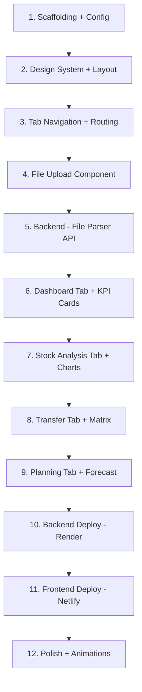

# StockPilot — Stock Analysis & Management Web App

A single-page stock analysis tool that lets users upload Excel/CSV files or connect a database, then provides stock analysis, inter-store transfer recommendations, and stock planning dashboards.

> [!IMPORTANT]
> This is a **standalone project** — it shares the same `.codex` skills, MCPs, and credentials as WizyClub but is a separate codebase located at `d:\WizyClub\stockpilot\`.

---

## User Review Required

> [!WARNING]
> **Render Account**: You need a Render API key. Please create one at [dashboard.render.com/settings#api-keys](https://dashboard.render.com/settings#api-keys) and share it so we can add `RENDER_API_KEY` to `.env`.

> [!IMPORTANT]
> **Render MCP**: The Render MCP server is hosted (not an npm package). It needs to be configured as a remote MCP server with your API key. We'll add it to `.codex/mcp-servers.json`.

1. **Do you have a Render account?** If not, create one at [render.com](https://render.com)
2. **Netlify site**: Should we create a new Netlify project named `stockpilot` or use an existing one?
3. **Database connectivity**: Do you want only file upload (Excel/CSV) for now, or also a Supabase/Postgres database connection feature from day one?

---

## Architecture Overview

```
stockpilot/
├── frontend/                    → Vite + React + TypeScript + Tailwind CSS
│   ├── public/
│   ├── src/
│   │   ├── assets/             → Icons, images, fonts
│   │   ├── components/
│   │   │   ├── layout/         → Header, Footer, TabNav
│   │   │   ├── upload/         → FileUploader, DropZone
│   │   │   ├── dashboard/      → KPICard, MetricsGrid
│   │   │   ├── analysis/       → StockTable, TrendChart, CategoryBreakdown
│   │   │   ├── transfer/       → TransferMatrix, StoreSelector
│   │   │   ├── planning/       → ForecastChart, ReorderAlerts
│   │   │   └── shared/         → Button, Card, Tabs, Spinner, EmptyState
│   │   ├── hooks/              → useFileUpload, useStockData, useAnalysis
│   │   ├── services/           → api.ts, parser.ts (xlsx handling)
│   │   ├── types/              → StockItem, Store, Transfer, etc.
│   │   ├── utils/              → formatting, calculations
│   │   ├── App.tsx
│   │   ├── App.css
│   │   ├── index.css           → Global styles + design system
│   │   └── main.tsx
│   ├── index.html
│   ├── tailwind.config.js
│   ├── postcss.config.js
│   ├── vite.config.ts
│   ├── tsconfig.json
│   └── package.json
│
├── backend/                     → Node.js + Express + TypeScript (Deploy to Render)
│   ├── src/
│   │   ├── routes/
│   │   │   ├── upload.ts       → POST /api/upload (file parsing)
│   │   │   ├── analysis.ts     → POST /api/analyze (stock analysis)
│   │   │   └── transfer.ts     → POST /api/transfer-plan (recommendations)
│   │   ├── services/
│   │   │   ├── parser.ts       → xlsx/xls/csv → JSON
│   │   │   ├── analyzer.ts     → Stock analysis algorithms
│   │   │   └── transfer.ts     → Inter-store optimization
│   │   ├── types/
│   │   │   └── index.ts
│   │   ├── utils/
│   │   │   └── validators.ts
│   │   └── index.ts            → Express app entry
│   ├── package.json
│   ├── tsconfig.json
│   └── render.yaml             → Render deploy config
│
├── .env.example
└── README.md
```

---

## Design System — Antigravity-Inspired

Inspired by [antigravity.google](https://antigravity.google/), the design aims for:

| Property | Value |
|---|---|
| **Background** | `#FAFBFC` (near-white) with subtle dot grid pattern |
| **Cards** | `#FFFFFF` with `rgba(0,0,0,0.04)` border, `0 1px 3px rgba(0,0,0,0.06)` shadow |
| **Primary** | `#1A73E8` (Google Blue) |
| **Accent** | `#34A853` (Google Green, for positive metrics) |
| **Danger** | `#EA4335` (Google Red, for alerts/low stock) |
| **Warning** | `#FBBC04` (Google Yellow) |
| **Text Primary** | `#1F2937` |
| **Text Secondary** | `#6B7280` |
| **Font** | `Inter` (Google Fonts, fallback: system-ui) |
| **Border Radius** | `12px` cards, `8px` buttons, `20px` pills |
| **Animations** | Framer Motion — fade-in, slide-up, stagger children |

### Key Design Principles
- **Clean whitespace** — generous padding, no visual clutter
- **Subtle gradients** — light-to-lighter, never harsh
- **Micro-animations** — hover lifts, tab transitions, chart entry animations
- **Glass morphism cards** — `backdrop-filter: blur(12px)` on floating elements
- **Premium typography** — Inter 400/500/600/700 weights

---

## Proposed Changes

### Frontend (Vite + React + Tailwind CSS)

#### [NEW] `stockpilot/frontend/` — Complete frontend app

**Scaffolding:**
```bash
npx -y create-vite@latest ./ --template react-ts
npm install
npm install -D tailwindcss@3.4 postcss autoprefixer
npx tailwindcss init -p
```

**Key dependencies:**
```json
{
  "dependencies": {
    "xlsx": "^0.18.5",
    "recharts": "^2.15.0",
    "framer-motion": "^12.0.0",
    "lucide-react": "latest",
    "@tanstack/react-query": "^5.0.0",
    "axios": "^1.7.0",
    "react-dropzone": "^14.3.0"
  }
}
```

**Components breakdown:**

| Component | Description |
|---|---|
| `Header` | Logo + "StockPilot" branding, minimal nav |
| `TabNav` | 4 tabs: Dashboard, Stock Analysis, Transfers, Planning |
| `Footer` | Copyright, version, subtle links |
| `FileUploader` | Drag-and-drop zone for Excel/CSV files |
| `KPICard` | Animated metric card (total SKUs, low stock, value) |
| `StockTable` | Sortable/filterable data table with search |
| `TrendChart` | Recharts line/bar chart for stock trends |
| `TransferMatrix` | Store-to-store transfer recommendation grid |
| `ForecastChart` | Simple forecasting visualization |
| `EmptyState` | Beautiful empty state with upload CTA |

**Tailwind config:**
```js
module.exports = {
  content: ['./index.html', './src/**/*.{ts,tsx}'],
  theme: {
    extend: {
      colors: {
        primary: '#1A73E8',
        accent: '#34A853',
        danger: '#EA4335',
        warning: '#FBBC04',
        surface: '#FAFBFC',
        card: '#FFFFFF',
      },
      fontFamily: {
        sans: ['Inter', 'system-ui', 'sans-serif'],
      },
      borderRadius: {
        card: '12px',
        btn: '8px',
        pill: '20px',
      },
      boxShadow: {
        card: '0 1px 3px rgba(0,0,0,0.06), 0 1px 2px rgba(0,0,0,0.04)',
        'card-hover': '0 10px 40px rgba(0,0,0,0.08)',
        glass: '0 8px 32px rgba(0,0,0,0.06)',
      },
    },
  },
  plugins: [],
}
```

---

### Backend (Node.js + Express — Render Deploy)

#### [NEW] `stockpilot/backend/` — API server

**Key dependencies:**
```json
{
  "dependencies": {
    "express": "^4.21.0",
    "cors": "^2.8.5",
    "multer": "^1.4.5-lts.1",
    "xlsx": "^0.18.5",
    "typescript": "^5.7.0"
  }
}
```

**API Endpoints:**

| Method | Path | Description |
|---|---|---|
| `POST` | `/api/upload` | Upload Excel/CSV, returns parsed JSON |
| `POST` | `/api/analyze` | Run stock analysis on parsed data |
| `POST` | `/api/transfer-plan` | Generate inter-store transfer recommendations |
| `GET` | `/api/health` | Health check for Render |

**Analysis features:**
- **Stock Level Analysis**: Identify low/overstock items per store
- **ABC Classification**: Categorize items by revenue contribution (A=80%, B=15%, C=5%)
- **Reorder Point Calculation**: Based on avg daily sales × lead time + safety stock
- **Inter-Store Transfer Suggestions**: Match overstocked stores with understocked for same SKU
- **Category Breakdown**: Pie/bar charts by product category

---

### MCP & Deployment Configuration

#### [MODIFY] [mcp-servers.json](file:///d:/WizyClub/.codex/mcp-servers.json)
Add Render MCP server entry:
```json
{
  "name": "render",
  "type": "url",
  "url": "https://mcp.render.com/sse",
  "headers": {
    "Authorization": "Bearer {env:RENDER_API_KEY}"
  },
  "description": "Render MCP server for backend deployment management.",
  "optional": true,
  "requiresEnv": ["RENDER_API_KEY"]
}
```

#### [MODIFY] [.env](file:///d:/WizyClub/.env)
Add new environment variable:
```
RENDER_API_KEY=<your-render-api-key>
```

#### [NEW] `stockpilot/frontend/netlify.toml`
```toml
[build]
  command = "npm run build"
  publish = "dist"

[[redirects]]
  from = "/api/*"
  to = "https://<render-service-url>/api/:splat"
  status = 200
  force = true
```

#### [NEW] `stockpilot/backend/render.yaml`
```yaml
services:
  - type: web
    name: stockpilot-api
    runtime: node
    plan: free
    buildCommand: npm install && npm run build
    startCommand: npm start
    envVars:
      - key: NODE_ENV
        value: production
```

---

## Feature Details

### Tab 1: Dashboard (Overview)
- **KPI Cards**: Total SKUs, Total Stock Value, Low Stock Items, Overstock Items
- **Category Distribution**: Donut chart by product category
- **Stock Health**: Bar chart showing healthy/warning/critical stock levels
- **Recent Uploads**: List of uploaded files with timestamps

### Tab 2: Stock Analysis
- **Data Table**: Full inventory with sort/filter/search
- **ABC Classification**: Color-coded table (A=green, B=yellow, C=red)
- **Stock Level Chart**: Bar chart per store
- **Low Stock Alerts**: Highlighted items below reorder point
- **Export**: Download analysis as Excel

### Tab 3: Inter-Store Transfers
- **Transfer Matrix**: Heatmap showing surplus/deficit by store × SKU
- **Recommendations**: Auto-generated transfer suggestions
- **Cost Estimation**: Estimated transfer cost (if distance data available)
- **Transfer Request**: Generate printable transfer documents

### Tab 4: Stock Planning
- **Reorder Points**: Table with calculated reorder levels
- **Safety Stock**: Visual safety stock buffer per item
- **Purchase Suggestions**: What to order and quantities
- **Simple Forecast**: Moving average trend line (3-period)

---

## Tech Decisions

| Decision | Choice | Rationale |
|---|---|---|
| Frontend Framework | Vite + React 18 + TS | Fast dev, familiar, great DX |
| Styling | Tailwind CSS 3.4 | As requested, utility-first, clean |
| Charts | Recharts | React-native charting, lightweight |
| Animations | Framer Motion | Premium feel, easy API |
| File Parsing | xlsx (SheetJS) | Supports .xls, .xlsx, .csv, .xlm |
| Backend Runtime | Node.js + Express | Same language as frontend, xlsx lib works natively |
| Backend Deploy | Render (free tier) | User requested, MCP available |
| Frontend Deploy | Netlify (via dist) | Existing MCP, user requested |
| Icons | Lucide React | Consistent, lightweight |
| HTTP Client | Axios + React Query | Caching, loading states built-in |

---

## Implementation Order



---

## Verification Plan

### Automated Tests

1. **Frontend Build Check**
   ```bash
   cd d:\WizyClub\stockpilot\frontend
   npm run build
   # Must complete with no errors, output in dist/
   ```

2. **Backend Build Check**
   ```bash
   cd d:\WizyClub\stockpilot\backend
   npm run build
   # Must compile TypeScript with no errors
   ```

3. **Dev Server Smoke Test**
   ```bash
   cd d:\WizyClub\stockpilot\frontend
   npm run dev
   # Open http://localhost:5173 in browser
   # Verify: page loads, header/tabs/footer visible
   ```

### Browser Tests (via browser tool)
1. Navigate to `http://localhost:5173`
2. Verify header with "StockPilot" branding is visible
3. Click each tab (Dashboard, Analysis, Transfers, Planning)
4. Upload a test Excel file via drag-and-drop
5. Verify data appears in Dashboard KPI cards
6. Verify charts render in Analysis tab

### Manual Verification (User)
1. **Design Review**: Does the UI look clean and premium like antigravity.google?
2. **File Upload**: Upload your own Excel stock file — does it parse correctly?
3. **Netlify Deploy**: Visit the deployed URL — does the site load?
4. **Render Backend**: Does the API respond at the Render URL `/api/health`?
