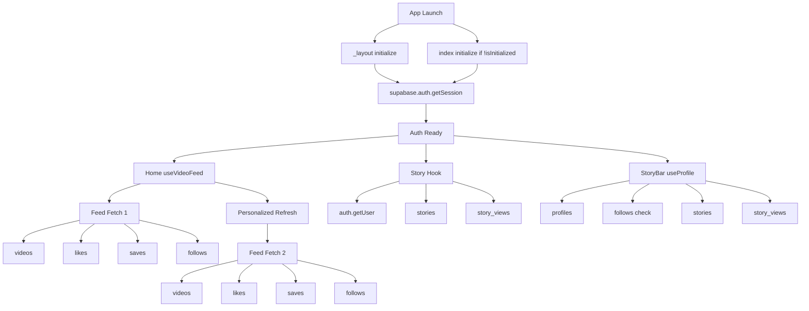
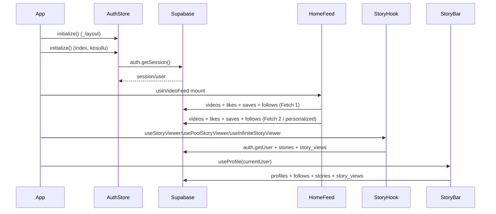
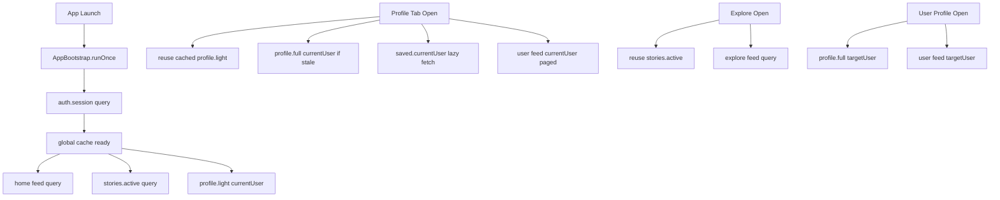

# Supabase Sorgu Analizi ve Tek Cati Veri Mimarisi Plani

Bu dokuman, uygulamadaki Supabase sorgu akislarini analiz eder, tekrar eden sorgulari tespit eder ve "tek cati" veri yonetimi icin uygulanabilir bir plan sunar.

## 1) Hedef ve Kapsam

Amac:
- Uygulama acilisindan profile/explore/user ekranlarina kadar hangi sorgularin ne zaman tetiklendigini netlestirmek.
- Gereksiz/tekrar eden sorgulari azaltmak.
- Sayac ve profil gibi kritik verileri tek bir dogruluk kaynagindan yonetmek.
- Ozellikle profile ekranindaki gecikmeyi azaltmak.

Kapsam:
- Auth baslatma akisi
- Home feed, explore, profile, user/[id]
- Story ve profile verisi
- Saved/feed counter baglantilari

## 2) Incelenen Kritik Dosyalar

Analizde dogrudan kontrol edilen baslica dosyalar:

- `mobile/app/_layout.tsx`
- `mobile/app/index.tsx`
- `mobile/src/presentation/store/useAuthStore.ts`
- `mobile/src/presentation/hooks/useVideoFeed.ts`
- `mobile/src/data/datasources/SupabaseVideoDataSource.ts`
- `mobile/src/presentation/hooks/useProfile.ts`
- `mobile/src/data/datasources/SupabaseProfileDataSource.ts`
- `mobile/src/presentation/hooks/useStoryViewer.ts`
- `mobile/src/presentation/hooks/useInfiniteStoryViewer.ts`
- `mobile/src/presentation/hooks/usePoolStoryViewer.ts`
- `mobile/src/presentation/components/infiniteFeed/InfiniteStoryBar.tsx`
- `mobile/src/presentation/components/poolFeed/PoolFeedStoryBar.tsx`
- `mobile/app/(tabs)/profile.tsx`
- `mobile/app/(tabs)/explore.tsx`
- `mobile/app/user/[id].tsx`
- `mobile/src/presentation/hooks/useSavedVideos.ts`
- `mobile/src/domain/usecases/GetSavedVideosUseCase.ts`
- `mobile/src/data/repositories/InteractionRepositoryImpl.ts`

## 3) Kisa Ozet (Executive Summary)

Ana bulgular:

1. Auth initialize birden fazla yerden tetiklenebiliyor.
- `_layout.tsx` ve `index.tsx` ikisi de `initialize()` cagiriyor.

2. Feed ilk acilista cogu durumda iki tur cekiliyor.
- `initial fetch` + `personalized refresh` etkisi var.
- Her turda `videos + likes + saves + follows` sorgulari calisiyor.

3. Story verisi birden fazla hook ile ayni mantikta tekrar tekrar cekiliyor.
- `useStoryViewer`, `useInfiniteStoryViewer`, `usePoolStoryViewer` neredeyse ayni.

4. Story bar icinde tekrar profile fetch var.
- Hem `InfiniteStoryBar` hem `PoolFeedStoryBar` icinde `useProfile()` kullaniliyor.

5. Profile ekraninda saved verisi mount ve focus'ta tekrar tetikleniyor.
- Ilk giriste iki ayrik saved fetch olasiligi olusuyor.

6. `getProfile` sorgusu agir.
- Tek bir profile fetch icinde profile + follow + stories + story_views (+ bazen auth.getUser) adimlari var.

Net etki:
- Uygulama acilisinda ve profile girisinde Supabase cagri sayisi beklenenden yuksek.
- Bu durum profile tab "gec aciliyor" hissini acikliyor.

## 4) Trigger Semasi (Mevcut Durum)

### 4.1 Sequence Diagram (Cold Start)

## 5) Ekran Bazli Sorgu Akislari

### 5.1 App Acilisi -> Home

Beklenen tetikler:
- Auth:
  - `mobile/app/_layout.tsx` icinde `initialize()`
  - `mobile/app/index.tsx` icinde `!isInitialized` ise `initialize()`
- Feed:
  - `useVideoFeed()` icinde initial fetch
  - Ardindan user gelince personalized refresh
- Story:
  - Home moduna gore story hook (`useInfiniteStoryViewer` veya `usePoolStoryViewer`)
- Story bar profile:
  - Story bar bileseni icindeki `useProfile(authUser?.id || '')`

Yaklasik Supabase cagri adedi:
- Auth: 1-2
- Feed: 2 tur x 4 = 8
- Story: 2-3
- Story bar profile: 2-4
- Toplam: yaklasik 13-17 (duruma gore degisir)

### 5.2 Profile Tab Ilk Giris

Beklenen tetikler:
- `useVideoFeed(currentUserId, 50)` (cogu durumda 2 tur)
- `useSavedVideos(currentUserId)` mount fetch
- `useFocusEffect` icinden `refreshSavedVideos()` (ilk focus'ta ek fetch)
- `useProfile(currentUserId)` profile detay fetch

Yaklasik Supabase cagri adedi:
- Feed: 8
- Saved: 2 fetch
  - Her fetch: `saves` ids + `videosByIds` + (likes/saves/follows) => yaklasik 5
  - Iki fetch toplam: yaklasik 10
- Profile: 2-4
- Toplam: yaklasik 20+ (olasilikli)

Not:
- Profile ekraninda Supabase disi API cagrilari da var (admin config websocket/fetch), bunlar bu sayima dahil degil.

### 5.3 user/[id] Ekrani

Tetikler:
- `useVideoFeed(userId, 50)` (genelde 2 tur)
- `useProfile(userId, currentUserId)`

Yaklasik Supabase:
- Feed: 8
- Profile: 3-5
- Toplam: 11-13

### 5.4 Explore Ekrani

Tetikler:
- `useVideoFeed(undefined, 50)` (2 tur etkisi)
- `useStoryViewer()`

Yaklasik Supabase:
- Feed: 8
- Story: 2-3
- Toplam: 10-11

## 6) Kök Nedenler

1. Auth initialize daginik
- Birden fazla noktada initialize tetigi var.

2. Story hooklari klon mantikta
- Ayni sorgu mantigi farkli hooklarda tekrar ediyor.

3. Story bar icinde agir profile fetch
- Avatar/username gibi hafif veri icin agir `getProfile` akisi cagriliyor.

4. Feed iki asamali ilk yukleme
- Ilk fetch + personalized refresh etkisi cagrilari ikiye katiyor.

5. Profile saved fetch tekrar tetigi
- Ilk mount + focus refresh kombinasyonu gereksiz duplicate fetch uretebiliyor.

6. In-flight dedupe yok
- Ayni key ile kisa surede gelen talepler ortaklasmiyor.

## 7) Neden Profile Gec Aciliyor?

Profile tab ilk acilista eszamanli olarak su agir yukleri baslatabiliyor:
- Feed (2 tur, interaction join sorgulariyla)
- Saved (en az 1, bazen 2 fetch)
- Profile detail (story/follow kontrolu dahil)

Bu, ilk render sonrasi network ve state guncelleme yiginina sebep oluyor. UI hissi olarak "gec acilma" goruluyor.

## 8) Cozum Mimarisi: Tek Cati Veri Yonetimi

Hedef mimari:
- Tek auth bootstrap
- Ortak query cache
- In-flight request dedupe
- TTL/stale-time ile kontrollu yenileme
- Story/profile icin hafif ve agir endpoint ayrimi

### 8.1 Onerilen Veri Katmani

Secenek A (onerilen): TanStack Query
- Query key standardi:
  - `auth.session`
  - `feed.home`
  - `feed.user.{userId}`
  - `profile.{userId}`
  - `profile.light.{userId}`
  - `stories.active`
  - `saved.{userId}`
- `staleTime` ve `cacheTime` ile tekrar fetch kontrolu.
- Ayni key icin in-flight dedupe dogal.

Secenek B: Mevcut Zustand ile QueryCoordinator
- Merkezi `QueryCoordinator` store
- `inFlightMap`, `lastFetchedAt`, `dataByKey`, `errorByKey`
- API:
  - `fetchOnce(key, fetcher, ttlMs)`
  - `invalidate(key)`
  - `prefetch(key)`

### 8.2 Hafif Profile Modeli

`useProfile` yerine story bar icin:
- `useLightProfile` (yalnizca avatar, username, full_name)
- Story status ayrica `stories.active` query'sinden cozulur.

Bu sekilde:
- Story bar acildiginda `getProfile` icindeki follow/story_views agirligi tetiklenmez.

### 8.3 Story Hook Birlesimi

3 ayri hook yerine tek hook:
- `useStories({ mode: 'all' | 'byUser', userId?, initial? })`

Bu hook:
- tek fetch kaynagi kullanir,
- mode bazli projection yapar,
- local viewed-state merge eder.

### 8.4 Feed Ilk Yukleme Duzenlemesi

Mevcut problem:
- `initial fetch` sonrasi `personalized refresh`.

Iyilestirme:
- Auth kesinlesmeden feed fetch baslatma.
- User belli olduktan sonra tek fetch.
- `anon` fallback ile interaction querylerine gitmeme.

## 9) Onerilen Trigger Semasi (Hedef)

## 10) Uygulanabilir To-Do Plani

### Faz 1 - Olcum ve Guvenli Refactor

1. Auth initialize tek noktaya indir.
- Kaynak: `_layout.tsx`
- `index.tsx` ve profile icindeki tekrar initialize tetigini kaldir veya sadece read-only guard tut.

2. Feed fetch tetigini teklestir.
- `isInitialized` + gercek user kararindan sonra tek fetch.
- `anon` durumunda interaction queryleri atlanmali.

3. Saved initial duplicate fetch'i temizle.
- Ilk profile focus'ta ikinci fetchi kosullu yap.

Beklenen kazanc:
- Ilk acilis ve profile ilk giriste belirgin sorgu azalmasi.

### Faz 2 - Story ve Profile Ortaklastirma

1. Story hooklarini birlestir.
2. Story bar icin `useLightProfile` kullan.
3. `getProfile` agir kisimlarini ihtiyaca gore ayir:
- `getProfileFull`
- `getProfileLite`

Beklenen kazanc:
- Story acilisinda ve tab gecislerinde tekrar fetch azalmasi.

### Faz 3 - Tek Cati Cache Katmani

1. Query key standardi uygulamasi.
2. In-flight dedupe.
3. TTL/stale policy.
4. Invalidasyon kurallari:
- like/save/follow sonrasinda ilgili key'ler invalidate.

Beklenen kazanc:
- Sayac ve status verilerinde tum ekranlarda tutarlilik + daha az sorgu.

## 11) Sayac Tutarliligi Icin Kural Seti

Tek dogruluk kurali:
- UI once optimistic delta uygular.
- Sonra server cevabi ile reconcile eder.
- Tum ekranlar `resolved counters` katmanindan okur.

Invalidasyon matrisi:

| Islem | Invalidate |
|---|---|
| Like toggle | `feed.*`, `video.{id}`, `profile.posts.{ownerId}`, `activity.likes.{userId}` |
| Save toggle | `feed.*`, `video.{id}`, `saved.{userId}`, `activity.saved.{userId}` |
| Follow toggle | `profile.{targetId}`, `profile.{viewerId}`, `feed.*` |
| View insert | `video.{id}`, `activity.watch.{userId}` |
| Story view | `stories.active`, `profile.light.{storyOwnerId}` |

## 12) Gecis Stratejisi ve Risk

Riskler:
- Refactor sirasinda stale cache nedeniyle gecici tutarsizlik.
- Invalidasyon eksigi durumunda eski veri gorunmesi.

Azaltma:
- Her faz sonunda ekran bazli smoke test.
- Logger ile query key + fetch source izleme.
- Gerektiginde fail-safe: force refresh butonu.

## 13) Test Checklist (Pratik)

1. Cold start:
- App ac
- Home ilk render suresi not et
- Network logda ayni endpoint tekrarlarini kontrol et

2. Profile first open:
- Profile tabina ilk giris
- Feed/saved/profile sorgu sayilarini not et

3. Cross-screen consistency:
- Home'da like/save yap
- Explore, Profile, User/[id], Activity ekranlarinda sayac ayni mi kontrol et

4. Story consistency:
- Story izle
- Unseen ring ve story state tum ilgili ekranlarda tutarli mi kontrol et

5. Regression:
- Pull-to-refresh
- Tab reselect
- App background -> foreground

## 14) Basari Kriterleri (Definition of Done)

1. Auth initialize tek noktadan calisir.
2. Home/Explore/Profile ilk acilista duplicate feed fetch yoktur.
3. Story tek query kaynagindan beslenir.
4. Story bar profile fetch agir endpoint kullanmaz.
5. Profile ilk acilis suresi gozle gorulur sekilde iyilesir.
6. Sayaclar ekranlar arasi ayni veriyle gorunur.

## 15) Son Not

Bu plan, mevcut kodun isleyisini bozmadan kademeli iyilestirme icin tasarlandi:
- once duplicate tetikler temizlenir,
- sonra ortak hook/caching mimarisi oturtulur,
- en son sayac invalidasyon kurallari kesinlestirilir.

Bu siralama ile hem risk dusuk kalir hem de her fazda olculebilir performans kazanci elde edilir.
