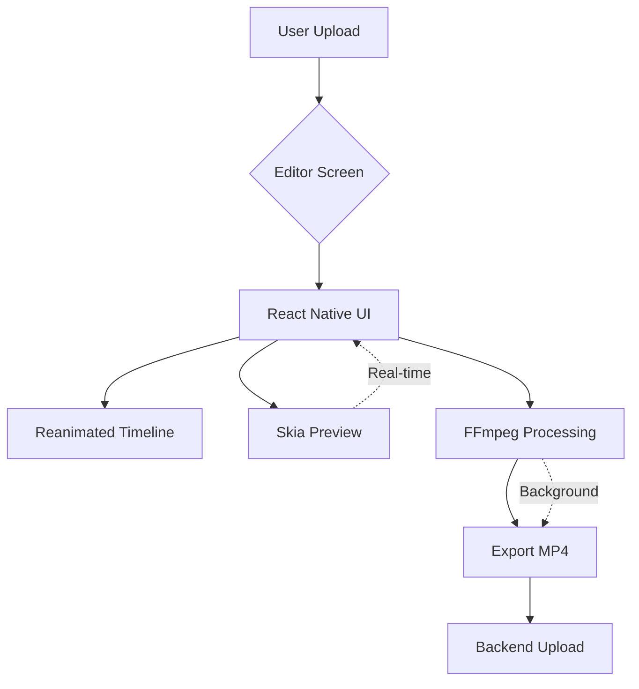

# WizyClub Video Editor - Implementation Plan
**Phase-Based Roadmap | Technical Architecture**

> Bu dosya, WizyClub uygulamasına entegre edilecek Video Editor özelliklerinin teknik analizi ve uygulama planını içerir.

---

## 📊 Executive Summary

**Vizyon:** TikTok tarzı sosyal video uygulamasına **CapCut-lite** düzeyinde editing özellikleri eklemek.

**Mevcut Durum:** 
- ✅ Video feed (HLS streaming)
- ✅ Upload (basic)
- ❌ Editing yok

**Hedef:** Kullanıcıların videoları upload öncesi düzenleyebilmesi

**Zorluk:** 🔴 Yüksek (2-3 aylık geliştirme)

---

## 🎯 Özellik Matrisi

### Zorunlu (MVP - Phase 1)
| Özellik | Öncelik | Zorluk | Kullanıcı Etkisi |
|:--------|:--------|:-------|:-----------------|
| ✂️ **Trim (Kırpma)** | 🔴 Kritik | ⭐⭐ Orta | %100 |
| 🎵 **Müzik Ekleme** | 🔴 Kritik | ⭐⭐ Orta | %80 |
| 📝 **Metin/Sticker** | 🟡 Önemli | ⭐⭐⭐ Yüksek | %70 |
| ⏱️ **90sn Limiti** | 🔴 Kritik | ⭐ Düşük | %100 |
| 💾 **Export (1080p)** | 🔴 Kritik | ⭐⭐ Orta | %100 |

### İleri Seviye (Phase 2)
| Özellik | Öncelik | Zorluk | Kullanıcı Etkisi |
|:--------|:--------|:-------|:-----------------|
| 🔇 **Silence Detection** | 🟡 Önemli | ⭐⭐⭐⭐ Çok Yüksek | %40 |
| 🎨 **Filtreler** | 🟢 Nice-to-have | ⭐⭐⭐ Yüksek | %60 |
| 📖 **Auto Subtitles** | 🟡 Önemli | ⭐⭐⭐⭐⭐ Ekstrem | %30 |
| 🎬 **Birleştirme** | 🟢 Nice-to-have | ⭐⭐⭐ Yüksek | %20 |
| 🤖 **AI Güzelleştirme** | ⚪ Gelecek | ⭐⭐⭐⭐⭐ Ekstrem | %15 |

---

## 🏗️ Teknik Mimari

### Core Technologies



### Technology Stack

| Katman | Teknoloji | Amaç |
|:-------|:----------|:-----|
| **UI Framework** | React Native + Expo | Temel platform |
| **Animasyon** | `react-native-reanimated` | Timeline, scrubbing, gestures |
| **GPU Rendering** | `@shopify/react-native-skia` | Preview, filters, overlays |
| **Video Processing** | `ffmpeg-kit-react-native` | Trim, merge, export |
| **State Management** | Zustand + MMKV | Draft autosave |
| **File I/O** | `expo-file-system` | Temporary files |

---

## 📱 UI/UX Design

### Editor Screen Layout

```
┌─────────────────────────────┐
│  [X]  Preview     [✓] Done  │ ← Header
├─────────────────────────────┤
│                             │
│       Video Preview         │ ← Skia Canvas
│     (with overlays)         │   (Stickers, Text, Filters)
│                             │
├─────────────────────────────┤
│  [🎵] [✂️] [📝] [🎨] [⚙️]  │ ← Tool Tabs
├─────────────────────────────┤
│                             │
│   ═══╬════════╬═══          │ ← Timeline Trimmer
│   0:00    0:45    1:30      │   (Reanimated slider)
│                             │
└─────────────────────────────┘
```

### Tool Panels

**1. Müzik (🎵)**
- Kategori listesi (Upbeat, Chill, etc.)
- Arama
- Volume slider (Video: 50% | Music: 100%)
- Offset adjustment

**2. Trim (✂️)**
- Timeline with thumbnails
- Start/End handles
- Duration display
- 90sn warning

**3. Metin/Sticker (📝)**
- Text input
- Font picker
- Color picker
- Sticker library
- Position/Rotate gestures

**4. Filtre (🎨)**
- Filter preview grid
- Intensity slider
- Temperature/Brightness/Contrast

**5. Ayarlar (⚙️)**
- Export quality
- Resolution
- FPS
- Cancel/Draft save

---

## 🔧 Feature Implementation Details

### 1. ✂️ Trim & Split

**User Flow:**
1. Load video → Generate thumbnails (FFmpeg)
2. Display timeline with 10 thumbnails
3. User drags handles
4. Real-time duration update
5. Tap "Done" → FFmpeg trim command

**Technical:**
```typescript
// Generate thumbnails
await FFmpegKit.execute(
  `-i ${input} -vf fps=10/duration -s 120x68 ${outputDir}/thumb_%d.jpg`
);

// Trim video
await FFmpegKit.execute(
  `-ss ${startTime} -t ${duration} -i ${input} -c copy ${output}`
);
```

**Complexity:** ⭐⭐ Orta (Timeline UI zor)

---

### 2. 🎵 Müzik Ekleme

**User Flow:**
1. Browse music library
2. Select track
3. Adjust volume sliders
4. Preview (Skia + expo-av)
5. Export with mixed audio

**Technical:**
```typescript
// Mix audio streams
await FFmpegKit.execute(
  `-i ${video} -i ${music} -filter_complex "[0:a]volume=0.5[a1];[1:a]volume=1.0[a2];[a1][a2]amix=inputs=2:duration=first" -c:v copy ${output}`
);
```

**Backend:**
- Müzik kütüphanesi API
- Telifsiz mp3 deposu (Epidemic Sound, Artlist gibi)

**Complexity:** ⭐⭐ Orta

---

### 3. 📝 Metin & Sticker Overlay

**User Flow:**
1. Tap "Add Text" → Input modal
2. Type text → Appears on canvas
3. Pinch/rotate/drag gestures
4. Tap "Done" → Burn into video

**Technical:**
```typescript
// Preview (Skia - real-time)
<Canvas>
  <Text text="Hello" x={x} y={y} font={font} color={color} />
</Canvas>

// Export (FFmpeg - burn-in)
await FFmpegKit.execute(
  `-i ${video} -vf "drawtext=text='${text}':x=${x}:y=${y}:fontsize=40:fontcolor=white" ${output}`
);
```

**Stickers:**
- PNG overlays with alpha channel
- FFmpeg `overlay` filter
- Position tracking with `react-native-gesture-handler`

**Complexity:** ⭐⭐⭐ Yüksek

---

### 4. 🔇 Silence Detection (Phase 2)

**User Flow:**
1. Analyze video → Find silent parts
2. Show timeline with gray blocks
3. User taps "Clean" → Auto-remove silences
4. Export trimmed video

**Technical:**
```typescript
// Detect silence
const { logs } = await FFmpegKit.execute(
  `-i ${video} -af silencedetect=n=-30dB:d=0.5 -f null -`
);

// Parse timestamps from logs
const silentRanges = parseSilenceLogs(logs);

// Cut video (remove silent parts)
const filterComplex = buildCutFilter(silentRanges);
await FFmpegKit.execute(
  `-i ${video} -filter_complex "${filterComplex}" -c:v libx264 ${output}`
);
```

**Complexity:** ⭐⭐⭐⭐ Çok Yüksek (Log parsing + concat zor)

---

### 5. 📖 Auto Subtitles (Phase 2)

**⚠️ Cloud API Gerekir - Mobilde İmkansız**

**User Flow:**
1. Upload video to backend
2. Backend → OpenAI Whisper API
3. Get SRT file
4. Download to app
5. Render subtitles with Skia
6. Export with FFmpeg

**Technical:**
```python
# Backend (Python)
import openai

audio = extract_audio(video_path)
transcript = openai.Audio.transcribe("whisper-1", audio)
srt = generate_srt(transcript)
return srt
```

```typescript
// App (FFmpeg burn-in)
await FFmpegKit.execute(
  `-i ${video} -vf "subtitles=${srtFile}" ${output}`
);
```

**Maliyet:** ~$0.006/dakika (Whisper API)

**Complexity:** ⭐⭐⭐⭐⭐ Ekstrem

---

## 📐 Performance Considerations

### App Boyutu
| Paket | Boyut | Gerekli Mi? |
|:------|:------|:------------|
| `ffmpeg-kit` (full-gpl) | ~80 MB | ✅ Evet |
| `react-native-skia` | ~10 MB | ✅ Evet |
| **Toplam Ekleme** | **~90 MB** | - |

**Optimize:** Sadece gerekli codec'leri içeren custom FFmpeg build (gelişmiş)

### Battery & CPU
- FFmpeg işlemleri CPU-intensive
- Export sırasında progress bar göster
- Background processing (WorkManager - Android)
- Süre limiti: Max 2 dakikalık videolar

### Storage
- Temporary files için `expo-file-system` cache directory
- Export sonrası auto-cleanup
- Draft save için AsyncStorage (küçük metadata) + MMKV (hızlı)

---

## 🗺️ Implementation Roadmap

### Phase 1: MVP Editor (6-8 hafta)

**Week 1-2: Altyapı**
- [x] FFmpeg-kit kurulumu ve test
- [ ] Timeline UI (Reanimated slider)
- [ ] Thumbnail generation
- [ ] Basic trim functionality

**Week 3-4: Core Features**
- [ ] Müzik ekleme UI
- [ ] Volume mixing
- [ ] Text overlay (Skia)
- [ ] Export pipeline (H.264, 1080p)

**Week 5-6: Polish & Test**
- [ ] Progress indicators
- [ ] Error handling
- [ ] Draft save/restore
- [ ] Performance optimization

**Week 7-8: Integration**
- [ ] Upload flow entegrasyonu
- [ ] Backend upload
- [ ] User testing
- [ ] Bug fixes

**Deliverables:**
- ✂️ Trim
- 🎵 Müzik
- 📝 Temel metin
- 💾 Export

---

### Phase 2: Advanced Features (4-6 hafta)

**Week 9-10: Silence Detection**
- [ ] FFmpeg silence analysis
- [ ] Log parsing
- [ ] Auto-clean UI
- [ ] Concat filter chain

**Week 11-12: Filters & Effects**
- [ ] Skia ColorMatrix filters
- [ ] FFmpeg eq filter
- [ ] Preview pipeline
- [ ] Filter library

**Week 13-14: Cloud Features**
- [ ] Backend Whisper API
- [ ] Subtitle rendering
- [ ] SRT download/upload

**Deliverables:**
- 🔇 Silence cleaning
- 🎨 Filters
- 📖 Auto subtitles (cloud)

---

## 💰 Cost Estimation

### Development
- **Phase 1 (MVP):** 6-8 hafta × 1 developer = **~240 saat**
- **Phase 2 (Advanced):** 4-6 hafta × 1 developer = **~160 saat**
- **Total:** ~400 saat

### Infrastructure
- **Cloud Processing:** $0.01/video (Whisper API)
- **Storage:** R2 kullanıyoruz (mevcut)
- **EAS Build:** 2-3 build gerekebilir (~$20)

### App Store Impact
- **Boyut:** +90 MB (Editor libs)
- **Review:** Permissions (camera, mic, storage)

---

## 🚨 Riskler & Mitigations

| Risk | Olasılık | Etki | Çözüm |
|:-----|:---------|:-----|:------|
| **FFmpeg performans** | Yüksek | Yüksek | Background processing, progress bar |
| **Uygulama boyutu** | Kesin | Orta | Custom FFmpeg build (gelişmiş) |
| **Battery drain** | Yüksek | Orta | Encoding süresi limiti (max 2dk) |
| **UI karmaşıklığı** | Orta | Yüksek | UX testing, basit tutma |
| **Cloud API maliyeti** | Düşük | Düşük | Cache, rate limiting |

---

## 💡 Recommendations

### Başlangıç Stratejisi: **Hybrid Approach**

**Mobil (On-Device):**
- ✅ Trim
- ✅ Müzik ekleme
- ✅ Text/Sticker
- ✅ Basit filtreler

**Cloud (Backend API):**
- ✅ Silence detection (ağır)
- ✅ Auto subtitles (Whisper)
- ✅ AI filters (gelecek)
- ✅ Batch processing

**Avantajları:**
1. Mobil battery korunur
2. App boyutu küçük kalır
3. Karmaşık işlemler server'da yapılır
4. Hızlı iterasyon (cloud-side updates)

**Implementation:**
```typescript
// Basit iş → Mobil
if (task === 'trim' || task === 'music') {
  processOnDevice(video);
}

// Ağır iş → Cloud
if (task === 'silence' || task === 'subtitles') {
  uploadToBackend(video);
  pollForResult();
  downloadProcessedVideo();
}
```

---

## 📚 Resources & Learning

### FFmpeg Komutları
- [FFmpeg Official Docs](https://ffmpeg.org/documentation.html)
- [FFmpeg Filters](https://ffmpeg.org/ffmpeg-filters.html)
- [React Native FFmpeg Kit](https://github.com/arthenica/ffmpeg-kit)

### Skia
- [Shopify Skia Docs](https://shopify.github.io/react-native-skia/)
- [Canvas API](https://shopify.github.io/react-native-skia/docs/canvas/overview)

### Video Editing Apps (Benchmarks)
- CapCut (feature reference)
- InShot (UI inspiration)
- VN Editor (timeline design)

---

## 🎯 Success Metrics

### MVP (Phase 1)
- [ ] %80+ users trim videoları export ediyor
- [ ] %60+ users müzik ekliyor
- [ ] Export süresi < 30 saniye (60sn video için)
- [ ] <5% crash rate

### Phase 2
- [ ] %40+ users silence cleaning kullanıyor
- [ ] %30+ users auto subtitle kullanıyor
- [ ] Cloud processing cost < $100/ay

---

## 📝 Next Steps

### Immediate (This Sprint)
1. ✅ Bu dokümanı gözden geçir
2. ✅ Library Build Plan'i kontrol et
3. [ ] Teknik olarak GO/NO-GO kararı
4. [ ] Timeline onayı

### Short-term (Next 2 Weeks)
1. [ ] FFmpeg-kit + Skia kurulumu
2. [ ] Timeline UI prototype
3. [ ] Trim POC (Proof of Concept)
4. [ ] UX wireframes

---

**Last Updated:** 2025-12-11  
**Status:** 📋 Planning  
**Next Review:** TBD
