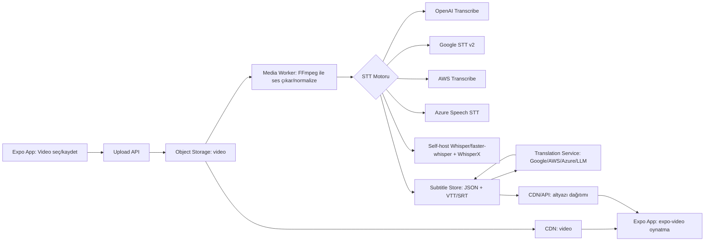
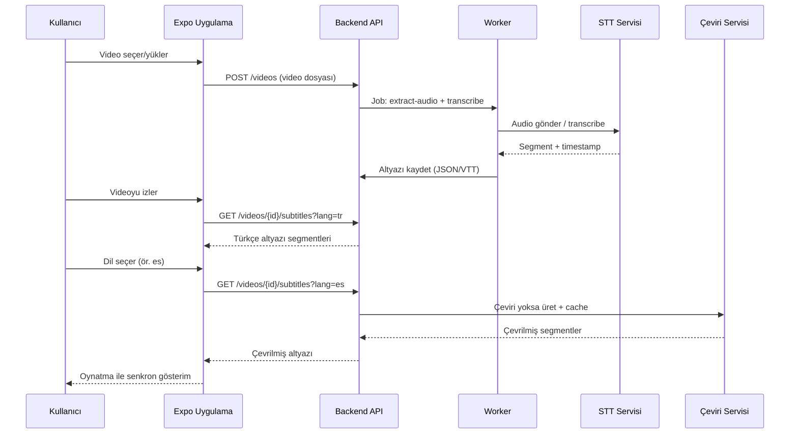

# Expo Managed Workflow ile Video Altyazı ve Çeviri Gereksinimi İçin Kütüphane ve Servis Araştırması

## Yönetici özeti

Bu rapor, **2026-02-19 (Europe/Istanbul)** itibarıyla **güncel Expo SDK sürümünü doğrulayarak** (stabil ve beta), Expo (managed workflow) ile “kısa video / Reels” benzeri bir uygulamada **(1) videodan ses çıkarma**, **(2) çok dilli speech-to-text**, **(3) izleyicilere altyazı sunma (önceden üretilmiş ya da gerçek zamanlı)** ve **(4) altyazıyı isteğe bağlı çeviri** gereksinimlerini karşılamak için **Expo uyumluluğu doğrulanmış** seçenekleri inceler. Stabil sürüm olarak **Expo SDK 54**; beta hat olarak **SDK 55 beta** görülmektedir. citeturn1search6turn1search5turn0search18

Expo tarafında kritik nokta: **`expo-av` içindeki Video/Audio API’leri deprecated** durumdadır ve belgeler **SDK 55’te kaldırılacağını** belirtiyor; yeni projelerde oynatma için **`expo-video`** ve ses için **`expo-audio`** hattı esas alınmalıdır. citeturn22search0turn22search1

Mimari açıdan en düşük riskli ve en hızlı “ürünleşen” yaklaşım: **video dosyasını istemciden (Expo Go uyumlu) sunucuya yüklemek**, sunucuda **FFmpeg ile ses çıkarıp normalize etmek**, ardından **bulut STT (OpenAI/Google/AWS/Azure) veya self-host Whisper** ile zaman kodlu altyazı üretmek, altyazıları **WebVTT/SRT + JSON segment** olarak saklayıp istemciye servis etmek; çeviriyi de **isteğe bağlı** yapıp cache’lemektir. “Cihaz içi (tam offline)” yaklaşımlar mümkündür ancak Expo managed’da **native modül + development build/EAS** gerektirdiği için karmaşıklık ve bakım maliyeti belirgin artar. citeturn0search17turn0search5turn0search1turn25view0

Önerilen varsayılan STT seçenekleri (maliyet/performans dengesi): **OpenAI Transcription modelleri** (ör. `gpt-4o-mini-transcribe` $0.003/dk, `gpt-4o-transcribe` $0.006/dk) veya **Google Speech-to-Text v2** (standart $0.016/dk; “dynamic batch” $0.003/dk). citeturn10view1turn13view0 Çeviri tarafında en pratik seçenekler: **Google Cloud Translation (NMT)** (500K karakter/ay ücretsiz, sonra $20/M), **Amazon Translate** ($15/M ve 12 ay boyunca 2M karakter/ay ücretsiz), veya **Azure Translator** (2M karakter/ay free tier). citeturn20view0turn19search1turn21view0

## Expo SDK sürümü ve managed workflow uyumluluk kriterleri

**Expo SDK 54** stabil sürüm hattında referans alınmalıdır; repo/changelog ve “versions/latest” belgeleri bunu doğrular. citeturn1search6turn1search5turn22search16 Ayrıca **SDK 55 beta** mevcuttur; ancak üretim için stabil hat (SDK 54) daha öngörülebilir kabul edilmelidir. citeturn0search18

Expo managed workflow’da pratik uyumluluk 3 sınıfta düşünülmelidir:

- **Expo Go ile “kutudan çıktığı gibi” çalışanlar**: Sadece JS/HTTP tabanlı entegrasyonlar ve Expo’nun paketlediği modüller. Bu rapordaki bağlamda: video seçme/yükleme, sunucuya API çağrıları, `expo-video` ile oynatma ve overlay altyazı gibi işler bu sınıfta kalabilir. citeturn22search1turn0search5  
- **Managed + Development Build (expo-dev-client) + EAS Build gerektirenler**: Özel native code / config plugin içeren kütüphaneler. Örn. cihaz içi STT (OS API veya Whisper/Vosk), cihaz içi FFmpeg. Expo Go, “custom native code” desteklemez; development build yaklaşımı önerilir. citeturn0search17turn0search5turn3view0  
- **Bare seviyesine yaklaşan, bakım maliyeti yüksek entegrasyonlar**: Çok ağır native bağımlılıklar, büyük modeller, platform-spesifik optimizasyonlar. Expo Modules ile yapılabilir; ancak build zinciri ve güncellemeler daha fazla mühendislik gerektirir. citeturn0search1turn2search23

Video oynatmada (özellikle uzun vadeli uyumluluk): `expo-av` yerine `expo-video` kullanılmalıdır; `expo-av` dokümanı SDK 55’te kaldırılacağını açıkça belirtir. citeturn22search0turn22search1

## Video’dan ses çıkarma: seçenekler

### Sunucu tarafı ses çıkarma ve normalizasyon (önerilen temel yaklaşım)

Sunucuda FFmpeg ile ses çıkarma, hem açık kaynak (Whisper/faster-whisper/WhisperX) hem de bulut STT servisleri için en az sürtünmeli yoldur. Whisper açık kaynak deposu, çalışmak için sistemde FFmpeg gerektirdiğini belirtir. citeturn26view0 Benzer biçimde `whisper.cpp` örnekleri, ses dönüştürme için FFmpeg komutuyla 16kHz/mono PCM hattını gösterir (ASR için yaygın pratik). citeturn25view0

**Tipik sunucu hattı**: `mp4/mov` → (FFmpeg) → `wav` (mono, 16kHz, pcm_s16le) → STT → zaman kodlu segmentler → VTT/SRT/JSON. Bu yaklaşımın Expo açısından avantajı: istemcide native kütüphane zorunluluğu yoktur; Expo Go ile bile çalışır (yalnızca upload + API). citeturn0search5turn25view0turn26view0

**Minimal istemci (Expo Go) video seçme ve yükleme örneği**

```ts
// Expo (managed) - video seç + sunucuya yükle (FormData)
import * as ImagePicker from "expo-image-picker";

export async function pickAndUploadVideo(uploadUrl: string) {
  const res = await ImagePicker.launchImageLibraryAsync({
    mediaTypes: ImagePicker.MediaTypeOptions.Videos,
    quality: 1,
  });

  if (res.canceled) return null;
  const asset = res.assets[0];

  const form = new FormData();
  form.append("video", {
    uri: asset.uri,
    name: "upload.mp4",
    type: asset.mimeType ?? "video/mp4",
  } as any);

  const r = await fetch(uploadUrl, { method: "POST", body: form });
  if (!r.ok) throw new Error(`Upload failed: ${r.status}`);
  return await r.json(); // örn: { videoId, status: "queued" }
}
```

### Cihaz içi (in-app) ses çıkarma (yüksek risk / yüksek bakım)

Cihaz içinde videodan ses ayırmak, pratikte **FFmpeg wrapper** gerektirir. Ancak React Native ekosistemindeki yaygın wrapper hattı olan **FFmpegKit** 2025-01-06 itibarıyla “resmi olarak emekli edildiğini” açıklamıştır; bu da uzun vadeli bakım riskini artırır. citeturn2search18

FFmpegKit’in React Native paket varyantları (örn. `@spreen/ffmpeg-kit-react-native`) kullanılabilir; ancak Expo managed’da bu tarz native modüller **Expo Go ile değil**, **EAS build + config plugin / prebuild** yaklaşımıyla çalıştırılır. citeturn2search19turn0search17turn0search5 Uygulamada bunun anlamı: “cihaz içi ses çıkarma” yolu, ürünün build zincirini ve platform uyumluluk test yükünü artırır.

### Alternatif: ses çıkarma yerine gerçek zamanlı altyazı için mikrofon akışı

“Gerçek zamanlı altyazı” ihtiyacınız asıl olarak **kayıt sırasında** ise, video dosyasından ses ayırmak yerine **mikrofondan** STT yapmak daha kolaydır. Expo ekosisteminde `expo-speech-recognition`, iOS (SFSpeechRecognizer) ve Android (SpeechRecognizer) entegrasyonunu hedefler; ayrıca config plugin ve development build gerektirdiğini özellikle vurgular. citeturn3view0turn0search5turn0search17 Bu yaklaşım “kayıt sırasında canlı altyazı” üretir; nihai dosyaya “daha kaliteli” altyazı için yine sunucu tarafı yeniden işleme eklenebilir (hibrit).

## Konuşmadan metne ve altyazı üretimi: API’ler ve açık kaynak

Aşağıda seçenekler; her birinde **Expo uyumluluğu**, **native gereksinim**, **fiyat**, **gecikme**, **gürültü/kısa klip performansı**, **dil desteği**, **offline**, **gizlilik/veri yerleşimi** ve **kısa entegrasyon adımı** verilir.

### Seçenek: OpenAI Transcription API (bulut)

**Expo uyumluluğu**: En sağlıklı kullanım “sunucu üzerinden”dir; istemciden doğrudan çağrı yapmak API anahtarını ifşa eder (Expo-managed kısıtı değil, güvenlik gereği). İstemci yalnızca kendi backend’inize çağrı yapar; Expo Go uyumludur. citeturn0search5turn7view1  

**Native/EAS gereksinimi**: Yok (sunucu tabanlı kullanımda). citeturn0search5  

**Fiyatlandırma modeli**: OpenAI fiyat sayfası “dakika başına” tahmini maliyetleri açıkça verir: `gpt-4o-mini-transcribe` **$0.003/dk**, `gpt-4o-transcribe` **$0.006/dk**, ayrıca “Whisper Transcription” **$0.006/dk** olarak listelenir. citeturn10view1turn10view0  

**Gecikme/latency**: Dosya tabanlı transkripsiyon (upload→işleme) tipiktir; ayrıca OpenAI belgeleri “tamamlanmış kayıt” için `stream=True` ile **parça parça transcript event** akışından bahseder; ancak API referansı `whisper-1` için streaming’in desteklenmediğini not eder (streaming davranışı model seçimine bağlıdır). citeturn7view1turn9search18turn9search16  

**Gürültü/kısa video doğruluğu**: Whisper’ın “arka plan gürültüsü ve aksanlara karşı daha dayanıklı” olacak şekilde büyük ve çeşitli veriyle eğitildiği belirtilir. citeturn5search28turn4search31 Türkçe özelinde akademik bir çalışma, Whisper ve wav2vec2.0’ı Common Voice üzerinden WER ile karşılaştırır; Whisper’ın Türkçe STT bağlamında ölçüldüğünü ve WER metriklerinin raporlandığını gösterir. citeturn5search0turn5search8 Buna karşın 2025 tarihli bir vaka çalışması, belirli senaryolarda Google Speech-to-Text’in Whisper’a göre daha düşük WER ve daha hızlı işlem süresi gösterebildiğini raporlar; bu, “en iyi” seçimin içerik tipine göre değişebileceğine işaret eder. citeturn5search1  

**Dil desteği**: OpenAI “speech-to-text” rehberi, transkripsiyonun “sesin olduğu dilde” çalıştığını ve bu uçların Whisper (`whisper-1`) ve daha yeni “transcribe” modelleriyle sunulduğunu belirtir. citeturn7view1 Ayrıca Whisper açık kaynak deposu, modelin çok dilli konuşma tanıma, çeviri ve dil tespiti yapabildiğini belirtir. citeturn26view0  

**Offline**: Hayır (bulut). citeturn7view1  

**Gizlilik / veri yerleşimi**: OpenAI platform dokümanı, API’ye gönderilen verilerin varsayılan olarak model eğitimi için kullanılmadığını (opt-in hariç) belirtir. citeturn18search1 Ayrıca OpenAI, Avrupa için “data residency” duyurusu ve sonrasında bunu iş müşterilerine genişletme duyurusu yapmıştır (uygun müşteriler için içeriklerin “in-region” saklanması gibi). citeturn18search9turn18search25  

**Entegrasyon adımları (minimal)**:
1) Sunucu: videodan ses çıkar (FFmpeg) → OpenAI `/audio/transcriptions` çağır → segmentleri VTT/SRT/JSON sakla. citeturn7view1turn26view0  
2) İstemci: `/videos/{id}/subtitles?lang=tr` gibi bir endpoint’ten altyazı JSON’u al → oynatıcı zamanına göre göster.

**Minimal backend çağrısı (istemci tarafı)**

```ts
// Expo istemcisi: altyazı iste (sunucu proxy)
export async function fetchSubtitles(videoId: string, lang: string) {
  const r = await fetch(`https://api.example.com/videos/${videoId}/subtitles?lang=${lang}`);
  if (!r.ok) throw new Error("subtitle fetch failed");
  return (await r.json()) as Array<{ startMs: number; endMs: number; text: string }>;
}
```

### Seçenek: Google Cloud Speech-to-Text (bulut)

**Expo uyumluluğu**: Sunucu üzerinden (service account / API anahtarı yönetimi nedeniyle) önerilir; istemci sadece kendi backend’ine konuşur. citeturn13view0turn0search5  

**Native/EAS gereksinimi**: Yok (sunucu tabanlı kullanımda). citeturn0search5  

**Fiyatlandırma modeli**: Google fiyat sayfası, **işlenen ses süresine** göre fiyatlandırmayı ve v2 için dakikaya dayalı tabloları verir; örneğin v2 “Standard” ilk dilimde **$0.016/dk**; ayrıca daha düşük öncelikli “Standard dynamic batch recognition” için **$0.003/dk** listelenir. citeturn13view0  

**Gecikme/latency**: Fiyat sayfası, “dynamic batch”in daha düşük aciliyetle işlendiğini belirtir (daha ucuz ama düşük öncelik). citeturn13view0  

**Gürültü/kısa video doğruluğu**: 2025 tarihli bir karşılaştırma çalışması, incelenen kurulumda Google Speech-to-Text’in Whisper’a göre daha düşük WER ve daha hızlı işlem süresi gösterdiğini raporlar; özellikle kısa kliplerde bulut optimizasyonları avantajlı olabilir. citeturn5search1  

**Dil desteği**: Google, Speech-to-Text için desteklenen dilleri ayrı bir sayfada listeler ve isteklerde `languageCodes` ile belirtildiğini dokümante eder. citeturn5search3  

**Offline**: Hayır. citeturn5search3  

**Gizlilik / veri yerleşimi**: Google Speech-to-Text, **US ve EU bölgesel endpoint**’leri olduğunu ve bölgesel endpoint seçilirse verinin “Europe veya USA kıta sınırları içinde” kalacağını belirtir (lokasyon kontrolü için). citeturn18search0  

**Entegrasyon adımları (minimal)**:
1) Sunucu: ses çıkar/normalize et → Google STT v2 “recognize / long running / batch” seç → segment + zaman kodu üret → sakla. citeturn13view0turn5search3  
2) İzleyici: altyazı JSON/VTT’yi CDN’den alır; çeviri istenirse ayrı servis çağrılır.

### Seçenek: Amazon Transcribe (bulut)

**Expo uyumluluğu**: Tipik entegrasyon S3 + Transcribe job veya streaming; istemci doğrudan AWS imzalama/sigv4 gerektireceğinden pratikte backend üzerinden yapılır. citeturn17search25turn16view0  

**Native/EAS gereksinimi**: Yok (sunucu tabanlı kullanımda). citeturn16view0  

**Fiyatlandırma modeli**: AWS, “pay-as-you-go” ve tier’lı fiyatlandırma sunar; arama snippet’ı “Standard Batch Transcription… First 250,000 minutes, $0.02400 …” gibi oranları gösterir (bölgeye göre değişebilir). citeturn17search1 AWS Transcribe Developer Guide PDF, kullanımın **1 saniye artışlarla** ve **istek başına minimum 15 saniye ücret** ile faturalandığını belirtir. citeturn16view0turn14view1  

**Gecikme/latency**: AWS dokümanı, hem **streaming (gerçek zamanlı)** hem **batch (S3’te dosya)** transkripsiyon yapılabildiğini belirtir; bu da “yükleme sonrası üretim” veya “anlık altyazı” gibi iki moda imkan tanır. citeturn16view0turn17search25  

**Gürültü/kısa video doğruluğu**: AWS tarafı bu raporda kıyas WER’i olarak değil; ancak benchmark literatüründe gürültülü koşulların ASR’i düşürdüğü genel olarak vurgulanır (WER ölçümü). citeturn5search33turn5search5 (Not: sağlayıcılar arası gerçek doğruluk; veri seti, dil ve ses kalitesine göre değişir.)

**Dil desteği**: AWS “supported languages” tablosu ile arasında değişen özellikleri listeler. citeturn5search2  

**Offline**: Hayır. citeturn16view0  

**Gizlilik / veri yerleşimi**: Developer Guide, Transcribe’ın desteklendiği **AWS region** listesini verir ve “region support differs” notunu düşer; bu, veri yerleşimi için region seçiminin pratikte ana kontrol kolu olduğuna işaret eder. citeturn16view0turn18search3  

**Artı özellik notu (altyazı odağı)**: Developer Guide’daki “feature comparison” bölümünde **“Video Subtitles”** satırı yer alır (batch). Bu, “SRT/VTT üretimi” gibi işlevler için AWS’in hazır çıktılar sunabildiği ürün yollarına işaret eder (dil/özellik uyumu ayrıca kontrol edilmelidir). citeturn16view0turn5search2  

**Entegrasyon adımları (minimal)**:
1) Video→S3 yükle; ses çıkarma gerekiyorsa pipeline’da FFmpeg kullan.  
2) Transcribe batch job başlat; sonuç JSON (zaman kodlu) alın. citeturn17search25turn16view0  
3) JSON’dan VTT/SRT üret; sakla ve dağıt.

### Seçenek: Azure Speech to Text (bulut)

**Expo uyumluluğu**: Sunucu üzerinden önerilir; istemci doğrudan anahtar taşımamalıdır. citeturn6search7turn0search5  

**Native/EAS gereksinimi**: Yok (sunucu tabanlı kullanımda). citeturn6search7  

**Fiyatlandırma modeli**: Azure Speech fiyat sayfası, Speech-to-Text’in **“per second billing”** olduğunu ve free tier’da **aylık 5 audio hours** sunduğunu gösterir. citeturn12view0 (Bazı bölgelerde/tabloda $ değerleri dinamik görünebilir; model “süre bazlı”dır.)

**Gecikme/latency**: Azure Speech dokümanı, hem **real-time** hem **batch transcription** desteklediğini belirtir. citeturn6search7  

**Gürültü/kısa video doğruluğu**: Genel literatürde (özellikle 2023–2025 taramaları) Transformer tabanlı yaklaşımların dayanıklılık/doğrulukta öne çıktığı belirtilir; spesifik sağlayıcı karşılaştırması için hedef veri setinde test önerilir. citeturn5search12turn5search33  

**Dil desteği**: Azure “language support” sayfası Speech-to-Text ve ilgili özellikler için dilleri/locale’leri tablolarla özetler. citeturn6search21  

**Offline**: Azure ekosisteminde “container” seçenekleri bulunur; ancak bu raporda Expo istemcisi açısından “offline” değil, “kendi altyapında çalıştırma” (self-host benzeri) olarak değerlendirilmelidir. (Fiyat sayfalarında “container/disconnected container” başlıkları görünür.) citeturn12view0  

**Gizlilik / veri yerleşimi**: Azure, Speech servislerinin region ve endpoint listesini verir. citeturn18search2 Ek olarak Speech-to-text “data privacy & security” dokümanı: real-time STT’de sesin Azure server memory üzerinde işlendiğini ve “at rest” saklanmadığını; batch transcription’da ise müşteri talimatıyla bir depolama konumuna gönderildiğini açıklar. citeturn18search6  

**Entegrasyon adımları (minimal)**:
1) Backend: ses çıkar/normalize et → Azure Speech REST/SDK ile batch veya real-time çağır. citeturn6search7turn18search34  
2) Çıktıyı segmentlere böl, VTT/SRT/JSON üret.

### Seçenek: Self-host Whisper (open source) + hız/align eklentileri

Bu seçenek, özellikle **veri yerleşimi** ve **maliyet kontrolü** için önemlidir (kendi sunucunuz/kendi bulut hesabınızda çalıştırma).

**Expo uyumluluğu**: İstemci tamamen Expo Go uyumlu kalır (upload + API). citeturn0search5  

**Native/EAS gereksinimi**: İstemcide yok; sunucuda GPU/CPU gereksiniminize göre altyapı kurulumu gerekir. citeturn26view0turn6search1  

**Fiyatlandırma modeli**: Lisans maliyeti yok (MIT); maliyet “compute + depolama + operasyon”dur. Whisper kodu ve ağırlıklarının MIT lisansla yayınlandığı belirtilir. citeturn26view0  

**Gecikme/latency**: `faster-whisper`, CTranslate2 ile aynı doğrulukta **“4 kata kadar daha hızlı”** ve daha az bellek kullanan bir yeniden-uygulama olduğunu iddia eder; bu, “yükleme sonrası altyazı hazır olma süresi”ni düşürmeye yarar. citeturn6search1  

**Zaman kodu kalitesi (altyazı senkronu)**: Whisper’ın segment zamanları bazı kullanımda yeterli olsa da “kelime düzeyi timestamp” ve “diarization” ihtiyacı varsa `WhisperX` gibi araçlar kullanılır. WhisperX reposu **kelime düzeyi zaman damgası** ve **speaker diarization** vurgular; ayrıca Whisper repo discussions’ta “forced alignment ile timestamp refine” yaklaşımı anlatılır. citeturn6search4turn6search0  

**Gürültü/kısa video doğruluğu**: Türkçe özelinde DergiPark/ArXiv üzerinden yayımlanan çalışmada Whisper-Small’ın Türkçe Common Voice üzerinde WER ölçümleri raporlanır; bu, Türkçe için open-source hattın nicel değerlendirilebildiğini gösterir. citeturn5search0turn5search8 Ayrıca gürültülü acil durum senaryoları benchmark’ında open-source modeller arasında Whisper varyantlarının dayanıklılık metriklerinde öne çıktığı raporlanır. citeturn5search5  

**Dil desteği**: Whisper deposu, çok dilli modelleri ve dil bazlı performans dağılımını (WER/CER) raporladığını belirtir. citeturn26view0  

**Offline**: Evet (sunucunuz çevrimdışı ağda/kapalı ortamda da çalıştırılabilir; istemci offline değil). citeturn26view0  

**Gizlilik / veri yerleşimi**: Tam kontrol sizdedir; veri hangi bölgede işleniyorsa oradadır. (Bu seçenek, regülasyon/proje politikalarına göre en esnek olanıdır.) citeturn18search0turn18search2turn26view0  

**Entegrasyon adımları (minimal)**:
1) Sunucu: FFmpeg ile ses çıkar; Whisper/faster-whisper ile transcribe et. citeturn26view0turn6search1  
2) Altyazı zamanlamasını iyileştirmek istiyorsanız WhisperX ile word-level align edin. citeturn6search4  
3) Çıktıyı VTT/SRT/JSON olarak servis edin.

### Seçenek: expo-speech-recognition (cihazın yerleşik STT’si)

**Expo uyumluluğu**: Hedefi doğrudan “React Native Expo projeleri”dir; ancak README, yeni başlayanlar için **development build** gerektiğini açık biçimde belirtir (Expo Go ile sınırlı kalmayın). citeturn3view0turn0search5  

**Native/EAS gereksinimi**: Evet. Config plugin + prebuild/dev build gerekir. citeturn3view0turn0search17turn0search5  

**Fiyatlandırma modeli**: Doğrudan ücret yok; cihaz/OS servis koşullarına bağlı. (İşletim sistemi servisleri bazı durumlarda ağ kullanabilir.) citeturn3view0  

**Gecikme/latency**: “interimResults” gibi seçeneklerle gerçek zamanlı metin akışı hedeflenir (canlı altyazı için). citeturn3view0  

**Dil desteği**: iOS SFSpeechRecognizer ve Android SpeechRecognizer tabanlıdır; ayrıca `getSupportedLocales()` gibi API’ler sağlar. citeturn3view0  

**Offline**: Bazı platform/dillerde “on-device recognition” desteklenebilir; kütüphanenin `supportsOnDeviceRecognition()` gibi metotları vardır. citeturn3view0  

**Gizlilik / veri yerleşimi**: Ses işlemenin cihaz üzerinde mi yoksa sağlayıcı servisinde mi olduğu platform/dil ayarlarına bağlı olabilir; kurumsal veri yerleşimi garantisi isteyen senaryolarda bu belirsizlik risk yaratabilir. (Bu nedenle kritik içerikte sunucu + belirli region yaklaşımı tercih edilir.) citeturn3view0turn18search0turn18search2  

**Minimal app.json plugin örneği** (native build gerektirir):

```json
{
  "expo": {
    "plugins": [
      [
        "expo-speech-recognition",
        {
          "microphonePermission": "Mikrofonu kullanmama izin ver.",
          "speechRecognitionPermission": "Konuşma tanımaya izin ver.",
          "androidSpeechServicePackages": ["com.google.android.googlequicksearchbox"]
        }
      ]
    ]
  }
}
```

(Plugin’in Android manifest izinleri ve package visibility eklediği kütüphane README’de belirtilir.) citeturn3view0

### Seçenek: whisper.cpp (tam offline cihaz içi)

**Expo uyumluluğu**: Doğrudan Expo Go uyumlu değildir; native kütüphane gömmeniz gerekir. Expo Modules ile özel native modül eklemek mümkündür, ancak managed workflow’da EAS/dev build hattı gerekir. citeturn0search1turn2search23turn0search17  

**Native/EAS gereksinimi**: Evet (yüksek). citeturn0search17turn0search5  

**Fiyatlandırma modeli**: Lisans MIT; maliyet cihaz kaynakları (CPU/GPU/ANE) ve model boyutudur. citeturn25view0  

**Gecikme/latency**: `whisper.cpp` kendisini “high-performance inference” olarak konumlar; CPU-only inference, quantization, Metal/CoreML gibi optimizasyonlardan bahseder. citeturn25view0  

**Dil desteği**: OpenAI Whisper çok dilli modeller üzerinden gelir; `whisper.cpp` bu modeli taşır. (Dolaylı olarak Whisper’ın dil kapsamı). citeturn25view0turn26view0  

**Offline**: Evet. Repo, iPhone üzerinde “fully offline, on-device” örneğini açıkça verir. citeturn25view0  

**Cihaz kaynak etkisi**: Repo, model boyutlarına göre disk/bellek ihtiyacını listeler (tiny: 75MiB/~273MB … large: 2.9GiB/~3.9GB). Bu, mobilde “model download + depolama + RAM baskısı” anlamına gelir. citeturn25view0  

**Gizlilik / veri yerleşimi**: Maksimum gizlilik (ses cihazdan çıkmayabilir). citeturn25view0  

**Entegrasyon adımları (özet)**:
1) Expo Modules ile native modül köprüsü yaz (iOS/Android). citeturn2search23turn0search1  
2) Model dosyası indirme/versiyonlama (CDN) + cihaz depolama yönetimi. citeturn25view0  
3) Videodan ses çıkarma gerekiyorsa ayrıca native FFmpeg sorunu doğar; pratikte “kayıt sırasında mikrofon STT” veya “sunucu ekstraksiyonu” hibriti daha uygulanabilirdir. citeturn2search18turn3view0turn25view0  

### Seçenek: Vosk (offline, daha küçük modeller)

**Expo uyumluluğu**: Native modül gerekir; Expo Go değil, EAS/dev build. citeturn0search17turn0search5turn25view1  

**Fiyatlandırma modeli**: Açık kaynak; modellerin dağıtım/işletim maliyeti size aittir. citeturn25view1  

**Offline**: Evet; Vosk kendisini offline STT toolkit olarak tanımlar. citeturn25view1  

**Dil desteği**: Vosk README, **Türkçe dahil 20+ dil/diyalekt** desteklediğini yazar. citeturn25view1  

**Model boyutu/cihaz uygunluğu**: “models are small (50 Mb)” ifadesi mobil dağıtım için Whisper’a kıyasla daha hafif bir profil sunar. citeturn25view1  

**Doğruluk**: Modern Whisper sınıfı modellerle kıyaslandığında senaryo/dil bazında geride kalabilir; gürültü benchmark’ında Vosk’un bazı sistemlere göre daha düşük skor aldığı raporlanmıştır. citeturn5search5  

### Seçenek: Coqui STT (açık kaynak ama bakım riski)

Coqui STT reposu **“no longer actively maintained”** notunu düşer ve odağın Whisper gibi daha yeni STT modellere kaydığını belirtir; yeni bir ürün için temel motor olarak seçilmesi risklidir. citeturn4search2

## Altyazının saklanması, dağıtımı, render ve çeviri

### Altyazı formatı ve veri modeli

Mobilde esnek ve hızlı bir yaklaşım: altyazıyı **JSON segmentleri** (startMs/endMs/text) olarak saklamak ve istemcide overlay çizmek; ayrıca dışa aktarım / web uyumu için aynı segmentlerden **WebVTT/SRT** üretmektir. SRT/VTT parse/convert için saf JS kütüphaneleri tercih edilebilir:  
- `simple-subtitle-parser` SRT ve WebVTT parse edip zamanlı obje koleksiyonu üretir (zero-dependency TS). citeturn22search5  
- `srt-parser-2` SRT → dizi parse eder (JS). citeturn22search21  
- `subtitle` paketi SRT parse + VTT output gibi akış tabanlı işlemleri kapsar. citeturn22search9

### React Native/Expo’da altyazı render ve video ile senkron

**`expo-video`** oynatıcı tarafında ilerlemeyi düzenli almak için **`timeUpdate`** event’i vardır; event’in hangi sıklıkla atılacağını `timeUpdateEventInterval` ile saniye cinsinden ayarlarsınız. citeturn23view1turn24view0 Event payload, `currentTime` (saniye) içerir. citeturn23view2turn23view1

**Minimal overlay altyazı örneği (Expo managed, `expo-video`)**

```tsx
import React, { useEffect, useMemo, useState } from "react";
import { StyleSheet, Text, View } from "react-native";
import { useEvent } from "expo"; // expo-video örneklerinde kullanılan event hook yaklaşımı
import { useVideoPlayer, VideoView } from "expo-video";

type Segment = { startMs: number; endMs: number; text: string };

function findActive(segments: Segment[], tMs: number): string {
  // Basit tarama; prod’da binary search + “current index” cache önerilir
  for (const s of segments) {
    if (tMs >= s.startMs && tMs <= s.endMs) return s.text;
  }
  return "";
}

export function VideoWithSubtitles(props: { uri: string; segments: Segment[] }) {
  const player = useVideoPlayer(props.uri, (p) => {
    // timeUpdate event’i aktif olsun
    p.timeUpdateEventInterval = 0.25; // 250ms
    p.play();
  });

  const time = useEvent(player, "timeUpdate", { currentTime: 0 });
  const currentMs = Math.floor((time?.currentTime ?? 0) * 1000);

  const subtitle = useMemo(
    () => findActive(props.segments, currentMs),
    [props.segments, currentMs]
  );

  return (
    <View style={styles.container}>
      <VideoView player={player} style={styles.video} nativeControls={false} />
      {!!subtitle && (
        <View style={styles.captionBox}>
          <Text style={styles.captionText}>{subtitle}</Text>
        </View>
      )}
    </View>
  );
}

const styles = StyleSheet.create({
  container: { flex: 1 },
  video: { flex: 1 },
  captionBox: {
    position: "absolute",
    left: 12,
    right: 12,
    bottom: 80,
    padding: 10,
    borderRadius: 8,
    backgroundColor: "rgba(0,0,0,0.55)",
  },
  captionText: { color: "white", fontSize: 16, textAlign: "center" },
});
```

Not: Bu yaklaşım “altyazı ayrı payload” olarak geldiği için CDN cache, on-demand çeviri, A/B test gibi yetenekleri artırır. Senkronun temeli `timeUpdateEventInterval` + `timeUpdate` payload’daki `currentTime`’dır. citeturn23view1turn24view0turn23view2

### Altyazıları diğer kullanıcılara sunma stratejisi

İki ana dağıtım modeli pratikte işe yarar:

- **Overlay/JSON modeli**: Video dosyası (MP4/HLS) ayrı; altyazı JSON/VTT ayrı endpoint. Uygulama, video oynarken altyazıyı overlay eder. Bu model, transcode gerektirmez ve “isteğe bağlı çeviri”yi basitleştirir. `expo-video` ile zaman güncellemesi ve overlay mümkündür. citeturn23view1turn23view2  
- **HLS + subtitle track modeli**: Video HLS’e dönüştürülür, WebVTT subtitle track eklenir; `expo-video` tarafında `availableSubtitleTracks` ve `subtitleTrack` gibi alanlar vardır. Bu model, “altyazı track seçimi”ni oynatıcıya bırakır; ancak HLS pipeline (transcode + paketleme) maliyetlidir. citeturn24view0turn23view0

### Çeviri katmanı (isteğe bağlı çeviri)

Altyazı çevirisi “izleyici dili seçince” tetiklenebilir; çevirilen sonuç cache’lenir.

**Google Cloud Translation (NMT)**: İlk 500K karakter/ay ücretsiz, sonra $20/M; ayrıca LLM tabanlı çeviri seçenekleri ve doküman çevirisi sayfada listelenir. citeturn20view0  
**Amazon Translate**: Standart metin çeviri $15/M; 12 ay boyunca 2M karakter/ay free tier. citeturn19search1  
**Azure Translator**: Ücretsiz katmanda 2M karakter/ay “standard translation + custom training” birleşik free quota olarak listelenir; ücretli kısım karakter bazlıdır (fiyat tablosu bazı bölgelerde dinamik görünebilir). citeturn21view0turn21view1

LLM ile çeviri (bağlam/argo için) isterseniz, token bazlı fiyatlamaya dönersiniz; OpenAI fiyat sayfası token ücretlerini verir (ör. `gpt-4o-mini` gibi). citeturn10view1turn19search27

**Önerilen çeviri uygulama prensibi**: Segment başına değil, **toplu segment** (örn. 30–80 satır) çevir; hem maliyeti hem de bağlam tutarlılığını iyileştirir. Bu “toplu çeviri” yaklaşımı, Cloud Translation’ın “batch text translation” mantığıyla da uyumludur. citeturn20view0

## Önerilen mimariler, maliyet/karmaşıklık, karşılaştırma tablosu ve örnek akış

### Mimari seçenekler

**İstemci-only (tam cihaz içi)**  
Avantaj: Maksimum gizlilik (ses çıkmayabilir), düşük bulut maliyeti. citeturn25view0turn25view1  
Dezavantaj: Expo managed’da native modül + EAS/dev build; model boyutu (Whisper large sınıfı GB’lar), performans/ısı/pil, cihaz çeşitliliği. `whisper.cpp` model bellek/disk ihtiyacını açıkça listeler; bu mobil footprint’i büyütür. citeturn25view0turn0search17turn0search5  
Ne zaman mantıklı: Güçlü cihaz profili + offline zorunluluğu + sınırlı dil seti.

**İstemci + Sunucu (hibrit)**  
Kullanım: Kayıt sırasında cihazda “canlı altyazı” (expo-speech-recognition), upload sonrası sunucuda “nihai altyazı” (OpenAI/Google/WhisperX). `expo-speech-recognition` gerçek zamanlı event akışına ve dosya transkripsiyonuna yönelik API yüzeyi sunar. citeturn3view0turn7view1  
Avantaj: UX kazanımı (anlık), final kalite sunucu ile artar; cihaz içi bileşen küçük kalır.  
Dezavantaj: İki farklı STT hattı (senkron + tutarlılık), development build gereksinimi. citeturn3view0turn0search5  

**Sunucu-only (önerilen default)**  
Avantaj: Expo Go ile başlar; ölçek ve model değişimi sunucuda. Bulut STT fiyatları nettir (OpenAI: $0.003–0.006/dk; Google: $0.003–0.016/dk; AWS: tier’lı $0.024/dk tabanı). citeturn10view1turn13view0turn17search1  
Dezavantaj: Ses/veri transferi + latency; veri yerleşimi/regülasyon için region yönetimi gerekir (Google EU endpoint, AWS region listeleri vb.). citeturn18search0turn16view0turn18search2  

### Önerilen referans mimari



### Örnek UX akışı



### En iyi 6 seçenek karşılaştırma tablosu

Aşağıdaki tablo “video upload sonrası altyazı üretimi” ana senaryosu için en pratik 6 hattı karşılaştırır (cihaz içi Whisper/Vosk ayrıca değerlendirilmiştir).

| Seçenek | Expo (managed) uyumu | Native/EAS | Offline | Fiyat modeli | Çok dil | Gürültü/kısa klip performansı | Veri yerleşimi / gizlilik notu |
|---|---|---|---|---|---|---|---|
| OpenAI Transcription (`gpt-4o(-mini)-transcribe`, `whisper`) | Sunucu üzerinden tam uyum | Hayır | Hayır | $0.003–0.006/dk | Evet | Whisper gürültüye dayanıklılık vurgusu; ancak bazı çalışmalarda Google daha düşük WER bildirilmiş | API verisi eğitim için kullanılmaz (opt-in hariç); data residency seçenekleri duyuruldu | citeturn10view1turn7view1turn4search31turn5search1turn18search1turn18search25 |
| Google Speech-to-Text v2 | Sunucu üzerinden tam uyum | Hayır | Hayır | $0.016/dk; dynamic batch $0.003/dk | Evet | 2025 vaka çalışması: Whisper’a göre daha düşük WER ve daha hızlı işleme | EU/US regional endpoint ile lokasyon kontrolü | citeturn13view0turn5search1turn18search0turn5search3 |
| AWS Transcribe | Sunucu üzerinden tam uyum | Hayır | Hayır | Tier’lı; taban $0.024/dk (ilk 250K dk); min 15sn | Evet | Sağlayıcıya özgü performans test setine bağlı; WER metrikleriyle ölçmek gerekir | AWS region seçimi; region listesi dokümanda | citeturn17search1turn16view0turn5search2turn5search33 |
| Azure Speech to Text | Sunucu üzerinden tam uyum | Hayır | Hayır (cloud) | Süre bazlı; per-second billing; free tier 5 saat/ay | Evet | Kurulum/regiona bağlı; gerçek zamanlı ve batch destekli | Real-time’da server memory’de işleme; region/endpoints dokümante | citeturn12view0turn6search7turn18search6turn18search2turn6search21 |
| Self-host Whisper + faster-whisper + WhisperX | Sunucu üzerinden tam uyum | Hayır (istemci) | “Evet” (kendi ortamınız) | Compute maliyeti | Evet | faster-whisper hız; WhisperX word-level timestamp; Türkçe WER çalışmaları mevcut | Tam kontrol (veri sizde) | citeturn6search1turn6search4turn5search0turn26view0turn6search0 |
| expo-speech-recognition (OS STT) | Expo’da hedeflenir; dev build gerekir | Evet | Kısmi (platforma bağlı) | Ücretsiz/OS | Kısmi | Canlı altyazı için iyi; kalite/dil/limitler OS’e bağlı | Veri akışı OS politikalarına bağlı (kurumsal garanti zayıf olabilir) | citeturn3view0turn0search5turn0search17 |

### Maliyet ve karmaşıklık tahmini

“Kesin bütçe kısıtı yok” varsayımıyla, pratik ürünleştirme için 3 paket önerisi:

- **Hızlı MVP (en düşük karmaşıklık)**: Sunucu-only + OpenAI `gpt-4o-mini-transcribe` + overlay altyazı + Amazon Translate/Google Translation cache. Bu hatta Expo Go ile başlayabilirsiniz; maliyet dakikaya/karaktere bağlıdır. citeturn10view1turn19search1turn20view0turn0search5  
- **Kalite/Doğruluk odaklı**: Google STT v2 (özellikle kısa kliplerde) + overlay veya HLS subtitle track; çeviri için Cloud Translation glossaries/LLM opsiyonları. citeturn5search1turn13view0turn20view0turn24view0  
- **Regülasyon/Veri kontrolü odaklı**: Self-host Whisper (faster-whisper) + WhisperX; çeviri de self-host/kurumsal sağlayıcı (region kontrollü). Google STT tercih edilecekse EU endpoint kullanımı “kıta sınırı içinde kalma” garantisi verir; AWS/Azure’da region seçimi benzer kontrol koludur. citeturn6search1turn6search4turn18search0turn16view0turn18search2  

Bu üç paketin ortak noktası: Expo istemcisi tarafında **`expo-video`** ile oynatma ve `timeUpdateEventInterval` ile altyazı senkronu; `expo-av`’in kaldırılma ufku nedeniyle yeni projede `expo-video` hattı daha güvenli görünür. citeturn22search0turn22search1turn23view1