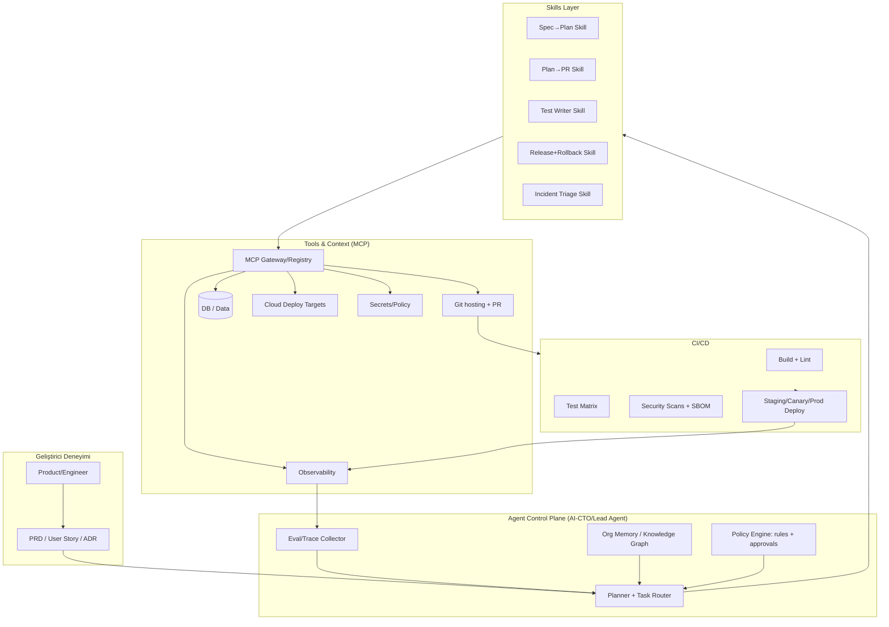
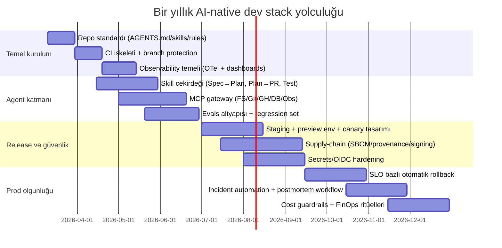

# AI-native Yazılım Şirketi Kurma Mimarisi ve Tam Otomatik Dev Pipeline

## Executive summary

Bu doküman, 2026 itibarıyla “AI-native yazılım şirketi” kurmak isteyen bir ekibin, insanı merkezde tutan ama mümkün olan en yüksek otomasyon oranına sahip **uçtan uca (spec → kod → test → deploy → gözlemleme → geri besleme)** geliştirme mimarisini tarif eder. Önerilen yaklaşım; güçlü bir “Agent Control Plane” (AI-CTO / Lead Agent) altında, tekrar eden işlerin **Skills** (tekrarlanabilir iş akışı paketleri) ile standardize edilmesi ve dış sistemlere erişimin **MCP** (Model Context Protocol) üzerinden **kontrollü, yetkili ve denetlenebilir** hâle getirilmesidir. citeturn8view1turn8view3turn8view2turn21view0

2026’da “en güçlü” stack iddiası artık tek bir model seçmekten çok; **çoklu ajan**, **çoklu model**, **çoklu araç** tasarımını doğru kurmakla ilgilidir. Bu raporda üç ana “coding-agent” ekosisteminin (Codex / Claude Code / Gemini CLI) ortak noktaları; dosya okuma-yazma, komut çalıştırma, git/PR akışı ve MCP ile araç bağlama yeteneğidir. citeturn8view0turn19view1turn19view0

Tam otomatik pipeline’ın “gizli maliyeti” ölçüm ve güvenliktir: otomasyon arttıkça **test matrisi**, **supply-chain güvenliği (SLSA, SBOM, imzalama)**, **least privilege**, **audit logging**, **SLO/SLI** ve **maliyet yönetimi (FinOps)** kritik hale gelir. citeturn1search2turn10search6turn10search0turn12search4turn3search15

Son kısımda, belirsiz altyapı detayları nedeniyle (bulut sağlayıcı, CI/CD, DB boyutu, ekip büyüklüğü) üç ölçek için (küçük/orta/büyük) uygulanabilir yol haritası ve tahmini kaynak-zaman-maliyet tabloları sunulmuştur.

## Varsayımlar ve ölçek senaryoları

Bu raporun “uygulanabilir” olması için aşağıdaki varsayımları yapıyorum (aksi durumda aynı mimariyi alternatiflerle de veriyorum):

- Ürün: React Native + bir backend/API + bir web admin/landing (tipik SaaS/mobil ürün). React Native’in test stratejisinde unit→integration→E2E katmanları ve E2E için Detox kullanılabilirliği esas alınmıştır. citeturn3search27turn3search2  
- Git hosting: GitHub üzerinden PR tabanlı workflow. Korunan branch, zorunlu inceleme ve status check’ler “güvenli merge” için temel kontrol noktasıdır. citeturn1search1turn1search4  
- AI-native ajan katmanı: Codex/Claude/Gemini gibi bir “coding agent” ile yerel/uzak çalışma + MCP ile araç bağlama. citeturn8view2turn19view1turn19view0

Aşağıdaki senaryolar, mimarinin aynı kalıp farklı ürün seçimleriyle uygulanmasını sağlar:

| Senaryo | Hedef | Platform tercihi | Pipeline yaklaşımı | İnsan onayı |
|---|---|---|---|---|
| Küçük ölçek | Hızlı MVP→PMF | Managed servis ağırlıklı (serverless/edge + BaaS) | “CI ağırlıklı, CD temkinli”, preview/staging güçlü | PR merge & prod deploy’da zorunlu |
| Orta ölçek | Büyüme + stabilite | Managed + kısmi Kubernetes/GitOps | GitOps/CD + canary, otomatik rollback | Seviyeli onay (risk bazlı) |
| Büyük ölçek | Regülasyon + multi-region | Kubernetes/GitOps + güçlü governance | SLSA, provenance, policy-as-code, kapsamlı audit | Değişiklik sınıfına göre çok aşamalı |

DORA araştırmaları (DevOps performans ölçümleri ve AI etkisi dahil) yazılım teslimat performansının metriklerle ve organizasyonel sistemlerle birlikte ele alınması gerektiğini vurgular; “AI tek başına mucize değil” yaklaşımı bu raporun temel varsayımıdır. citeturn15search0turn15search7turn15search2

## Nihai AI-native dev stack

Bu bölüm; katman katman (Model, Agent/CTO, Skills, MCP, Infrastructure) “en güçlü ve uygulanabilir” bir referans mimariyi tanımlar.

### Referans mimari özeti

**Önerilen temel omurga (2026):**  
entity["company","OpenAI","ai lab, san francisco"] Codex (Skills + MCP + multi-agent + otomations) citeturn8view0turn8view1turn8view3turn8view2  
entity["company","Anthropic","ai lab, san francisco"] Claude Code (MCP, multi-agent, CLAUDE.md, hooks) citeturn19view1turn13view2  
entity["company","Google","technology company, mountain view"] Gemini CLI (ReAct loop + MCP, terminal ajanı) citeturn19view0turn7search1  
Repo/PR kontrol düzlemi: entity["company","GitHub","code hosting, microsoft"] (branch protection, status checks, Actions) citeturn1search1turn3search0turn3search4  
Veri katmanı (küçük/orta ölçek için hızlı seçenek): entity["company","Supabase","backend platform, singapore"] Postgres + RLS citeturn1search0turn1search21  
Edge/compute ve obj storage: entity["company","Cloudflare","cdn and security company, san francisco"] Workers + R2 citeturn2search0turn2search2  
Frontend preview/prod deploy: entity["company","Vercel","web hosting, san francisco"] veya entity["company","Netlify","web hosting, san francisco"] (preview environments / deploy previews) citeturn4search2turn4search3  
Secrets: entity["company","HashiCorp","devops tools company, us"] Vault (rotasyon + audit) citeturn10search3turn10search24  

Bu “omurga” iki kritik standarda dayanır:
- **Agent Skills standardı:** Skills paketlerini taşınabilir, versiyonlanabilir hale getirir. citeturn9view0turn8view3  
- **MCP:** Ajanların araçlara erişimini standartlaştırır; Codex ve Gemini CLI MCP’yi doğrudan destekler. citeturn8view2turn19view0turn21view0  

### Mimari diyagram



Bu mimari, “ajanların kod yazması”nı tek başına amaç değil; **kontrollü araç erişimi + ölçülebilir kalite + geri besleme** ile sürekli iyileşen bir üretim sistemi olarak ele alır. Codex’in Skills ve Automations yaklaşımı bu “kontrol düzlemi” fikrini doğrudan destekler. citeturn8view0turn18search8turn18search0

image_group{"layout":"carousel","aspect_ratio":"16:9","query":["Model Context Protocol architecture diagram","Argo CD GitOps architecture diagram","OpenTelemetry reference architecture diagram"],"num_per_query":1}

### Model katmanı

2026’da “en güçlü” model seçimi, tek bir modelin IQ’sundan çok şu kriterlere dayanır:

- **Ajan modunda güvenilirlik:** Dosyalar arasında plan→icra→doğrulama döngüsünü sürdürebilmesi. Codex uygulaması ve Codex cloud/CLI, uzun işlerde paralel ajan çalıştırma ve worktree yaklaşımını öne çıkarır. citeturn8view0turn8view1turn18search21  
- **Tool-use ekosistemi:** MCP + yerel komut çalıştırma + git/PR entegrasyonu. Codex MCP desteği (stdio + streamable HTTP, bearer/OAuth) ve Gemini CLI’nin MCP desteği “agentic dev stack” için çekirdek kabiliyettir. citeturn8view2turn19view0  
- **Evals ve ölçüm:** Skill’lerin test edilebilir hale gelmesi gerekir; Codex ekibi bunu “Evals” yaklaşımıyla birinci sınıf pratik olarak tarif ediyor. citeturn24view0  
- **Benchmark farkındalığı:** SWE-bench Verified gibi benchmark’ların “contamination” (eğitim verisine sızma) ve test tasarımı sorunları vardır; bu yüzden şirket içinde özel ve taze eval setleri üretmek bir zorunluluk haline geliyor. citeturn23view0turn23view1  

**Pratik öneri:** Üretimde tek model yerine “model routing” kullanın:  
- “Plan/Architecture/Review” işleri → daha yüksek muhakeme (reasoning) profili  
- “Refactor/Boilerplate/Test skeleton” → daha hızlı/ucuz profil  
- “Incident triage” → kısa context + log odaklı profil  
Bu routing, Codex’in config/rules ve kurumsal governance araçlarıyla yönetilebilir. citeturn18search12turn18search10turn18search0  

### Agent/CTO (Orchestrator) katmanı

Agent Control Plane’in “AI-CTO” rolü; işi parçalara ayıran, doğru skill’i seçen, MCP tool erişimini yöneten ve riskli adımlarda onay isteyen üst orkestratördür. Codex’te bu yaklaşım; **skills**, **rules**, **sandbox+approvals**, **automations** ve enterprise governance bileşenleriyle açıkça ürünleştirilmiştir. citeturn8view3turn18search10turn18search1turn18search8turn18search0  

Orchestrator tasarımında iki kritik ders:

- **Tool sayısı arttıkça context maliyeti patlar.** Anthropic, MCP tool tanımlarının ve ara tool sonuçlarının token maliyetini artırdığını; bunun “code execution” yaklaşımıyla (tool’ları kod API’leri gibi kullanıp sadece gerekeni yükleyerek) büyük ölçüde azaltılabileceğini anlatır. citeturn17view0  
- **Tool tasarımı “az ama güçlü” olmalı.** Gereksiz parçalı tool setleri ajanı şaşırtır; arama/filtreleme gibi token-verimli tool’lar tercih edilmelidir. citeturn17view1  

### Skills katmanı

**Tanım:** Skill; bir klasör içinde `SKILL.md` + opsiyonel `scripts/` + `references/` + `assets/` + opsiyonel `agents/openai.yaml` ile paketlenen, ajanların gerektiğinde “progressive disclosure” ile yüklediği tekrar edilebilir workflow’dur. citeturn8view3turn7search24turn9view0  

**Neden Skills?**  
- Kurum standartlarını (branch stratejisi, test politikası, kod stili, güvenlik checklist’i) “ajan hafızası”na taşır. citeturn18search2turn19view1  
- Evals ile ölçülebilir hale gelir; bu, “vibe” yerine kaliteyi nesnel iyileştirir. citeturn24view0  

**Örnek minimal skill iskeleti** (Codex uyumlu): citeturn8view3turn24view0  
```text
my-skill/
  SKILL.md
  scripts/
  references/
  assets/
  agents/openai.yaml
```

#### Önerilen “eksiksiz” Skill seti (çekirdek)

Aşağıdaki liste, “tam otomatik pipeline” için minimumda ihtiyaç duyulan skill paketleridir. Her skill, mümkünse deterministic kontroller + eval rubric ile ölçülmelidir. citeturn24view0turn9view0  

| Skill adı | Sorumluluk | Input örneği | Output örneği |
|---|---|---|---|
| Spec→Plan | PRD/user story’den uygulanabilir teknik plan üretmek | “RN login + magic link” | “Task breakdown + riskler + test planı + rollout stratejisi” |
| Plan→Tasks | Planı ticket/issue setine dönüştürmek | “Plan v1” | “GitHub issues + etiketler + milestone” |
| Plan→PR (Backend) | Backend değişikliğini branch+PR olarak üretmek | “/api/auth refresh token” | “PR + açıklama + migration notu” |
| Plan→PR (React Native) | RN feature/bugfix üretmek | “Offline-first cache” | “PR + platform-notes (iOS/Android)” |
| Test Writer | Unit/integration/E2E test üretmek | “Bu PR’a test ekle” | “Test dosyaları + coverage raporu” |
| CI Fixer | CI failure triage ve otomatik fix PR’ı | “CI failed: lint” | “Fix commit + CI geçti” |
| Security Triage | SAST/dep/vuln bulgularını sınıflamak | “Dependabot alert” | “Risk seviyesi + önerilen patch” |
| Release Orchestrator | Staging→prod release yönetmek | “v1.2.0 release” | “Changelog + deploy plan + rollback” |
| Incident Triage | Alarm/log/trace üzerinden kök neden analizi | “p95 latency arttı” | “RCA + hotfix PR + postmortem taslağı” |
| Cost Guard | Maliyet sinyallerini analiz edip aksiyon önermek | “LLM token spike” | “Cache/routing önerisi + limit” |

RN özelinde E2E testler için Detox’un “real device/simulator üzerinde kullanıcı akışlarını test etme” yaklaşımı çekirdek bir kalite katmanı olarak ele alınmalıdır. citeturn3search2turn3search14  

### MCP katmanı

**MCP (Model Context Protocol)**; ajanları dış sistemlere bağlamak için açık bir standarttır. MCP’nin örnek sunucuları ve SDK ekosistemi, “tek tek entegrasyon yazma” maliyetini azaltmayı hedefler. citeturn21view0turn17view0turn6view2  

**Codex tarafı:** Codex, MCP server’ları CLI ve IDE extension’da destekler; stdio ve streamable HTTP, bearer token ve OAuth seçenekleriyle. `config.toml` ile yönetim ve `codex mcp` komutlarıyla ekleme akışı dokümante edilmiştir. citeturn8view2turn18search15  

**Önemli güvenlik notu:** MCP reference server’ları “production-ready” değil, eğitim amaçlıdır; gerçek kullanımda kendi threat model’inize göre sertleştirme gerekir. citeturn6view2  

#### MCP’lerin “tam listesi” (bu mimaride önerilen)

Aşağıdaki liste, “tam otomatik dev pipeline” için pratikte kullanılan MCP yetenek setinin tamamını kapsayacak şekilde tasarlanmıştır. Bazıları resmi reference server, bazıları ise “kurum içi yazılacak MCP server” kategorisindedir (özellikle güvenlik/izin modeli nedeniyle). MCP’nin çoklu SDK desteği bunun için meşru bir yaklaşım sağlar. citeturn6view2turn21view0  

| MCP | Tip | Yetenekler | Kullanım örneği | Güvenlik/izin gereksinimi | Entegrasyon notu |
|---|---|---|---|---|---|
| Filesystem | Reference | Kısıtlı dizinde dosya okuma/yazma | “/src/auth/* refactor et” | Allowlist path şart | Reference server “access control” odaklıdır. citeturn6view2turn21view0 |
| Git | Reference | Repo okuma, arama, commit branch işlemleri | “feature branch oluştur” | Push yetkisi sınırlı | PR açma ile birleştirilir. citeturn6view2turn21view0 |
| Fetch | Reference | Web içeriği çekme/dönüştürme | “RFC oku özetle” | Network policy | Tool çıktılarını kısıtlayın. citeturn6view2turn21view0 |
| Memory | Reference | Kalıcı “knowledge graph memory” | “Bu repo build komutlarını hatırla” | PII politikası | Agent memory, governance’e bağlanmalı. citeturn6view2turn21view0 |
| Sequential Thinking | Reference | Adım adım düşünme akışı | “Planı sırala” | — | Plan/CTO ajanında iyi çalışır. citeturn6view2turn21view0 |
| Time | Reference | Zaman/zon dönüşümü | “Deploy penceresi hesapla” | — | Release planlarında. citeturn6view2turn21view0 |
| GitHub API | Kurum içi / resmi doc tabanlı | Issue/PR, branch, review, status okuma-yazma | “PR aç, label ekle” | Token scope (least) | Branch protection ile uyumlu olmalı. citeturn1search1turn1search4 |
| CI Runner Controller | Kurum içi | CI job tetikleme/yeniden koşma, log çekme | “failed job retry + log analizi” | Repo + CI yetkisi | Actions runner mantığına göre. citeturn3search4turn3search19 |
| Artifact Registry | Kurum içi | Build artifact push/pull | “image tag v1.2.0 push” | Write registry | Supply-chain imzalama ile birlikte. citeturn1search2 |
| SBOM/Provenance | Kurum içi | SBOM üretme, attestation, doğrulama | “deploy öncesi provenance doğrula” | Signing keys | SLSA provenance yaklaşımı. citeturn1search2turn1search29 |
| Secrets Broker | Kurum içi | Secret read/rotate/audit | “DB creds rotate” | Strict RBAC | Vault audit + rotasyon. citeturn10search3turn10search24 |
| Cloud Deploy | Kurum içi | Deploy/rollback/progressive release API | “canary %10 başlat” | Prod erişimi çok kısıtlı | K8s’de Argo Rollouts; serverless’ta provider API. citeturn4search8turn4search4 |
| Observability Query | Kurum içi | Metric/log/trace sorgu | “p95 latency, error rate” | Read-only | OTel → backend. citeturn3search15turn11search2 |
| Postgres Read/Write | Kurum içi | Schema, migration, query | “migration planla” | DB role ayrımı | RLS politikalarıyla uyumlu. citeturn1search0 |
| Docs/Knowledge MCP | Kurum içi | İç doküman arama + retrieval | “runbook bul” | Data sınıflandırma | Tool çıktısı PII scrub içermeli. citeturn17view0turn17view1 |
| Ticketing MCP | Kurum içi | Backlog yönetimi | “bug triage” | Write yetkisi kontrollü | “Automations” için ana hedef. citeturn8view0turn18search8 |
| Mobile Build MCP | Kurum içi | iOS/Android build dağıtımı | “TestFlight gönder” | Signing key izolasyonu | fastlane ile komut/sandbox üzerinden. citeturn12search1 |

**Not:** Bazı platformlarda hazır MCP server bulunabilir; ancak resmi/kurumsal güvenlik ihtiyaçlarında genellikle “kurum içi MCP gateway” (izin, loglama, rate limit) üzerinden geçmek daha güvenlidir. MCP reference sunucularının “educational” uyarısı bunun temel gerekçesidir. citeturn6view2  

### Infrastructure katmanı

#### Küçük/orta ölçek için “en hızlı üretim” seçeneği (serverless/edge)

- Edge compute: Cloudflare Workers, “küresel ağda serverless compute” hedefiyle konumlanır. citeturn2search0turn2search13  
- Obj storage: Cloudflare R2, egress fee’siz konumlandırma iddiasıyla “medya, dosya, log archive” gibi kalemlerde maliyeti düşürmeyi hedefler. citeturn2search2turn2search4  
- DB/Auth/Storage: Supabase Postgres + RLS “defense in depth” sağlar; Storage erişimi de RLS politikalarıyla kontrol edilebilir. citeturn1search0turn1search21  

#### Orta/büyük ölçek için “platform engineering” seçeneği (GitOps + Kubernetes)

- CD/GitOps: Argo CD, Git’i “source of truth” olarak kullanır. citeturn2search7turn2search10  
- Progressive delivery: Argo Rollouts, canary/blue-green gibi stratejiler sağlar. citeturn4search8turn4search4turn4search0  
- Temel workload: Kubernetes Deployment kavramı “declarative updates” sunar; rollback için `kubectl rollout undo` vardır. citeturn4search1turn4search21  

## Auto-coding team organizasyonu ve governance

Bu bölüm, “tam otomatik” iddiasını gerçekçi hale getirmek için insan ve ajan rollerinin ayrımını, akışı ve zorunlu onay noktalarını tanımlar.

### Rol modeli

**Kural:** Ajanlar üretir; insanlar riskli kararları onaylar; sistem her adımı ölçer ve loglar.

Önerilen organizasyon (insan + ajan) şu şekilde modellenir:

| Rol | Tip | Ana çıktı | Onay zorunluluğu | Kritik araçlar |
|---|---|---|---|---|
| AI-CTO / Lead Orchestrator | Ajan | Plan, task routing, risk sınıflaması | Yüksek riskte “insan onayı” ister | Skills + MCP + policy engine citeturn18search10turn18search1 |
| Product Spec Agent | Ajan | PRD/user story → acceptance criteria | PM onayı | Docs MCP + ticket MCP |
| Architect Agent | Ajan | ADR + sistem tasarımı + threat model taslağı | Staff/Lead onayı | Repo read + diagram/ADR skill |
| Mobile Agent | Ajan | RN PR + platform notları | Mobil lead onayı | FS/Git + Detox/fastlane scripts citeturn3search2turn12search1 |
| Backend Agent | Ajan | API/DB PR, migrations | Backend lead onayı | Postgres MCP + CI skill citeturn1search0turn24view0 |
| QA Agent | Ajan | Test suite, flaky test triage | QA lead onayı | Detox + test matrix citeturn3search2turn3search27 |
| DevSecOps Agent | Ajan | SAST/dep bulgu triage, SBOM/provenance | Security onayı | SLSA/SBOM + policy-as-code citeturn1search2turn10search6 |
| Release Manager Agent | Ajan | Release plan + canary steps + rollback | Prod deploy onayı | Argo Rollouts/Deploy MCP citeturn4search4turn4search0 |
| SRE Agent | Ajan | SLO/SLI, alarmlar, incident runbook | On-call onayı | OTel + Prometheus/Grafana/Sentry citeturn3search15turn11search0turn11search5 |
| Humans (PM/Lead/Sec) | İnsan | Onay + stratejik karar | — | Branch protection + audit citeturn1search1turn18search0 |

### Görev akışı ve PR/merge politikasının “ajan uyumlu” tasarımı

**PR akışında minimum emniyet kemeri:**
- Korunan branch + zorunlu review + zorunlu status checks. citeturn1search1turn1search4  
- Status checks’in “son 7 gün içinde çalışmış olması” gibi pratik detaylar pipeline tasarımında önemlidir (aksi halde merge bloklanır). citeturn1search10  

**Ajanların PR üretim standardı (policy):**
1. Her PR, “neden/neyi değiştirdi”, “risk”, “test kanıtı” ve “rollback notu” içermeli (skill üzerinden zorunlu şablon).
2. PR açılmadan önce ajan “local test subset” koşmalı (en az lint + unit).  
3. Merge kararı:  
   - Low risk değişiklik → 1 insan + 1 agent review  
   - Medium risk → 2 insan + security check  
   - High risk (auth, ödeme, permission, DB migration) → “change advisory” + staged rollout

Codex’in enterprise governance/observability yaklaşımı; audit edilebilirlik ve programatik raporlama (Analytics/Compliance API) vurgularıyla bu politika ihtiyacını doğrudan hedefler. citeturn18search0  

### İnsan-onay noktaları

Tam otomatik bir pipeline’da bile “mutlaka insan” gerektiren noktalar:

- **Yetki yükseltme / sandbox bypass:** Codex’te “danger-full-access” gibi seçenekler açıkça “caution” uyarısıyla gelir; bu tip escalations otomatik olmamalıdır. citeturn18search1turn8view1  
- **Prod deploy / rollback:** Canary/blue-green otomatikleşebilir ama “promote to prod” kararının SLO sinyalleriyle birlikte insan tarafından onaylanması önerilir. citeturn4search4turn4search0turn11search0  
- **Security policy değişikliği:** RLS policy, IAM/OIDC trust, secrets rotation, signing key değişiklikleri. citeturn1search0turn10search0turn1search2  

## Tam otomatik pipeline tasarımı

Bu bölüm; CI/CD adımları, test matrisi, canary/blue-green deploy, rollback ve IaC örneklerini “ajanların uygulayacağı” şekilde tasarlar.

### CI/CD’nin temel prensibi

“Agentic pipeline”da CI/CD iki amaç taşır:
1) **Ajanların hatasını erken yakalamak** (regresyon, security, stil, test)  
2) **Ajanların davranışını ölçmek** (skill tetiklendi mi, gereksiz komut çalıştırdı mı, token maliyeti şişti mi) citeturn24view0  

### Önerilen CI/CD akışı

**PR Pipeline (her PR):**
- Lint/format  
- Unit tests  
- Integration tests (DB/HTTP contract)  
- RN build smoke (Android debug + iOS compile)  
- E2E (Detox) → nightly veya “release candidate” etiketinde  
- Security: dependency scan + SAST + SBOM  
- Artifact: build + provenance + imza (yüksek olgunlukta)

**CD Pipeline (merge→staging→prod):**
- Preview env (web) / internal build dağıtımı (mobile)  
- Staging deploy + smoke tests  
- Canary/blue-green (k8s varsa Argo Rollouts; değilse provider bazlı progressive rollout) citeturn4search8turn4search4turn4search0  
- SLO guard: p95 latency, error rate, crash-free sessions, auth success rate  
- Promote→prod  
- Otomatik rollback: SLO breach durumunda (kural tabanlı)

### Deploy stratejileri

- **Web/admin için preview:** Vercel “Preview Environment” ve Netlify “Deploy Previews” PR bazlı review ortamı sağlar; ajanların “UI doğrulama” adımına gerçek URL eklemek için idealdir. citeturn4search2turn4search3  
- **Kubernetes progressive delivery:** Argo Rollouts canary ve blue-green stratejilerini açıkça dokümante eder. citeturn4search4turn4search0  
- **Rollback:** Kubernetes tarafında `kubectl rollout undo` komutu temel mekanizmadır; otomasyon bunu GitOps ile “roll forward” (revert commit) şeklinde uygulamalıdır (drift riski). citeturn4search21turn4search1  

### Test matrisi (React Native odaklı)

React Native test önerileri, RN’in kendi test kılavuzunda farklı test seviyelerini içerecek şekilde anlatılır. citeturn3search27 Detox ise RN için E2E’de yaygın bir çözümdür. citeturn3search2  

| Katman | Araç yaklaşımı | Ne yakalar | Ne zaman koşulur |
|---|---|---|---|
| Static analysis | lint/typecheck | Stil, tip, basit bug | PR |
| Unit | Jest vb. | Fonksiyonel regresyon | PR |
| Integration | API+DB | Contract kırılması | PR/merge |
| E2E | Detox | Gerçek kullanıcı akışı | Nightly + RC citeturn3search2 |
| Release tests | Smoke + perf | Prod benzeri doğrulama | Staging→prod |
| Skill evals | Codex Evals | “Ajan doğru davrandı mı?” | Her skill değişikliğinde citeturn24view0 |

### Mobil dağıtım (iOS/Android)

Mobil tarafta tam otomasyonda en büyük darboğazlar: **code signing**, **store süreçleri**, **E2E cihaz altyapısı**. Burada iki güçlü yaklaşım:

- fastlane: iOS/Android release otomasyonu için resmi dokümantasyonda “beta deployments & releases” odağında konumlanır. citeturn12search1  
- Mobile CI platformu: Codemagic ve Bitrise gibi çözümler RN build/test/release akışlarını ürünleştirir (özellikle iOS build için macOS altyapısı). citeturn12search35turn12search7  

**Ajan entegrasyonu:** Bu araçlar doğrudan MCP üzerinden değilse bile, “Scripts + sandboxed command execution” üzerinden skill içinde güvenli hale getirilebilir (örn. `scripts/release_ios.sh`). Skills’in script desteği bu kullanım için tasarlanmıştır. citeturn8view3turn7search24  

## Güvenlik ve veri gizliliği

Bu bölüm; RLS, secret management, least privilege, audit logging, supply-chain, sandbox/approvals gibi kontrol katmanlarını bütünler.

### Veri erişimi: RLS ve “defense in depth”

Supabase, Row Level Security’nin Postgres primitive’i olduğunu ve “defense in depth” sağlayabildiğini vurgular; Auth ile birleştiğinde uçtan uca (client→DB) güvenlik modeli kurulur. citeturn1search0 Storage tarafında da erişim politikalarının RLS ile yönetilebilmesi özellikle çok önemlidir. citeturn1search21  

**Pratik politika:**
- Her tablo için RLS “deny by default” (policy yazılana kadar erişim yok)  
- Policy’ler için ayrı migration ve “security regression tests”  
- RLS performansı için index ve best practice’ler (özellikle büyük tablolar) citeturn1search34  

### Secrets management ve least privilege

- Vault; secret yönetimi, rotasyon ve audit gibi yeteneklerle konumlanır. citeturn10search3turn10search24  
- CI tarafında long-lived secret yerine GitHub Actions OIDC yaklaşımı; cloud kaynaklarına uzun ömürlü credential koymadan erişim sağlar. citeturn10search0turn10search14  

Bu ikisinin kombinasyonu: “CI job → OIDC ile kısa ömürlü token → Vault’tan scoped secret çek → deploy” şeklinde, uzun ömürlü anahtarları minimize eder. citeturn10search0turn10search28  

### Supply-chain güvenliği: SLSA, SBOM, provenance

SLSA provenance; bir artifact’in “nerede/ ne zaman/ nasıl” üretildiğini doğrulanabilir şekilde tarif etmeyi amaçlar. citeturn1search2 SBOM tarafında Cosign dokümantasyonu SBOM/attestation gibi spesifikasyonlara değinir; bu katman, tam otomatik pipeline’da “ajanın ürettiği artifact’e güven” problemini yönetmek için kritiktir. citeturn1search29  

### Ajan güvenliği: sandbox + approvals + rules

Codex’in güvenlik dokümantasyonu; sandbox ve approvals modlarıyla “workspace içinde okuma/yazma serbest, network/elevated işlemde onay” yaklaşımını tarif eder; tam bypass seçenekleri için açık uyarı verir. citeturn18search1  
Rules sistemi; komutlar için allow/prompt/forbidden kararını ve “en kısıtlayıcı kural kazanır” prensibini açıklar; bu, ajanın command execution riskini yönetmek için doğrudan kullanılır. citeturn18search10  

### OWASP ve SSDF ile güvenlik governance’i

- OWASP API Security Top 10 (2023) ve OWASP Top Ten (2025) güvenlik riskleri için referans çerçeveler sunar. citeturn10search1turn10search29  
- NIST SSDF; güvenli yazılım geliştirme pratiklerini SDLC’ye entegre etmek için “outcome-based” bir framework verir. citeturn10search6  

Bu mimaride governance; “policy-as-code + audit logs + ölçüm + onay zinciri” olarak uygulanır; Codex enterprise governance sayfası da “auditability / compliance logs” temasını doğrudan vurgular. citeturn18search0  

## Observability ve maliyet optimizasyonu

### Observability: OTel → metrics/logs/traces

OpenTelemetry, vendor-neutral bir observability framework olarak tanımlanır; telemetry üretme/collect/export yaklaşımıyla. citeturn3search15turn3search3  
Prometheus, metrik toplama ve alerting odaklı açık kaynak bir sistem olarak konumlanır. citeturn11search0turn11search11  
Grafana dashboard kavramını ve panellerle görünürlük sağlamayı dokümante eder. citeturn11search1  
Sentry ise error/performance izleme özelliklerini ürünleştirir; mobil crash ve tracing için pratik bir yol sağlar. citeturn11search5turn11search13  

**Önerilen SLI/SLO seti (örnek):**
- API Availability (%99.9)  
- p95 latency (örn. < 300ms)  
- Error rate (5xx) (örn. < %0.5)  
- Mobile crash-free sessions (örn. > %99.5)  
- Auth success rate / refresh token failure rate  
- Deploy health: canary error delta < eşik

DORA metrikleri, teslimat performansını ölçmek için endüstri standardı olarak anılır (deployment frequency, lead time, change failure rate, MTTR). citeturn15search2turn15search0  

### AI/Agent observability

Ajanların üretim sistemine girmesiyle “klasik observability” yanına şunlar eklenir:
- Skill invoke oranı ve false positive/negative  
- Token usage trendi (maliyet sinyali)  
- Tool-call yoğunluğu (MCP)  
- Sandbox escalation sayısı  
- PR başına “agent churn” (gereksiz tekrarlar)

Codex “Evals” yaklaşımı bu davranış ölçümünü skill seviyesine indirir. citeturn24view0  

### Maliyet optimizasyonu: FinOps + mimari kararlar

FinOps Foundation; FinOps’u “cloud ve teknoloji değerini maksimize eden, mühendislik/finans/iş birliğiyle finansal sorumluluk yaratan operasyonel framework” olarak tanımlar. citeturn12search4turn12search0  

Bu mimaride maliyet optimizasyonu üç ana sınıfta ele alınır:

| Kalem | Tipik maliyet sürücüsü | Kontrol mekanizması |
|---|---|---|
| LLM/Agent | Token, model seçimi, tool-call sayısı | Model routing + evals + cache + tool tasarımı citeturn17view0turn24view0 |
| CI/Mobile build | macOS runner/dakika, E2E cihaz | Test matrisini “risk bazlı” koş; nightly E2E; paralellik yönet |
| Observability | Log hacmi, trace sampling | Sampling, log redaction, SLO odaklı metrikler citeturn3search11turn3search18 |

Cloudflare R2’nin “egress fee yok” konumlandırması, özellikle medya/asset/backup tarafında birim maliyeti düşürme potansiyeli taşır (workload’a bağlı). citeturn2search2turn2search4  

## Bir yıllık yol haritası ve bütçeler

Aşağıdaki plan; “MVP→production” yolunu 12 aylık bir çerçevede, üç ölçek senaryosu olarak verir. Sayılar **varsayım**dır; fiyatlar ve kullanım profili değiştikçe güncellenmelidir.

### Uygulanabilir yol haritası



**Kritik “definition of done” (12 ay sonunda):**
- Skill’ler eval ile ölçülüyor ve regresyonlar görünür. citeturn24view0  
- MCP erişimi least-privilege + audit log ile yönetiliyor. citeturn8view2turn10search0turn18search0  
- Prod deploy canary/blue-green ve rollback stratejileri hazır. citeturn4search4turn4search0turn4search21  
- RLS/secret/supply-chain kontrolleri yerleşik. citeturn1search0turn10search3turn1search2  

### Küçük / orta / büyük ölçek için tahmini kaynak-zaman-maliyet

Aşağıdaki tablolar “mühendislik kapasitesi”ni FTE (full-time equivalent) üzerinden yaklaşıklar. (Örnek: 1 FTE = 1 tam zamanlı kişi/ay.)

#### Kaynak ve zaman (varsayım)

| Ölçek | MVP’ye kadar | Production olgunluğu | Ekip (insan) | Ajan rol sayısı (yaklaşık) |
|---|---:|---:|---:|---:|
| Küçük | 6–8 hafta | 6–12 ay | 2–4 FTE | 6–10 ajan |
| Orta | 4–6 hafta | 4–9 ay | 8–15 FTE | 10–16 ajan |
| Büyük | 3–5 hafta | 3–6 ay | 30+ FTE | 16+ ajan |

#### Aylık maliyet kalemleri (varsayım aralıkları, USD)

| Kalem | Küçük | Orta | Büyük |
|---|---:|---:|---:|
| LLM/Agent kullanımı | 1k–8k | 8k–40k | 40k+ |
| CI (runner, build dakikası) | 200–2k | 2k–10k | 10k+ |
| Mobile CI (macOS + cihaz/E2E) | 300–3k | 3k–15k | 15k+ |
| Observability (log/trace/APM) | 200–2k | 2k–15k | 15k+ |
| DB + Storage + CDN | 100–2k | 2k–20k | 20k+ |
| Security (vault, scanning, signing) | 200–3k | 3k–20k | 20k+ |

**Açıklama:** Bu aralıkların geniş olmasının nedeni; LLM token tüketimi ve E2E altyapısının ürün/traffik ve otomasyon oranına çok duyarlı olmasıdır. Ayrıca benchmark’ların kirlenmesi ve test tasarım sorunları gibi nedenlerle şirket içi eval/test altyapısına yatırım arttıkça kalite yükselir; fakat maliyet de artar. citeturn23view0turn24view0  

### Son not: “en güçlü stack”in gerçek ölçütü

2026’da en güçlü AI-native dev stack; tek bir model veya tek bir tool seti değil, şu üçlünün birlikte kurulmasıdır:

1) **Standartlaştırılmış workflow paketleri (Skills)** citeturn9view0turn8view3  
2) **Kontrollü araç erişimi (MCP + policy + sandbox)** citeturn8view2turn18search1turn18search10  
3) **Ölçülebilir kalite (Evals + test matrisi + SLO)** citeturn24view0turn3search27turn15search0